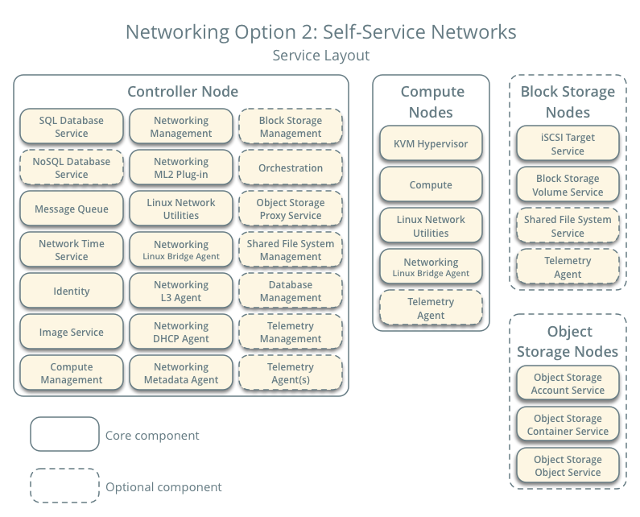

# 目标

创建虚拟机(linux/windows)

# Openstack是什么

虚拟机级别虚拟化平台

开源的

**Compute**

NOVA		[Compute Service](https://www.openstack.org/software/releases/antelope/components/nova)

ZUN		[Containers Service](https://www.openstack.org/software/releases/antelope/components/zun)

**Hardware Lifecycle**

IRONIC		[Bare Metal Provisioning Service](https://www.openstack.org/software/releases/antelope/components/ironic)

CYBORG		[Lifecycle management of accelerators](https://www.openstack.org/software/releases/antelope/components/cyborg)

**Storage**

SWIFT		[Object store](https://www.openstack.org/software/releases/antelope/components/swift)

CINDER		[Block Storage](https://www.openstack.org/software/releases/antelope/components/cinder)

MANILA		[Shared filesystems](https://www.openstack.org/software/releases/antelope/components/manila)

**Networking**

NEUTRON		[Networking](https://www.openstack.org/software/releases/antelope/components/neutron)

OCTAVIA		[Load balancer](https://www.openstack.org/software/releases/antelope/components/octavia)

DESIGNATE		[DNS service](https://www.openstack.org/software/releases/antelope/components/designate)

**Shared Services**

KEYSTONE		[Identity service](https://www.openstack.org/software/releases/antelope/components/keystone)

PLACEMENT		[Placement service](https://www.openstack.org/software/releases/antelope/components/placement)

GLANCE		[Image service](https://www.openstack.org/software/releases/antelope/components/glance)

BARBICAN		[Key management](https://www.openstack.org/software/releases/antelope/components/barbican)

**Orchestration**

HEAT		[Orchestration](https://www.openstack.org/software/releases/antelope/components/heat)

SENLIN		[Clustering service](https://www.openstack.org/software/releases/antelope/components/senlin)

MISTRAL			[Workflow service](https://www.openstack.org/software/releases/antelope/components/mistral)

ZAQAR

[Messaging Service](https://www.openstack.org/software/releases/antelope/components/zaqar)

BLAZAR

[Resource reservation service](https://www.openstack.org/software/releases/antelope/components/blazar)

AODH

[Alarming Service](https://www.openstack.org/software/releases/antelope/components/aodh)

**Workload Provisioning**

MAGNUM

[Container Orchestration Engine Provisioning](https://www.openstack.org/software/releases/antelope/components/magnum)

SAHARA

[Big Data Processing Framework Provisioning](https://www.openstack.org/software/releases/antelope/components/sahara)

TROVE

[Database as a Service](https://www.openstack.org/software/releases/antelope/components/trove)

**Application Lifecycle**

MASAKARI

[Instances High Availability Service](https://www.openstack.org/software/releases/antelope/components/masakari)

MURANO

[Application Catalog](https://www.openstack.org/software/releases/antelope/components/murano)

SOLUM

[Software Development Lifecycle Automation](https://www.openstack.org/software/releases/antelope/components/solum)

FREEZER

[Backup, Restore, and Disaster Recovery](https://www.openstack.org/software/releases/antelope/components/freezer)

**API Proxies**

EC2API

[EC2 API proxy](https://www.openstack.org/software/releases/antelope/components/ec2api)

**Web frontends**

HORIZON

[Dashboard](https://www.openstack.org/software/releases/antelope/components/horizon)

SKYLINE

[Next generation dashboard (emerging technology)](https://www.openstack.org/software/releases/antelope/components/skyline)

## 核心

计算: Nova、Zun

网络: Neutron

## 服务端

依赖中间件: rabbitmq、memcached、mariadb

# 版本列表

https://releases.openstack.org

https://github.com/openstack/openstack-helm

当前选取版本: [2023.2 Bobcat](https://releases.openstack.org/bobcat/index.html)

# 计算

基于KVM

web-ui: Horizon

nova概述				   https://docs.openstack.org/nova/latest/install/overview.html

OpenStack 架构设计指南	https://docs.openstack.org/arch-design/

OpenStack操作指南		 https://docs.openstack.org/operations-guide/

OpenStack 网络指南		https://docs.openstack.org/ocata/networking-guide/

CPU和Memory可以过载, 完全耗光宿主机资源之后会通过OOM Killer回收资源

## 计算服务概述

使用 OpenStack Compute 托管和管理云计算系统。OpenStack 计算是基础设施即服务 (IaaS) 系统的主要部分。主要模块是用Python实现的。

OpenStack Compute 与 OpenStack Identity 进行交互以进行身份验证，与 OpenStack Placement 进行交互以进行资源库存跟踪和选择，与 OpenStack Image 服务进行交互以进行磁盘和服务器映像，以及与 OpenStack Dashboard 进行交互以用于用户和管理界面。图像访问受到项目和用户的限制；每个项目的配额是有限的（例如实例的数量）。OpenStack Compute 可以在标准硬件上水平扩展，并下载镜像来启动实例。

OpenStack 计算由以下区域及其组件组成：

- `nova-api`服务

  接受并响应最终用户计算 API 调用。该服务支持 OpenStack 计算 API。它执行一些策略并启动大多数编排活动，例如运行实例。

- `nova-api-metadata`服务

  接受来自实例的元数据请求。有关更多信息，请参阅 [元数据服务](https://docs.openstack.org/nova/latest/admin/metadata-service.html)。

- `nova-compute`服务

  一个工作守护进程，通过虚拟机管理程序 API 创建和终止虚拟机实例。例如：用于 KVM 或 QEMU 的 libvirt适用于 VMware 的 VMwareAPI处理相当复杂。基本上，守护进程接受队列中的操作并执行一系列系统命令，例如启动 KVM 实例并更新其在数据库中的状态。

- `nova-scheduler`服务

  从队列中获取虚拟机实例请求并确定其在哪个计算服务器主机上运行。

- `nova-conductor`模块

  调解`nova-compute`服务和数据库之间的交互。它消除了对服务进行的云数据库的直接访问 `nova-compute`。该`nova-conductor`模块水平缩放。但是，请勿将其部署在`nova-compute`运行服务的节点上。有关详细信息，请参阅[配置选项](https://docs.openstack.org/nova/latest/configuration/config.html)`conductor`中的部分 。

- `nova-novncproxy`守护进程

  提供用于通过 VNC 连接访问正在运行的实例的代理。支持基于浏览器的 novnc 客户端。

- `nova-spicehtml5proxy`守护进程

  提供用于通过 SPICE 连接访问正在运行的实例的代理。支持基于浏览器的 HTML5 客户端。

- 队列

  用于在守护进程之间传递消息的中央集线器。通常使用 [RabbitMQ](https://www.rabbitmq.com/)实现，但 [也可以使用其他选项](https://docs.openstack.org/oslo.messaging/latest/admin/drivers)。

- SQL数据库

  存储云基础设施的大多数构建时和运行时状态，包括：可用实例类型使用中的实例可用网络项目理论上，OpenStack Compute 可以支持 SQLAlchemy 支持的任何数据库。常见的数据库有用于测试和开发工作的 SQLite3、MySQL、MariaDB 和 PostgreSQL。

# 存储

## 磁盘评估

IOPS

顺序/随机读写性能要求: 读写延迟

存储拓展

性价比

冷热分离

## 存储架构

物理机系统盘 raid-1

物理机数据盘 raid-5

物理机数据盘-裸盘

业务特点: 读多vs写多? 能否容忍延迟? 上层业务能否做高可用冗余?

|                 | 临时存储                           | 块存储                                                       | 对象存储                   | 共享文件系统存储                                             |
| :-------------- | :--------------------------------- | :----------------------------------------------------------- | :------------------------- | :----------------------------------------------------------- |
| 应用            | 运行操作系统和暂存空间             | 向虚拟机 (VM) 添加额外的持久存储                             | 存储数据，包括虚拟机镜像   | 向虚拟机添加额外的持久存储                                   |
| 通过…访问       | 一个文件系统                       | 可分区、格式化、挂载的块设备（如/dev/vdc）                   | 其余 API                   | 一种可以分区、格式化和挂载的共享文件系统服务共享（马尼拉管理的或在马尼拉注册的外部共享）（例如 /dev/vdc） |
| 可从…           | 在虚拟机内                         | 在虚拟机内                                                   | 任何地方                   | 在虚拟机内                                                   |
| 由…管理         | OpenStack 计算 (nova)              | OpenStack 块存储（cinder）                                   | OpenStack 对象存储 (swift) | OpenStack 共享文件系统存储（马尼拉）                         |
| 持续到……        | 虚拟机已终止                       | 已被用户删除                                                 | 已被用户删除               | 已被用户删除                                                 |
| 尺寸决定于...   | 大小设置的管理员配置，称为*口味*   | 初始请求中的用户规范                                         | 可用物理存储量             | 初始请求中的用户规范延期请求可用的用户级报价管理员施加的限制 |
| 加密配置        | 参数输入`nova.conf`                | 管理员建立[加密卷类型](https://docs.openstack.org/admin-guide/dashboard-manage-volumes.html)，然后用户选择加密卷 | 尚不可用                   | 共享文件系统服务不会应用超出共享后端存储提供的任何额外加密   |
| 典型用法示例... | 第一个磁盘 10 GB，第二个磁盘 30 GB | 1TB磁盘                                                      | 数十 TB 的数据集存储       | 完全取决于创建共享时指定的后端存储的大小。在精简配置的情况下，它可以是部分空间预留（有关更多详细信息，请参阅 [功能和额外规格](https://docs.openstack.org/manila/latest/contributor/capabilities_and_extra_specs.html#common-capabilities) 规范） |

实现方式:

​	ceph: 分布式 rdb块存储、fs文件存储、rgw对象存储

​	openebs: 本地lvm块存储

# 案例架构

## 控制器

控制器节点运行身份服务、图像服务、计算管理部分、网络管理部分、各种网络代理和仪表板。它还包括 SQL 数据库、消息队列和网络时间协议 (NTP) 等支持服务。

可选地，控制器节点运行块存储、对象存储、编排和遥测服务的部分。

控制器节点至少需要两个网络接口。

## 计算

计算节点运行计算的虚拟机管理程序部分，用于操作实例。默认情况下，Compute 使用基于内核的 VM (KVM) 虚拟机管理程序。计算节点还运行网络服务代理，将实例连接到虚拟网络，并通过安全组向实例提供防火墙服务。

您可以部署多个计算节点。每个节点至少需要两个网络接口。

## 块存储

可选的块存储节点包含块存储和共享文件系统服务为实例提供的磁盘。

为了简单起见，计算节点和该节点之间的服务流量使用管理网络。生产环境应实施单独的存储网络以提高性能和安全性。

您可以部署多个块存储节点。每个节点至少需要一个网络接口。

## 对象存储

可选的对象存储节点包含对象存储服务用于存储帐户、容器和对象的磁盘。

为了简单起见，计算节点和该节点之间的服务流量使用管理网络。生产环境应实施单独的存储网络以提高性能和安全性。

该服务需要两个节点。每个节点至少需要一个网络接口。您可以部署两个以上的对象存储节点。

## 联网

选择以下虚拟网络选项之一。

### 网络选项 1：提供商网络

提供商网络选项以最简单的方式部署 OpenStack 网络服务，主要使用第 2 层（桥接/交换）服务和网络的 VLAN 分段。本质上，它将虚拟网络与物理网络连接起来，并依赖物理网络基础设施来提供第 3 层（路由）服务。此外，DHCP<动态主机配置协议(DHCP)服务向实例提供IP地址信息。

OpenStack 用户需要有关底层网络基础设施的更多信息，以创建与基础设施完全匹配的虚拟网络。

 

警告

此选项缺乏对自助（专用）网络、第 3 层（路由）服务以及负载均衡器即服务 (LBaaS) 和防火墙即服务 (FWaaS) 等高级服务的支持。如果您需要这些功能，请考虑下面的自助服务网络选项。

### 网络选项 2：自助服务网络

自助服务网络选项通过第 3 层（路由）服务增强了提供商网络选项，这些服务支持使用虚拟可扩展 LAN (VXLAN) 等覆盖分段方法的自助服务网络。本质上，它使用网络地址转换 (NAT) 将虚拟网络路由到物理网络。此外，此选项还为 LBaaS 和 FWaaS 等高级服务奠定了基础。

OpenStack 用户无需了解数据网络上的底层基础设施即可创建虚拟网络。如果相应配置了第 2 层插件，这还可以包括 VLAN 网络。

# 架构设计

## 原则

### 要求

#### 成本

计算资源

网络资源

复制

贮存

管理

运营

迁移

### 高可用性

通过sla去衡量、体现、优化

分离master和worker节点

服务、数据多副本高可用

服务和数据恢复时间

## 设计

- 守护进程

  作为后台进程运行。在 Linux 平台上，守护进程通常作为服务安装。

- 脚本

  安装虚拟环境并运行测试。

- 命令行界面 (CLI)

  使用户能够通过命令向OpenStack服务提交API调用。

[OpenStack 逻辑架构](https://docs.openstack.org/arch-design/design.html#logical-architecture)展示了 OpenStack 中最常见的集成服务的一个示例以及它们如何相互交互。最终用户可以通过仪表板、CLI 和 API 进行交互。所有服务都通过公共身份服务进行身份验证，各个服务通过公共 API 相互交互，除非需要特权管理员命令。

# 机房

电力功率和冷却密度

地板承重

机架容量(U)
