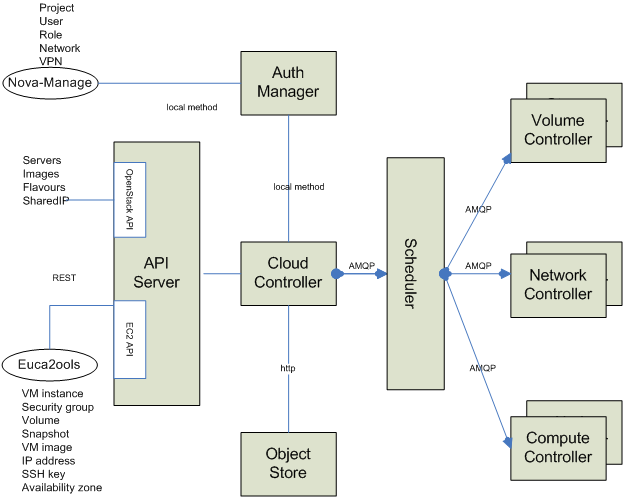
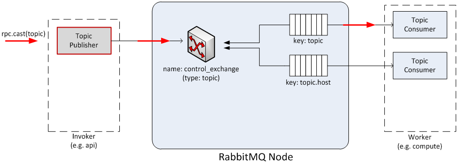
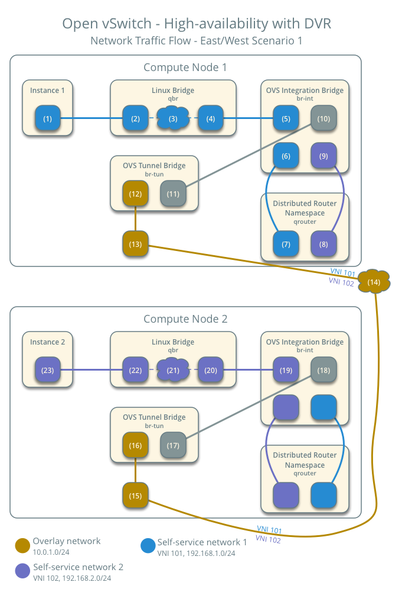

[toc]

# 目标

创建虚拟机(linux/windows)

# Openstack是什么

虚拟机级别虚拟化平台

开源的


**Compute**

NOVA		[Compute Service](https://www.openstack.org/software/releases/antelope/components/nova)

ZUN		[Containers Service](https://www.openstack.org/software/releases/antelope/components/zun)

**Hardware Lifecycle**

IRONIC		[Bare Metal Provisioning Service](https://www.openstack.org/software/releases/antelope/components/ironic)

CYBORG		[Lifecycle management of accelerators](https://www.openstack.org/software/releases/antelope/components/cyborg)

**Storage**

SWIFT		[Object store](https://www.openstack.org/software/releases/antelope/components/swift)

CINDER		[Block Storage](https://www.openstack.org/software/releases/antelope/components/cinder)

MANILA		[Shared filesystems](https://www.openstack.org/software/releases/antelope/components/manila)

**Networking**

NEUTRON		[Networking](https://www.openstack.org/software/releases/antelope/components/neutron)

OCTAVIA		[Load balancer](https://www.openstack.org/software/releases/antelope/components/octavia)

DESIGNATE		[DNS service](https://www.openstack.org/software/releases/antelope/components/designate)

**Shared Services**

KEYSTONE		[Identity service](https://www.openstack.org/software/releases/antelope/components/keystone)

PLACEMENT		[Placement service](https://www.openstack.org/software/releases/antelope/components/placement)

GLANCE		[Image service](https://www.openstack.org/software/releases/antelope/components/glance)

BARBICAN		[Key management](https://www.openstack.org/software/releases/antelope/components/barbican)

**Orchestration**

HEAT		[Orchestration](https://www.openstack.org/software/releases/antelope/components/heat)

SENLIN		[Clustering service](https://www.openstack.org/software/releases/antelope/components/senlin)

MISTRAL			[Workflow service](https://www.openstack.org/software/releases/antelope/components/mistral)

ZAQAR

[Messaging Service](https://www.openstack.org/software/releases/antelope/components/zaqar)

BLAZAR

[Resource reservation service](https://www.openstack.org/software/releases/antelope/components/blazar)

AODH

[Alarming Service](https://www.openstack.org/software/releases/antelope/components/aodh)

**Workload Provisioning**

MAGNUM

[Container Orchestration Engine Provisioning](https://www.openstack.org/software/releases/antelope/components/magnum)

SAHARA

[Big Data Processing Framework Provisioning](https://www.openstack.org/software/releases/antelope/components/sahara)

TROVE

[Database as a Service](https://www.openstack.org/software/releases/antelope/components/trove)

**Application Lifecycle**

MASAKARI

[Instances High Availability Service](https://www.openstack.org/software/releases/antelope/components/masakari)

MURANO

[Application Catalog](https://www.openstack.org/software/releases/antelope/components/murano)

SOLUM

[Software Development Lifecycle Automation](https://www.openstack.org/software/releases/antelope/components/solum)

FREEZER

[Backup, Restore, and Disaster Recovery](https://www.openstack.org/software/releases/antelope/components/freezer)

**API Proxies**

EC2API

[EC2 API proxy](https://www.openstack.org/software/releases/antelope/components/ec2api)

**Web frontends**

HORIZON

[Dashboard](https://www.openstack.org/software/releases/antelope/components/horizon)

SKYLINE

[Next generation dashboard (emerging technology)](https://www.openstack.org/software/releases/antelope/components/skyline)

## 核心

计算: Nova、Zun

网络: Neutron

## 服务端

依赖中间件: rabbitmq、memcached、mariadb

# 版本列表

https://releases.openstack.org

https://github.com/openstack/openstack-helm


当前选取版本: [2023.2 Bobcat](https://releases.openstack.org/bobcat/index.html)


# 计算

基于KVM

web-ui: Horizon


计算-nova概述				  https://docs.openstack.org/nova/latest/install/overview.html

网络-neutron				    https://docs.openstack.org/neutron/latest

OpenStack 架构设计指南		https://docs.openstack.org/arch-design/

OpenStack操作指南		 	https://docs.openstack.org/operations-guide/

OpenStack 网络指南			https://docs.openstack.org/ocata/networking-guide/


CPU和Memory可以过载, 完全耗光宿主机资源之后会通过OOM Killer回收资源

## 计算服务概述

使用 OpenStack Compute 托管和管理云计算系统。OpenStack 计算是基础设施即服务 (IaaS) 系统的主要部分。主要模块是用Python实现的。

OpenStack Compute 与 OpenStack Identity 进行交互以进行身份验证，与 OpenStack Placement 进行交互以进行资源库存跟踪和选择，与 OpenStack Image 服务进行交互以进行磁盘和服务器映像，以及与 OpenStack Dashboard 进行交互以用于用户和管理界面。图像访问受到项目和用户的限制；每个项目的配额是有限的（例如实例的数量）。OpenStack Compute 可以在标准硬件上水平扩展，并下载镜像来启动实例。

OpenStack 计算由以下区域及其组件组成：

- `nova-api`服务

  接受并响应最终用户计算 API 调用。该服务支持 OpenStack 计算 API。它执行一些策略并启动大多数编排活动，例如运行实例。

- `nova-api-metadata`服务

  接受来自实例的元数据请求。有关更多信息，请参阅 [元数据服务](https://docs.openstack.org/nova/latest/admin/metadata-service.html)。

- `nova-compute`服务

  一个工作守护进程，通过虚拟机管理程序 API 创建和终止虚拟机实例。例如：用于 KVM 或 QEMU 的 libvirt适用于 VMware 的 VMwareAPI处理相当复杂。基本上，守护进程接受队列中的操作并执行一系列系统命令，例如启动 KVM 实例并更新其在数据库中的状态。

- `nova-scheduler`服务

  从队列中获取虚拟机实例请求并确定其在哪个计算服务器主机上运行。

- `nova-conductor`模块

  调解`nova-compute`服务和数据库之间的交互。它消除了对服务进行的云数据库的直接访问 `nova-compute`。该`nova-conductor`模块水平缩放。但是，请勿将其部署在`nova-compute`运行服务的节点上。有关详细信息，请参阅[配置选项](https://docs.openstack.org/nova/latest/configuration/config.html)`conductor`中的部分 。

- `nova-novncproxy`守护进程

  提供用于通过 VNC 连接访问正在运行的实例的代理。支持基于浏览器的 novnc 客户端。

- `nova-spicehtml5proxy`守护进程

  提供用于通过 SPICE 连接访问正在运行的实例的代理。支持基于浏览器的 HTML5 客户端。

- 队列

  用于在守护进程之间传递消息的中央集线器。通常使用 [RabbitMQ](https://www.rabbitmq.com/)实现，但 [也可以使用其他选项](https://docs.openstack.org/oslo.messaging/latest/admin/drivers)。

- SQL数据库

  存储云基础设施的大多数构建时和运行时状态，包括：可用实例类型使用中的实例可用网络项目理论上，OpenStack Compute 可以支持 SQLAlchemy 支持的任何数据库。常见的数据库有用于测试和开发工作的 SQLite3、MySQL、MariaDB 和 PostgreSQL。


## 运行时目录

/var/lib/nova


## Nova系统架构

Nova 包含多个服务器进程，每个进程执行不同的操作 功能。面向用户的界面是 REST API，而内部 Nova 组件通过 RPC 消息传递机制进行通信。

API 服务器处理 REST 请求，通常涉及数据库 读/写，可选择将 RPC 消息发送到其他 Nova 服务， 并生成对 REST 调用的响应。 RPC 消息传递是通过 **oslo.messaging** 库完成的， 消息队列之上的抽象。 Nova 使用基于消息传递的“无共享”架构，并且大部分 主要的nova组件可以在多个服务器上运行，并且有一个管理器 正在监听 RPC 消息。 一个主要的例外是计算服务，其中单个进程运行在 它正在管理的虚拟机管理程序（使用 VMware 或 Ironic 驱动程序时除外）。 经理还可以选择执行定期任务。 有关我们的 RPC 系统的更多详细信息，请参阅[AMQP 和 Nova](https://docs.openstack.org/nova/latest/reference/rpc.html)。

Nova 使用传统的 SQL 数据库来存储信息。 这些（逻辑上）在多个组件之间共享。 为了帮助升级，通过对象层访问数据库，以确保 升级后的控制平面仍然可以与正在运行的计算节点通信 之前的版本。 为了实现这一点，在计算节点代理数据库上运行的服务 通过 RPC 向称为“conductor”的中央管理器发出请求。

为了水平扩展 Nova 部署，我们采用了部署分片 称为[细胞](https://docs.openstack.org/nova/latest/reference/glossary.html#term-Cell)的概念。 所有部署都至少包含一个单元。 有关详细信息，请参阅[单元 (v2)](https://docs.openstack.org/nova/latest/admin/cells.html)。

### 组件

下面您将找到关键组件的有用说明 典型的 Nova 部署。


- **DB**：用于数据存储的 SQL 数据库。
- **API**：接收 HTTP 请求、转换命令和 通过 **oslo.messaging** 队列或 HTTP 与其他组件通信。
- **调度程序**：决定哪个主机获取每个实例。
- **计算**：管理与虚拟机管理程序和虚拟机的通信。
- **Conductor**：处理需要协调（构建/调整大小）的请求，执行操作 作为数据库代理，或处理对象转换。
- **:placement-doc:`Placement <>`**：跟踪资源提供者库存并 用法。

### 虚拟机管理程序

Nova 通过 API 服务器控制虚拟机管理程序。选择最好的 使用虚拟机管理程序可能很困难，并且您必须考虑预算、资源 约束、支持的功能和所需的技术规范 帐户。然而，大多数 OpenStack 开发都是在系统上完成的 使用基于 KVM 的虚拟机管理程序。有关功能和详细列表 跨不同虚拟机管理程序的支持，请参阅[功能支持矩阵](https://docs.openstack.org/nova/latest/user/support-matrix.html)。

您还可以在不同的环境中使用多个虚拟机管理程序来编排云 可用区。 Nova 支持以下虚拟机管理程序：

- [裸机](https://docs.openstack.org/ironic/latest/)
- [超V](https://docs.microsoft.com/en-us/windows-server/virtualization/hyper-v/hyper-v-technology-overview)
- [基于内核的虚拟机 (KVM)](https://www.linux-kvm.org/page/Main_Page)
- [Linux 容器 (LXC)](https://linuxcontainers.org/)
- [快速模拟器 (QEMU)](https://wiki.qemu.org/Manual)
- [维图奥佐](https://www.virtuozzo.com/products/vz7.html)
- [VMware vSphere](https://www.vmware.com/support/vsphere-hypervisor.html)
- [zVM](https://www.ibm.com/it-infrastructure/z/zvm)

有关虚拟机管理程序的更多信息，请参阅 [虚拟机管理程序](https://docs.openstack.org/nova/latest/admin/configuration/hypervisors.html) Nova 配置参考中的部分。

### 项目、用户和角色

要开始使用 Nova，您必须创建一个用户 [身份服务](https://docs.openstack.org/keystone/latest/)。

Nova系统旨在以不同的形式供不同的消费者使用 共享系统上的项目以及基于角色的访问分配。角色控制 允许用户执行的操作。

项目是构成主体的独立资源容器 Nova 服务内的组织结构。它们通常包括 网络、卷、实例、映像、密钥和用户。用户可以 通过将 `project_id` 附加到其访问密钥来指定项目。

对于项目，您可以使用配额控制来限制处理器核心的数量 以及可以分配的 RAM 量。其他项目也允许配额 靠自己的资源。例如，[neutron](https://docs.openstack.org/neutron/latest//admin/ops-quotas.html) 允许您管理可以 在项目中创建。

角色控制允许用户执行的操作。默认情况下，大多数 操作不需要特定角色，但您可以通过编辑来配置它们 用户角色的 `policy.yaml` 文件。例如，可以定义一个规则 用户必须具有 `admin` 角色才能分配 公共IP地址。

项目限制用户对特定图像的访问。每个用户都被分配一个 用户名和密码。授予实例访问权限的密钥对已启用 每个用户，但设置配额，以便每个项目都可以控制资源 可用硬件资源的消耗。


 

笔记


早期版本的 OpenStack 使用术语 `tenant` 而不是 `project`。由于这个遗留术语，一些命令行工具使用 `--tenant_id` 您通常希望在其中输入项目 ID。

### 块存储

OpenStack 提供两类块存储： Nova 本身，以及由块存储服务 Cinder 管理的存储。

Nova 配置的块存储

Nova 提供了创建根磁盘和可选“临时”磁盘的功能 体积。根磁盘将始终存在，除非实例是 [从卷启动](https://docs.openstack.org/nova/latest/reference/glossary.html#term-Boot-From-Volume)实例。

根磁盘与实例关联，并且仅在实例的生命周期内存在 就这个例子。一般用于存放实例的根文件 系统，在来宾操作系统重新启动后仍然存在，并在 实例删除。根临时卷的数量由下式定义： 实例的风味。

除了根卷之外，口味还可以提供额外的 临时块设备。它被表示为一个原始块设备，没有 分区表或文件系统。云感知操作系统可以发现， 格式化并安装这样的存储设备。 Nova定义默认文件系统 适用于不同的操作系统，例如适用于 Linux 发行版的 ext4、适用于 VFAT 的 非 Linux 和非 Windows 操作系统，以及 Windows 的 NTFS。然而，它 可以配置其他文件系统类型。


 

笔记


例如，Ubuntu 库存中包含的 `cloud-init` 软件包 云镜像默认将此空间格式化为 ext4 文件系统，并且 将其安装在 `/mnt` 上。这是一个 cloud-init 功能，而不是 OpenStack 机制。 OpenStack 仅提供原始存储。

Cinder 配置的块存储

OpenStack 块存储服务 Cinder 提供持久卷， 由独立于任何设备的持久虚拟化块设备表示 特定实例。

持久卷可以由单个实例访问或附加到多个实例 实例。这种类型的配置需要传统的网络文件 系统允许多个实例访问持久卷。它也是 需要传统的网络文件系统，如 NFS、CIFS 或集群文件 系统，例如 Ceph。这些系统可以构建在 OpenStack 中 集群，或在集群外部配置，但 OpenStack 软件不提供 这些功能。

您可以将持久卷配置为可启动并使用它来提供 类似于传统的非基于云的持久虚拟实例 虚拟化系统。结果实例仍然有可能保留 临时存储，取决于所选的口味。在这种情况下，根 文件系统可以位于持久卷上，并且其状态得到维护，甚至 如果实例关闭。有关此类型的更多信息 配置，请参阅[块存储服务简介](https://docs.openstack.org/cinder/latest/configuration/block-storage/block-storage-overview.html)。

### 构建块

在 OpenStack 中，基本操作系统通常是从存储的映像中复制的 在OpenStack镜像服务中，一目了然。这是最常见的情况并且 产生一个从已知模板状态开始的短暂实例，并且 删除虚拟机时会丢失所有累积状态。也是可以的 将操作系统放置在 OpenStack 块中的持久卷上 仓储服务。这提供了一个更传统的持久系统 累积 OpenStack 块存储卷上保留的状态 跨越虚拟机的删除和重新创建。获取列表 系统上可用的图像，运行：

```
$ openstack image list
+--------------------------------------+-----------------------------+--------+
| ID                                   | Name                        | Status |
+--------------------------------------+-----------------------------+--------+
| aee1d242-730f-431f-88c1-87630c0f07ba | Ubuntu 14.04 cloudimg amd64 | active |
| 0b27baa1-0ca6-49a7-b3f4-48388e440245 | Ubuntu 14.10 cloudimg amd64 | active |
| df8d56fc-9cea-4dfd-a8d3-28764de3cb08 | jenkins                     | active |
+--------------------------------------+-----------------------------+--------+
```

显示的图像属性有：

- `ID`

  自动生成图像的UUID

- `Name`

  自由格式、人类可读的图像名称

- `Status`

  图像的状态。标记为 `ACTIVE` 的图像可供使用。

- `Server`

  对于作为运行实例的快照创建的映像，这是 快照派生的实例的 UUID。对于上传的图像，这 字段为空。

虚拟硬件模板称为`flavors`。默认情况下，这些是 由管理员用户配置，但是，可以通过重新定义来更改该行为 服务器上的访问控制`policy.yaml`。了解更多 信息，请参阅[Nova 政策](https://docs.openstack.org/nova/latest/configuration/policy.html)。`nova-api`

有关您的系统上可用的风味列表：

```
$ openstack flavor list
+-----+-----------+-------+------+-----------+-------+-----------+
| ID  | Name      |   RAM | Disk | Ephemeral | VCPUs | Is_Public |
+-----+-----------+-------+------+-----------+-------+-----------+
| 1   | m1.tiny   |   512 |    1 |         0 |     1 | True      |
| 2   | m1.small  |  2048 |   20 |         0 |     1 | True      |
| 3   | m1.medium |  4096 |   40 |         0 |     2 | True      |
| 4   | m1.large  |  8192 |   80 |         0 |     4 | True      |
| 5   | m1.xlarge | 16384 |  160 |         0 |     8 | True      |
+-----+-----------+-------+------+-----------+-------+-----------+
```

### Nova 服务架构

这些基本类别描述了服务架构和相关信息 云控制器。

API服务器

云框架的核心是 API 服务器，它使命令和 以编程方式控制虚拟机管理程序、存储和网络 给用户。

API端点是处理身份验证的基本HTTP Web服务， 使用各种 API 进行授权、基本命令和控制功能 Amazon、Rackspace 和相关模型下的接口。这将启用 API 与为交互而创建的多个现有工具集的兼容性 其他供应商的产品。这种广泛的兼容性可以防止供应商锁定。

消息队列

消息队列代理计算节点之间的交互（处理）， 网络控制器（控制网络基础设施的软件）， API端点，调度程序（确定分配给哪个物理硬件 虚拟资源）和类似的组件。与对方的通讯 云控制器通过多个 API 端点由 HTTP 请求处理。

典型的消息传递事件从 API 服务器接收请求开始 来自用户。 API 服务器对用户进行身份验证并确保他们是 允许发出主题命令。涉及对象的可用性 评估请求中的内容，如果可用，则将请求路由到 相关工作人员的排队引擎。工人们不断地倾听 基于其角色的队列，有时还基于其类型主机名。当 适用的工作请求到达队列，工作人员接受分配 任务并开始执行它。完成后，响应将发送至 API 服务器接收并中继到原始队列的队列 用户。数据库条目在必要时被查询、添加或删除 过程。

计算工作者

计算工作人员管理主机上的计算实例。 API 调度 计算工作人员完成这些任务的命令：

- 运行实例
- 删除实例（终止实例）
- 重启实例
- 附加卷
- 分离卷
- 获取控制台输出

网络控制器

网络控制器管理主机上的网络资源。这 API Server通过消息队列调度命令，分别是 随后由网络控制器处理。具体操作包括：

- 分配固定IP地址
- 为项目配置VLAN
- 为计算节点配置网络


### AMQP 和 Nova

AMQP 是 OpenStack 云选择的消息传递技术。 AMQP 代理（RabbitMQ 或 Qpid）位于任意两个 Nova 组件之间，并且 允许他们以松散耦合的方式进行通信。更准确地说，诺瓦 组件（OpenStack 的计算结构）使用远程过程调用 (RPC 下文）相互沟通；然而这样的范式是建立起来的 发布/订阅范式之上，以便可以实现以下好处 实现：

- 客户端和服务端解耦（比如客户端不需要 知道仆人的参考号在哪里）。
- 客户端和服务端之间完全不同步（例如客户端不同步） 需要servant在远程调用的同时运行）。
- 远程调用的随机平衡（例如，如果有更多仆人启动并且 正在运行的单向调用会透明地分派给第一个可用的 仆人）。

Nova 使用直接、扇出和基于主题的交换。架构看起来 如下图所示：

[](https://docs.openstack.org/nova/pike/_images/rpc-arch.png)

Nova 实现了 RPC（既是请求+响应，又是单向，分别昵称 `rpc.call` 和 `rpc.cast`）通过 AMQP 提供适配器类 负责将消息编组和解组到函数调用中。每个 Nova 服务（例如 Compute、Scheduler 等）在以下位置创建两个队列： 初始化时间，接受带有路由键的消息 `NODE-TYPE.NODE-ID`（例如`compute.hostname`）和另一个，其中 接受带有通用路由键的消息`NODE-TYPE`（例如 `compute`）。前者专门用于 Nova-API 需要重定向时 向特定节点发出命令，如 。在这种情况下， 仅主机管理程序正在运行虚拟机的计算节点 可以杀死实例。当 RPC 调用时，API 充当消费者 请求/响应，否则它仅充当发布者。`euca-terminate instance`

#### Nova RPC 映射[¶](https://docs.openstack.org/nova/pike/reference/rpc.html#nova-rpc-mappings)

下图展示了消息代理节点（简称消息代理节点）的内部结构 图中的 RabbitMQ 节点）当单个实例部署并共享时 OpenStack 云。每个 Nova 组件都连接到消息代理，并且， 取决于其个性（例如计算节点或网络节点）， 可以将队列用作 Invoker（例如 API 或 Scheduler）或 Worker （例如计算或网络）。 Invoker 和 Workers 实际上并不存在于 Nova 对象模型，但我们将使用它们作为抽象 明晰。 Invoker 是在队列系统中发送消息的组件 通过两个操作：1) `rpc.call` 和 ii) `rpc.cast`；工人是 从队列系统接收消息并做出相应回复的组件 `rpc.call` 操作。

图 2 显示了以下内部元素：

- 主题发布者

  当 `rpc.call` 或 `rpc.cast` 时，主题发布者就会诞生 操作被执行；该对象被实例化并用于推送消息 到排队系统。每个发布者始终连接到同一个 基于主题的交流；它的生命周期仅限于消息传递。

- 直接消费者

  直接消费者诞生当（且仅当）`rpc.call` 操作是 被处决；该对象被实例化并用于接收响应消息 从排队系统。每个消费者都连接到一个独特的直接基础 通过独特的独占队列进行交换；它的生命周期仅限于 消息传递；交换和队列标识符由 UUID 确定 生成器，并在主题发布者发送的消息中进行编组（仅 `rpc.call` 操作）。

- 主题消费者

  一旦 Worker 被实例化并存在，Topic Consumer 就会启动 整个生命周期；该对象用于接收来自 队列，它会调用 Worker 角色定义的适当操作。 A 主题消费者通过共享连接到相同的基于主题的交换 队列或通过唯一的独占队列。每个Worker有两个主题消费者， 仅在 `rpc.cast` 操作期间寻址（并且它连接到 一个共享队列，其交换密钥为 `topic`），另一个是 仅在 `rpc.call` 操作期间寻址（并且它连接到一个唯一的 交换密钥为 `topic.host` 的队列）。

- 直接出版商

  直接发布商仅在`rpc.call`操作期间生效，并且它 被实例化以返回请求/响应所需的消息 手术。该对象连接到一个基于直接的交换，其身份是 由传入消息决定。

- 话题交流

  Exchange 是存在于虚拟主机上下文中的路由表 （Qpid或RabbitMQ提供的多租户机制）；它的类型（例如 topic 与 direct）决定路由策略；消息代理节点将 Nova 中的每个主题只有一个基于主题的交换。

- 直接交换

  这是在`rpc.call`操作期间创建的路由表；那里 在整个生命周期中这种交换的例子有很多 消息代理节点，每个 `rpc.call` 调用一个。

- 队列元素

  队列是一个消息桶。消息将保留在队列中，直到消费者 （主题或直接消费者）连接到队列并获取它。队列 可以共享，也可以独占。路由键为 `topic` 的队列是 在具有相同性格的工人之间共享。

[](https://docs.openstack.org/nova/pike/_images/rpc-rabt.png)

#### RPC 调用[¶](https://docs.openstack.org/nova/pike/reference/rpc.html#rpc-calls)

下图显示了`rpc.call`操作期间的消息流：

1. 实例化一个Topic Publisher，将消息请求发送到队列中 系统;在发布操作之前，直接消费者是 实例化以等待响应消息。
2. 一旦消息被交换器发送，它就会被主题获取 消费者由路由键（例如“topic.host”）指定并传递给 负责该任务的工人。
3. 任务完成后，将分配直接发布者来发送 向排队系统响应消息。
4. 一旦消息被交换器分派，它就会被 Direct 获取。 消费者由路由键（例如`msg_id`）指定并传递给 调用者。

[](https://docs.openstack.org/nova/pike/_images/rpc-flow-1.png)

#### RPC 转换[¶](https://docs.openstack.org/nova/pike/reference/rpc.html#rpc-casts)

下图显示了`rpc.cast`操作期间的消息流：

1. 实例化一个Topic Publisher，将消息请求发送到队列中 系统。
2. 一旦消息被交换器发送，它就会被主题获取 消费者由路由键（例如“topic”）决定并传递给 负责这项任务的工人。

[](https://docs.openstack.org/nova/pike/_images/rpc-flow-2.png)

#### AMQP 代理负载[¶](https://docs.openstack.org/nova/pike/reference/rpc.html#amqp-broker-load)

在任何给定时间，运行 Qpid 或 Qpid 的消息代理节点的负载 RabbitMQ 是以下参数的函数：

- API调用吞吐量

  由服务提供的 API 调用数量（更准确地说`rpc.call` 操作） OpenStack 云规定了基于直接的交换、相关队列的数量 以及与之相关的直接消费者。

- 工人数量

  具有相同性格的工人共享一个队列；然而 有多少个worker就有多少个独占队列；的数量 工作人员还规定了基于主题的路由键的数量 交换，由所有工人共享。

下图显示了 Nova 组件启动后 RabbitMQ 节点的状态。 在测试环境中引导。 Nova 创建的交换器和队列 组成部分是：

- 交流
  1. nova（主题交换）
- 队列
  1. `compute.phantom`（`phantom` 是主机名）
  2. `compute`
  3. `network.phantom`（`phantom` 是主机名）
  4. `network`
  5. `scheduler.phantom`（`phantom` 是主机名）
  6. `scheduler`

[](https://docs.openstack.org/nova/pike/_images/rpc-state.png)

#### RabbitMQ 陷阱[¶](https://docs.openstack.org/nova/pike/reference/rpc.html#rabbitmq-gotchas)

Nova 使用 Kombu 连接到 RabbitMQ 环境。昆布是一条蟒蛇 反过来使用 AMQPLib 的库，AMQPLib 是一个实现标准 AMQP 的库 在撰写本文时为 0.8。使用 Kombu 时，调用者和工作人员需要 以下参数以便实例化连接的 Connection 对象 到 RabbitMQ 服务器（请注意，以下大部分材料都可以 也可在 Kombu 文档中找到；已经在这里总结和修改了 为了清楚起见）：

- `hostname`

  AMQP 服务器的主机名。

- `userid`

  用于向服务器进行身份验证的有效用户名。

- `password`

  用于向服务器进行身份验证的密码。

- `virtual_host`

  要使用的虚拟主机的名称。该虚拟主机必须存在于 服务器，并且用户必须有权访问它。默认为“/”。

- `port`

  AMQP 服务器的端口。默认为 `5672` (amqp)。

以下参数为默认值：

- `insist`

  坚持连接到服务器。在具有多个的配置中 负载共享服务器，Insist 选项告诉服务器客户端正在 坚持连接到指定的服务器。默认值为 False。

- `connect_timeout`

  客户端放弃与服务器的连接之前的超时时间（以秒为单位）。 默认是没有超时的。

- `ssl`

  使用 SSL 连接到服务器。默认值为 False。

更准确地说，消费者需要以下参数：

- `connection`

  上面提到的Connection对象。

- `queue`

  队列的名称。

- `exchange`

  队列绑定到的交换的名称。

- `routing_key`

  路由键的解释取决于 `exchange_type` 属性。直接兑换如果消息的路由键属性和 `routing_key` 属性 队列相同，则将消息转发到该队列。扇出交换消息被转发到绑定交换器的队列，即使 绑定没有密钥。话题交流如果消息的路由键属性与消息的路由键匹配 根据原始模式匹配方案的密钥，则消息是 转发到队列。消息路由键由单词组成 用点分隔（`.`，如域名）和两个特殊字符 可用；星号 (`*`) 和哈希 (`#`)。星星与任何单词匹配， 并且哈希匹配零个或多个单词。例如 `.stock.#` 匹配 路由键 `usd.stock` 和 `eur.stock.db` 但不是 `stock.nasdaq`。

- `durable`

  该标志决定了交换器和队列的持久性；耐用的 当 RabbitMQ 服务器重新启动时，交换和队列保持活动状态。 非持久交换/队列（瞬态交换/队列）在以下情况下被清除： 服务器重新启动。值得注意的是，AMQP指定持久队列 无法绑定到瞬态交换。默认为 True。

- `auto_delete`

  如果设置，则当所有队列都使用完交换器后，交换器将被删除。 默认值为 False。

- `exclusive`

  独占队列（例如非共享队列）只能由 当前连接。当独占打开时，这也意味着 `auto_delete`。 默认值为 False。

- `exchange_type`

  AMQP 定义了几种默认交换类型（路由算法），涵盖 大多数常见的消息传递用例。

- `auto_ack`

  收到消息后会自动处理确认。经过 默认`auto_ack`设置为False，需要接收者手动 处理确认。

- `no_ack`

  它禁用服务器端的确认。这不同于 `auto_ack` 确认已完全关闭。这 功能提高了性能，但以可靠性为代价。留言 如果客户端在将它们传递给应用程序之前死亡，则可能会迷失方向。

- `auto_declare`

  如果这是 True 并且设置了交换名称，则交换将是 在实例化时自动声明。默认情况下自动声明处于启用状态。

发布者指定了消费者的大部分参数（比如他们不 指定队列名称），但他们还可以指定以下内容：

- `delivery_mode`

  用于消息的默认传送模式。该值为整数。这 RabbitMQ 支持以下交付模式：`1`（短暂的）该消息是暂时的。这意味着它仅存储在内存中，并且是 如果服务器死机或重新启动，则会丢失。`2`（执着的）该消息是持久的。这意味着消息同时被存储 内存中和磁盘上，因此如果服务器死机或 重新启动。

默认值为`2`（持久）。在发送操作期间，发布者 可以覆盖消息的传递模式，例如，瞬态 消息可以通过持久队列发送。

# 存储

## 磁盘评估

IOPS

顺序/随机读写性能要求: 读写延迟

存储拓展

性价比

冷热分离


## 存储架构

物理机系统盘 raid-1

物理机数据盘 raid-5

物理机数据盘-裸盘


业务特点: 读多vs写多? 能否容忍延迟? 上层业务能否做高可用冗余?


|                 | 临时存储                           | 块存储                                                       | 对象存储                   | 共享文件系统存储                                             |
| :-------------- | :--------------------------------- | :----------------------------------------------------------- | :------------------------- | :----------------------------------------------------------- |
| 应用            | 运行操作系统和暂存空间             | 向虚拟机 (VM) 添加额外的持久存储                             | 存储数据，包括虚拟机镜像   | 向虚拟机添加额外的持久存储                                   |
| 通过…访问       | 一个文件系统                       | 可分区、格式化、挂载的块设备（如/dev/vdc）                   | 其余 API                   | 一种可以分区、格式化和挂载的共享文件系统服务共享（马尼拉管理的或在马尼拉注册的外部共享）（例如 /dev/vdc） |
| 可从…           | 在虚拟机内                         | 在虚拟机内                                                   | 任何地方                   | 在虚拟机内                                                   |
| 由…管理         | OpenStack 计算 (nova)              | OpenStack 块存储（cinder）                                   | OpenStack 对象存储 (swift) | OpenStack 共享文件系统存储（马尼拉）                         |
| 持续到……        | 虚拟机已终止                       | 已被用户删除                                                 | 已被用户删除               | 已被用户删除                                                 |
| 尺寸决定于...   | 大小设置的管理员配置，称为*口味*   | 初始请求中的用户规范                                         | 可用物理存储量             | 初始请求中的用户规范延期请求可用的用户级报价管理员施加的限制 |
| 加密配置        | 参数输入`nova.conf`                | 管理员建立[加密卷类型](https://docs.openstack.org/admin-guide/dashboard-manage-volumes.html)，然后用户选择加密卷 | 尚不可用                   | 共享文件系统服务不会应用超出共享后端存储提供的任何额外加密   |
| 典型用法示例... | 第一个磁盘 10 GB，第二个磁盘 30 GB | 1TB磁盘                                                      | 数十 TB 的数据集存储       | 完全取决于创建共享时指定的后端存储的大小。在精简配置的情况下，它可以是部分空间预留（有关更多详细信息，请参阅 [功能和额外规格](https://docs.openstack.org/manila/latest/contributor/capabilities_and_extra_specs.html#common-capabilities) 规范） |


实现方式:

​	ceph: 分布式 rdb块存储、fs文件存储、rgw对象存储

​	openebs: 本地lvm块存储


优化:

​	可以通过额外副本提高读取速度, 降低写入速度, 降低集群容量率

# 网络

VLAN

VXLAN

以太网L2物理链路层mac

IP段子网, ARP

DHCP

IP

IP协议: TCP/UDP/ICMP

DNS

NTP


MTU

VRRP/DVR

## 概述

OpenStack Networking (neutron) 允许您创建和附加接口 由其他 OpenStack 服务管理的网络设备。插件可以 实施以适应不同的网络设备和软件， 为 OpenStack 架构和部署提供灵活性。

它包括以下组件：

- API服务器

  接受 API 请求并将其路由到适当的 OpenStack 用于操作的网络插件。

  OpenStack 网络 API 包括对第 2 层网络的支持 和 IP 地址管理 (IPAM)，以及第 3 层的扩展 支持第 2 层网络和网关之间路由的路由器结构 到外部网络。 OpenStack 网络包括越来越多的 插件可实现与各种商业和开放的互操作性 源网络技术，包括路由器、交换机、虚拟化 交换机和软件定义网络 (SDN) 控制器。

- OpenStack 网络插件和代理

  插拔端口、创建网络或子网并提供 IP 寻址。这些插件和代理根据具体情况而有所不同 特定云中使用的供应商和技术。开放堆栈 网络附带了用于思科虚拟和网络的插件和代理。 物理交换机、NEC OpenFlow 产品、Open vSwitch、Linux 桥接、开放虚拟网络 (OVN) 和 VMware NSX 产品。常见的代理有L3（三层）、DHCP（动态主机IP 寻址）和插件代理。

- 消息队列

  大多数 OpenStack 网络安装使用它来路由信息 中子服务器和各种代理之间。也充当数据库 存储特定插件的网络状态。

  接受代理之间的 RPC 请求并进行路由以完成 API 操作。 ML2插件中使用消息队列进行neutron之间的RPC ML2 中每个虚拟机管理程序上运行的服务器和 neutron 代理 Open vSwitch 和 Linux 桥的机制驱动程序。

OpenStack Networking主要与OpenStack Compute交互以提供 其实例的网络和连接。

## 概念

OpenStack Networking (neutron) 管理所有网络方面 虚拟网络基础设施 (VNI) 和接入层方面 OpenStack 中的物理网络基础设施 (PNI) 环境。 OpenStack Networking 使项目能够创建先进的 虚拟网络拓扑，其中可能包括诸如 防火墙和虚拟专用网络 (VPN)。

网络提供网络、子网和路由器作为对象抽象。 每个抽象都具有模仿其物理对应物的功能： 网络包含子网，路由器在不同子网之间路由流量 子网和网络。

任何给定的网络设置都至少有一个外部网络。不像 与其他网络相比，外部网络不仅仅是一个虚拟网络 定义的网络。相反，它代表了一个切片的视图 OpenStack 外部可访问的物理外部网络 安装。外部网络上的IP地址可以通过以下方式访问 物理上位于外部网络上的任何人。

除了外部网络之外，任何网络设置还具有一个或多个 内部网络。这些软件定义的网络直接连接到 虚拟机。仅任何给定内部网络或子网上的虚拟机 通过接口连接到类似的路由器，可以访问连接的虚拟机 直接连接到该网络。

对于外部网络访问虚拟机，反之亦然，之间的路由器 需要网络。每台路由器都有一个连接的网关 到外部网络以及一个或多个连接到内部网络的接口 网络。与物理路由器一样，子网可以访问其他计算机上的计算机 连接到同一路由器的子网，机器可以访问 外部网络通过路由器的网关。

此外，您还可以将外部网络上的 IP 地址分配给 内部网络上的端口。每当某物连接到 子网，该连接称为端口。您可以关联外部 带有虚拟机端口的网络 IP 地址。这样，实体上 外部网络可以访问虚拟机。

网络还支持*安全组*。安全组启用 管理员可以分组定义防火墙规则。虚拟机可以属于 一个或多个安全组，并且网络应用这些规则 用于阻止或取消阻止端口、端口范围或流量类型的安全组 对于该虚拟机。

Networking 使用的每个插件都有自己的概念。虽然不重要 操作VNI和OpenStack环境，了解这些 概念可以帮助您建立网络。所有网络安装 使用核心插件和安全组插件（或仅使用 No-Op 安全组插件）。此外，防火墙即服务 (FWaaS) 可用。

要配置丰富的网络拓扑，您可以创建和配置网络 和子网并指示其他 OpenStack 服务（例如计算）附加 虚拟设备到这些网络上的端口。 OpenStack Compute 是 OpenStack Networking 的重要消费者，提供 其实例的连接性。 特别是，OpenStack Networking 支持每个项目拥有多个 专用网络并使项目能够选择自己的 IP 寻址方案， 即使这些 IP 地址与其他项目使用的 IP 地址重叠。那里 有两种类型的网络：项目网络和提供商网络。有可能 作为网络的一部分在项目之间共享任何这些类型的网络 创作过程。

### 提供商网络(Linux 桥)

提供商网络提供与可选实例的第 2 层连接 支持 DHCP 和元数据服务。这些网络连接或映射到 数据中心现有的第 2 层网络，通常使用 VLAN (802.1q) 标记以识别和分离它们。

提供商网络通常提供简单性、性能和可靠性 以灵活性为代价。默认情况下，只有管理员可以创建或 更新提供商网络，因为它们需要配置物理 网络基础设施。可以更改允许的用户 使用以下参数创建或更新提供商网络 `policy.yaml`：

- `create_network:provider:physical_network`
- `update_network:provider:physical_network`

警告

提供商网络的创建和修改使得能够使用 物理网络资源，例如 VLAN。启用这些更改 仅适用于受信任的项目。

此外，提供商网络仅处理实例的第 2 层连接，因此 缺乏对路由器和浮动 IP 地址等功能的支持。

在许多情况下，已经熟悉虚拟网络的运营商 依赖于第 2 层物理网络基础设施的架构， 第三层或其他服务可以无缝部署OpenStack网络 服务。特别是，提供商网络对寻求以下服务的运营商具有吸引力： 从计算网络服务 (nova-network) 迁移到 OpenStack 网络服务。随着时间的推移，运营商可以在这个最小的基础上进行构建 架构以启用更多云网络功能。

一般来说，处理第 3 层的 OpenStack 网络软件组件 操作对性能和可靠性影响最大。提高性能 和可靠性，提供商网络将第 3 层操作转移到物理层 网络基础设施。

在一个特定的用例中，OpenStack 部署驻留在混合环境中 具有传统虚拟化和裸机主机的环境 规模庞大的物理网络基础设施。在内部运行的应用程序 OpenStack 部署可能需要直接第 2 层访问，通常使用 VLAN，用于部署之外的应用程序。


### 路由提供商网络

路由提供商网络提供到实例的第 3 层连接。这些 网络映射到数据中心现有的第 3 层网络。更多的 具体来说，网络映射到多个第 2 层段，每个段都是 本质上是一个提供商网络。每个都有一个连接到它的路由器网关 在它们之间和外部之间路由流量。网络服务不 提供路由。

路由提供商网络提供难以企及的大规模性能 通过普通提供商网络实现，但以保证第 2 层为代价 连接性。

Neutron 端口只能与一个网段关联， 但 OVN 分布式服务（例如 OVN 元数据）有一个例外。

请参阅[路由提供商网络](https://docs.openstack.org/neutron/latest/admin/config-routed-networks.html#config-routed-provider-networks)了解更多信息。


在路由提供商网络之前，网络服务无法提供 多段第 3 层网络作为单个实体。因此，每个操作员通常 选择以下架构之一：

- 单一大二层网络
- 多个较小的二层网络

单个大型第 2 层网络在规模上变得复杂并涉及大量 故障域。

多个较小的第 2 层网络可以更好地扩展并缩小故障域，但是 将网络选择留给用户。无需额外信息，用户 无法轻易地区分这些网络。

路由提供商网络使单个提供商网络能够代表 多个第 2 层网络（广播域）或分段，并启用 运营商向用户呈现一个网络。然而，特定的IP 实例可用的地址取决于网络段 在特定计算节点上可用。中子端口可以关联 只有一个网段，但OVN分布式除外 OVN 元数据等服务。

与传统网络类似，第 2 层（交换）处理数据传输 同一网段上的端口之间的流量和第 3 层（路由）句柄 段之间的流量传输。

每个网段至少需要一个明确属于该网段的子网 部分。网段和子网之间的关联区分了 来自其他类型网络的路由提供商网络。网络服务 强制特定网络上的零个或所有子网关联 与一段。例如，尝试创建没有网段的子网 在包含带段的子网的网络上会生成错误。

网络服务不提供网段之间的第 3 层服务。 相反，它依赖物理网络基础设施来路由子网。 因此，网络服务和物理网络基础设施都必须 包含路由提供商网络的配置，类似于传统的 提供商网络。未来动态路由协议的实现 可以简化路由网络的配置。

#### 先决条件

与传统网络相比，路由提供商网络需要额外的先决条件 提供商网络。我们建议使用以下过程：

1. 从片段开始。网络服务使用以下方式定义一个段： 以下组件：

   - 唯一的物理网络名称
   - 分段类型
   - 分段ID

   例如，`provider1`、`VLAN` 和 `2016`。请参阅 [API 参考](https://docs.openstack.org/api-ref/network/v2/#segments) 了解更多信息。

   在网络中，为每个网段使用唯一的物理网络名称 允许在子网之间重用相同的分段详细信息。为了 例如，在特定的所有网段中使用相同的 VLAN ID 提供商网络。与传统的提供商网络类似，运营商 必须相应地配置第 2 层物理网络基础设施。

2. 实现段之间的路由。

   网络服务不提供网段之间的路由。这 运营商必须在提供商网络的各个网段之间实现路由。 网段上的每个子网都必须包含该网段的网关地址 该特定子网上的路由器接口。例如：

   | 部分 | 版本 | 地址                 | 网关               |
   | :--- | :--- | :------------------- | :----------------- |
   | 段1  | 4    | 203.0.113.0/24       | 203.0.113.1        |
   | 段1  | 6    | fd00:203:0:113::/64  | fd00:203:0:113::1  |
   | 段2  | 4    | 198.51.100.0/24      | 198.51.100.1       |
   | 段2  | 6    | fd00:198:51:100::/64 | fd00:198:51:100::1 |

3. 将段映射到计算节点。

   路由提供商网络意味着计算节点驻留在不同的 段。运营商必须确保每台计算主机 参与路由器提供商网络可以直接连接到一个路由器提供商网络 其细分市场。

   | 主持人   | 架子  | 物理网络 |
   | :------- | :---- | :------- |
   | 计算0001 | 机架1 | 分段 1   |
   | 计算0002 | 机架1 | 分段 1   |
   | ……       | ……    | ……       |
   | 计算0101 | 机架2 | 分段2    |
   | 计算0102 | 机架2 | 分段2    |
   | 计算0102 | 机架2 | 分段2    |
   | ……       | ……    | ……       |

4. 部署 DHCP 代理。

   与传统的提供商网络不同，DHCP 代理无法支持更多 比网络中的一个网段。运营商必须至少部署一个 每个网段的 DHCP 代理。考虑在计算节点上部署 DHCP 代理 包含要减少的段而不是一个或多个网络节点 节点数。

   | 主持人   | 架子  | 物理网络 |
   | :------- | :---- | :------- |
   | 网络0001 | 机架1 | 分段 1   |
   | 网络0002 | 机架2 | 分段2    |
   | ……       | ……    | ……       |

5. 配置网络服务与计算的通信 调度程序。

   具有路由提供程序中具有 IPv4 地址的接口的实例 网络必须由计算调度程序放置在有权访问的主机中 具有可用 IPv4 地址的网段。为了使这成为可能， 网络服务将库存信息传达给计算调度程序 与路由提供商网络的每个网段关联的 IPv4 地址。 操作员必须配置身份验证凭据 网络服务将用于与计算调度程序进行通信 放置 API。请参阅下面的示例配置。

   笔记

   网络服务和计算调度程序之间的协调是 由于地址较大，因此对于 IPv6 子网来说不是必需的 空间。

   笔记

   网络服务和计算调度程序之间的协调 需要以下最低 API 微版本。

   - 计算服务API：2.41
   - 放置API：1.1

### 自助服务网络

自助服务网络主要支持一般（非特权）项目 无需管理员参与即可管理网络。这些网络是 完全虚拟，需要虚拟路由器与提供商交互 以及外部网络，例如互联网。还有自助服务网络 通常为实例提供 DHCP 和元数据服务。

大多数情况下，自助服务网络使用 VXLAN 等覆盖协议 或 GRE，因为它们可以支持比第 2 层分段更多的网络 使用 VLAN 标记 (802.1q)。此外，VLAN 通常需要额外的 物理网络基础设施的配置。

IPv4 自助服务网络通常使用私有 IP 地址范围 (RFC1918) 并通过虚拟路由器上的源 NAT 与提供商网络交互。 浮动 IP 地址允许从提供商网络访问实例 通过虚拟路由器上的目标 NAT。 IPv6自助服务网络始终 使用公共 IP 地址范围并通过以下方式与提供商网络交互 具有静态路由的虚拟路由器。

网络服务使用第 3 层代理来实现路由器，该代理通常 驻留在至少一个网络节点。与连接的提供商网络相反 第 2 层物理网络基础设施的实例，自助服务 网络必须经过第 3 层代理。因此，超额认购或失败 第 3 层代理或网络节点的影响可能会影响大量的 自助服务网络和使用它们的实例。考虑实施一项或 更多高可用性功能可提高冗余和性能 的自助服务网络。

用户创建项目网络以实现项目内的连接。默认情况下， 它们是完全隔离的，不与其他项目共享。开放堆栈 网络支持以下类型的网络隔离和覆盖 技术。

- 平坦的

  所有实例都位于同一网络上，也可以共享 与主人。不会发生 VLAN 标记或其他网络隔离。

- 虚拟局域网

  网络允许用户创建多个提供商或项目网络 使用与存在于网络中的 VLAN 对应的 VLAN ID（802.1Q 标记） 物理网络。这允许实例相互通信 跨越环境。他们还可以与专用服务器通信， 防火墙和同一第 2 层 VLAN 上的其他网络基础设施。

- GRE 和 VXLAN

  VXLAN 和 GRE 是创建覆盖网络的封装协议 激活和控制计算实例之间的通信。 A 需要网络路由器来允许流量流向外部 GRE 或 VXLAN 项目网络。还需要路由器才能连接 与外部网络直接连接的项目网络，包括 互联网。路由器提供直接连接实例的能力 来自使用浮动 IP 地址的外部网络。

[](https://docs.openstack.org/neutron/latest/_images/NetworkTypes.png)


#### 子网

IP 地址块和关联的配置状态。这 也称为本机 IPAM（IP 地址管理），由 项目和提供商网络的网络服务。 当在某个网络上创建新端口时，子网用于分配 IP 地址 网络。


服务子网使运营商能够为每个子网定义有效的端口类型 网络上的子网，无需将网络限制为一个子网或手动 创建具有特定子网 ID 的端口。使用此功能，运营商 可以确保实例和路由器接口的端口，例如， 始终使用不同的子网。

##### 操作

为特定网络上的一个或多个子网定义一种或多种服务类型 网络。每个服务类型必须对应于有效的设备所有者 端口模型以便使用它。

在 IP 分配期间，[IPAM](https://docs.openstack.org/neutron/latest/admin/config-ipam.html#config-ipam) 驱动程序返回一个 来自服务类型与端口设备匹配的子网的地址 所有者。如果没有子网匹配，或者所有匹配的子网都缺少可用的 IP 地址，IPAM 驱动程序尝试使用没有任何服务的子网 类型以保持兼容性。如果网络上的所有子网都有 服务类型，IPAM 驱动程序无法保持兼容性。然而，这 该功能可通过匹配设备从子网进行严格的 IP 分配 所有者。如果多个子网包含相同的服务类型，或者一个子网 如果不存在服务类型，IPAM 驱动程序会选择第一个子网 具有匹配的服务类型。例如浮动IP代理网关端口 使用以下选择过程：

- `network:floatingip_agent_gateway`
- `None`

笔记

设备所有者的端口`network:dhcp`不受上述 IPAM 的约束 `dhcp_enabled` 设置为 `True` 的子网逻辑。这保留了 启用 DHCP 的子网的现有自动 DHCP 端口创建行为。

创建或更新具有特定子网的端口会跳过此选择 处理并显式使用给定的子网。

##### 子网加入(扩展)

子网板载功能允许您采用已添加的现有子网 在子网池外部创建并将它们移动到现有子网池中。 这使您能够开始使用子网池和地址范围（如果您还没有） 从子网池中分配现有子网。它还可以让你移动 子网池之间的各个子网，并通过扩展，在之间移动它们 地址范围。

##### 工作原理

子网池的基本约束之一是所有子网 网络上相同的地址族（IPv4、IPv6）必须从 同一子网池。由于此限制，必须移动子网， 或“加入”，作为网络级别的一个组进入子网池，而不是 单独处理。因此，子网的加入需要用户 提供与板载子网关联的网络的 UUID， 以及执行操作的目标子网池的 UUID。

#### 子网池

最终用户通常可以使用任何有效的 IP 地址创建子网，而无需其他 限制。然而，在某些情况下，这对管理员或项目来说是件好事 预先定义一个地址池，从中自动创建子网 分配。

使用子网池限制了可以使用的地址 每个子网都在定义的池内。它还可以防止地址重用或 同一池中的两个子网重叠。

请参阅[子网池](https://docs.openstack.org/neutron/latest/admin/config-subnet-pools.html#config-subnet-pools)了解更多信息。


自 Kilo 版本以来，子网池已可用。这是一个简单的 该功能有可能大大改善您的工作流程。它也是 提供了一个构建块，可以从中构建其他新功能 OpenStack 网络。

要查看您的云是否具有此功能，您可以检查它是否可用 在支持的别名中列出。您可以使用 OpenStack 客户端来执行此操作。

```
$ openstack extension list | grep subnet_allocation
| Subnet Allocation | subnet_allocation | Enables allocation of subnets
from a subnet pool                                                                                                         |
```

##### 为什么需要它们

在 Kilo 之前，Networking 没有围绕用于创建网络的地址进行自动化。 子网。要创建一个，您必须自己想出地址 无需系统的任何帮助。这有有效的用例，但如果您 对以下功能感兴趣，那么子网池可能适用于 你。

首先，如果您可以将地址池移交给 中子要照顾吗？当您需要创建子网时，您只需要求 从池中分配的地址。您不必担心什么 您已经使用过以及您的池中有哪些地址。子网池可以做 这。

其次，子网池可以跨项目管理地址。地址是 保证不重叠。如果地址来自外部可路由 池，那么您就知道所有项目都有地址*可路由* 和独特的。这在以下场景中非常有用。

1. 自 OpenStack Networking 起，IPv6 就没有 IPv6 浮动 IP。
2. 从外部网络直接路由到项目网络。

##### 它们如何工作

子网池管理可从中分配子网的地址池。 它确保从分配的任何两个子网之间不存在重叠 同一个泳池。

作为 OpenStack 云中的常规项目，您可以创建一个子网池 您自己的并用它来管理您自己的地址池。这不需要 任何管理员权限。您的池对任何其他项目都不可见。

如果您是管理员，您可以创建一个可供任何常规人员访问的池 项目。作为共享资源，有配额机制进行仲裁 使用权。

##### 配额

子网池有一个配额系统，与 Neutron 中的其他配额。中子计数离散中的其他配额 针对配额的对象实例。每次你创造一些东西 就像路由器、网络或端口一样，它使用您总配额中的一个。

对于子网，资源就是 IP 地址空间。某些子网采用 比其他人更多。例如，203.0.113.0/24使用256个地址 在一个子网中，但 198.51.100.224/28 仅使用 16 个。如果地址空间为 在有限的情况下，配额制度可以鼓励空间的有效利用。

对于 IPv4，default_quota 可以设置为绝对数量 地址允许任何给定项目从池中使用。为了 例如，配额为 128，我可能会得到 203.0.113.128/26， 203.0.113.224/28，并且仍有空间分配另外 48 个地址 未来。

对于 IPv6，情况略有不同。计算起来不太实际 个人地址。为了避免数量过大，配额是 以可分配的 /64 子网数量表示。为了 例如，如果 default_quota 为 3，我可能会得到 2001:db8:c18e:c05a::/64， 2001:db8:221c:8ef3::/64，并且仍有空间再分配一个前缀 将来。


#### 端口

端口是用于连接单个设备（例如 NIC）的连接点 虚拟服务器到虚拟网络。该端口还描述了 相关的网络配置，例如 MAC 和 IP 地址 在该端口上使用。

#### 路由器

路由器提供路由、NAT等虚拟三层服务 自助服务和提供商网络之间或自助服务之间 属于一个项目的网络。网络服务使用 第三层代理通过命名空间管理路由器。

#### 安全组

安全组为虚拟防火墙规则提供了一个容器，用于控制 入口（实例入站）和出口（实例出站）网络 端口级别的流量。安全组使用默认拒绝策略 仅包含允许特定流量的规则。每个端口可以引用一个 或以附加方式添加更多安全组。防火墙驱动程序 将安全组规则转换为底层数据包的配置 过滤技术，例如`iptables`。

每个项目都包含一个`default` 安全组，默认情况下允许所有项目 出口流量并拒绝所有入口流量。您可以更改规则 `default` 安全组。管理员用户还可以定义自己的一组安全组 默认情况下将添加到每个新的 `default` 和每个新的非规则 为云中的每个项目创建默认（自定义）安全组。有 `security-group-default-rules` API 扩展允许定义这样自己的 默认安全组规则集。 如果您在未指定安全组的情况下启动实例，`default` 安全组会自动应用于它。同样，如果您创建一个端口 如果不指定安全组，则 `default` 安全组 自动应用到它。

笔记

如果您使用元数据服务，则删除默认出口规则会拒绝 访问 169.254.169.254 上的 TCP 端口 80，从而防止实例 检索元数据。

安全组规则是有状态的。因此，允许入口 TCP 端口 22 安全 shell 自动创建允许返回出口流量的规则 以及涉及这些 TCP 连接的 ICMP 错误消息。

默认情况下，所有安全组都包含一系列基本（理智）和 执行以下操作的反欺骗规则：

- 仅在使用源 MAC 和 IP 地址时才允许出口流量 实例的端口、源 MAC 和 IP 组合 `allowed-address-pairs`，或有效的 MAC 地址（端口或 `allowed-address-pairs`）和关联的 EUI64 链路本地 IPv6 地址。
- 允许使用源 MAC 的出口 DHCP 发现和请求消息 实例的端口地址和未指定的 IPv4 地址 (0.0.0.0)。
- 允许来自 DHCP 服务器的入口 DHCP 和 DHCPv6 响应 子网，以便实例可以获得 IP 地址。
- 拒绝出口 DHCP 和 DHCPv6 响应以防止实例 充当 DHCP(v6) 服务器。
- 允许入口/出口 ICMPv6 MLD、邻居请求和邻居 发现消息，以便实例可以发现邻居并加入 多播组。
- 拒绝出口 ICMPv6 路由器通告以防止实例运行 作为 IPv6 路由器并为其他实例转发 IPv6 流量。
- 允许出口 ICMPv6 MLD 报告（v1 和 v2）和邻居请求 使用特定实例的源 MAC 地址的消息以及 未指定的 IPv6 地址 (::)。重复地址检测 (DAD) 依赖于 关于这些消息。
- 允许来自端口 MAC 地址的传出非 IP 流量 实例和 `allowed-address-pairs` 上的任何其他 MAC 地址 实例的端口。

上面提到的那些规则是neutron自动添加的，不能被修改 使用 API 提供的更改 扩展。`default security group rules``security-group-default-rules`

尽管是非 IP 流量，安全组并不隐式允许所有 ARP 交通。单独的 ARP 过滤规则可防止实例使用 ARP 拦截另一个实例的流量。您无法禁用或删除 这些规则。

您可以禁用安全组，包括基本规则和反欺骗规则 将端口属性 `port_security_enabled` 设置为 `False`。

#### 扩展

OpenStack 网络服务是可扩展的。扩展服务两个 目的：它们允许在 API 中引入新功能 无需更改版本，并且它们允许引入 供应商特定的利基功能。应用程序可以通过编程方式 通过执行 GET 来列出可用的扩展 `/extensions` URI。请注意，这是一个版本控制的请求；那 也就是说，某个 API 版本中可用的扩展可能不可用 在另一个。

#### DHCP

可选的 DHCP 服务管理提供商实例的 IP 地址 和自助服务网络。网络服务实现 DHCP 使用管理 `qdhcp` 命名空间和 `dnsmasq`服务。

#### 元数据

可选的元数据服务提供API供实例获取 元数据，例如 SSH 密钥。


## 介绍

OpenStack 网络服务 (neutron) 提供允许用户设置和定义网络连接的 API 并在云端寻址。网络服务的项目代号是 中子。 OpenStack Networking 处理虚拟网络的创建和管理 网络基础设施，包括网络、交换机、子网和 由 OpenStack 计算服务管理的设备的路由器 （新星）。高级服务，例如防火墙或虚拟专用网络 (VPN) 也可以使用。

OpenStack Networking 由 neutron-server 组成，它是一个数据库 持久存储和任意数量的插件代理，它们提供 其他服务，例如与本机 Linux 网络的接口 机制、外部设备或 SDN 控制器。

OpenStack 网络是完全独立的，可以部署到 专用主机。如果您的部署使用控制器主机来运行 集中计算组件，可以部署网络服务器 改为该特定主机。

OpenStack Networking 与各种 OpenStack 集成 成分：

- OpenStack Identity 服务（keystone）用于身份验证 以及 API 请求的授权。
- OpenStack计算服务（nova）用于插入每个虚拟 VM 上的 NIC 连接到特定网络。
- OpenStack Dashboard (horizon) 供管理员使用 和项目用户通过基于网络的创建和管理网络服务 图形界面。


## 服务和组件层次结构

### 服务器

- 提供API、管理数据库等

### 插件

- 管理代理商

### 代理

- 提供到实例的第 2/3 层连接
- 处理物理-虚拟网络过渡
- 处理元数据等。

#### 第 2 层（以太网和交换）

- Linux桥
- OVS

#### 第 3 层（IP 和路由）

- L3
- 动态主机配置协议

#### 其他

- 元数据

### 服务

#### 路由服务

#### VPNaaS

虚拟专用网络即服务 (VPNaaS) 是一个中子 引入 VPN 功能集的扩展。

#### LBaaS

负载均衡器即服务 (LBaaS) API 提供和配置 负载平衡器。参考实现基于HAProxy 软件负载平衡器。请参阅[Octavia 项目](https://docs.openstack.org/octavia/latest/)了解更多信息。

#### FWaaS

防火墙即服务 (FWaaS) 插件将防火墙应用于 OpenStack 对象，例如项目、路由器和路由器端口。

OpenStack 防火墙的核心概念是防火墙的概念 策略和防火墙规则。策略是规则的有序集合。一条规则 指定属性的集合（例如端口范围、协议和 IP） 地址）构成匹配标准和要采取的操作（允许或拒绝） 在匹配的流量上。政策可以公开，因此可以在各方之间共享 项目。

防火墙有多种实现方式，具体取决于所使用的驱动程序。为了 例如，iptables 驱动程序使用 iptable 规则实现防火墙。一个 OpenVSwitch 驱动程序使用流表中的流条目实现防火墙规则。 Cisco 防火墙驱动程序操纵 NSX 设备。

##### FWaaS v2

较新的 FWaaS 实施 v2 提供了更精细的服务。 防火墙的概念已被防火墙组取代，以表明 防火墙由两个策略组成：入口策略和出口策略 政策。防火墙组不是在路由器级别应用的（同一路由器上的所有端口） 路由器）但在端口级别。目前，可以指定路由器端口。为了 还可以指定 Ocata、VM 端口。

##### FWaaS v1

FWaaS v1 在 Newton 循环中已被弃用，并在 Stein 中被完全删除 循环。

##### FWaaS 特征矩阵

下表显示了 FWaaS v2 功能。

| 特征                       | 支持的 |
| :------------------------- | :----- |
| 支持路由器的 L3 防火墙     | 不*    |
| 支持路由器端口的 L3 防火墙 | 是的   |
| 支持L2防火墙（VM端口）     | 是的   |
| CLI 支持                   | 是的   |
| 地平线支持                 | 是的   |

\* 防火墙组可以应用于给定路由器上的所有端口，以便 达到这个效果。

有关更多信息，请参阅 [FWaaS v2 配置指南](https://docs.openstack.org/neutron/latest/admin/fwaas-v2-scenario.html)。

## 服务质量 (QoS)

QoS 被定义为保证某些网络要求的能力 例如带宽、延迟、抖动和可靠性，以满足 应用程序提供商和终端之间的服务级别协议 (SLA) 用户。

交换机和路由器等网络设备可以对流量进行标记，以便 优先处理以满足约定的 QoS 条件 SLA。在其他情况下，某些网络流量，例如 IP 语音 (VoIP) 视频流需要以最小的带宽传输 限制。在没有网络 QoS 管理的系统上，所有流量都将被 以“尽力而为”的方式传输，无法保证服务 交付给客户。

QoS 是一种高级服务插件。 QoS 与其余部分解耦 多个级别的 OpenStack 网络代码，可通过 ml2 扩展驱动程序。

有关数据库模型、API 扩展和用例的详细信息超出了范围 本指南的内容，但可以在 [Neutron QoS 规范](https://specs.openstack.org/openstack/neutron-specs/specs/liberty/qos-api-extension.html)。

### 支持的 QoS 规则类型

QoS 支持的规则类型现已在 [QoS 规则类型](https://opendev.org/openstack/neutron-lib/src/branch/master/neutron_lib/services/qos/constants.py)中以 `VALID_RULE_TYPES` 形式提供：

- Bandwidth_limit：网络、端口或浮动IP的带宽限制。
- packet_rate_limit：某些类型流量的数据包速率限制。
- dscp_marking：使用 DSCP 值标记网络流量。
- 最小带宽：某些类型流量的最小带宽限制。
- 最小数据包速率：对某些类型的流量的最小数据包速率限制。

任何 QoS 驱动程序都可以声明支持某些 QoS 规则类型 通过提供一个名为的驱动程序属性 `supported_rules`，QoS驱动管理器将重新计算规则类型 QoS 驱动程序支持的动态。在最简单的情况下， 属性可以用类上定义的简单 Python 列表来表示。

下表显示了网络后端、QoS 支持的规则和 流量方向（从虚拟机的角度）。

| 规则\后端      | 开放虚拟交换机  | SR-IOV          | Linux桥   | OVN       |
| :------------- | :-------------- | :-------------- | :-------- | :-------- |
| 带宽限制       | 出口\入口       | 出口 (1)        | 出口\入口 | 出口\入口 |
| 数据包速率限制 | 出口\入口       |                 |           |           |
| 最小带宽       | 出口 \ 入口 (2) | 出口 \ 入口 (2) |           |           |
| 最低数据包速率 |                 |                 |           |           |
| DSCP 标记      | 出口            |                 | 出口      | 出口      |

笔记

1. 最大突发参数被跳过，因为它不受 知识产权工具。
2. 基于位置的强制执行适用于出口和入口方向， 但数据平面的执行取决于后端。

| 执行类型 后端 | 开放虚拟交换机 | SR-IOV        | Linux桥 | OVN  |
| :------------ | :------------- | :------------ | :------ | :--- |
| 数据平面      | 出口 (3)       | 出口 (1)      |         |      |
| 放置          | 出口/入口 (2)  | 出口/入口 (2) |         |      |

笔记

1. 自牛顿以来
2. 自从斯坦因
3. Open vSwitch 最小带宽支持仅针对出口实现 方向并且仅适用于没有隧道流量的网络（仅 VLAN 和 扁平网络类型）。

笔记

SR-IOV 代理不支持端口的数据平面强制实施 与 `direct-physical` vnic_type。然而自从瑜伽的放置 此 vnic_type 也支持强制执行。

| 执行类型 后端 | 开放虚拟交换机       | SR-IOV | Linux桥 | OVN  |
| :------------ | :------------------- | :----- | :------ | :--- |
| 数据平面      |                      |        |         |      |
| 放置          | 任意(1)/出口/入口(2) |        |         |      |

笔记

1. 最小数据包速率规则支持`any`可以使用的方向 使用非硬件卸载 OVS 部署，其中处理数据包 来自入口和出口方向的处理由同一组 CPU 核心。
2. 自从瑜伽。

对于 ml2 插件，支持的 QoS 规则类型和参数列表为 定义为所有主动机制驱动程序支持的规则的公共子集。 QoS 规则始终附加到 QoS 策略。当创建规则或 更新：

- QoS 插件将检查此规则和参数是否受任何支持 如果 QoS 策略未附加到任何端口或则主动机制驱动程序 网络。
- QoS 插件将检查该规则和参数是否受支持。 如果 QoS 策略附加到任何端口，则管理这些端口的机制驱动程序 端口或网络。

### 有效的 DSCP 标记

有效的 DSCP 标记值为 0 到 56 之间的偶数，2-6、42 和 50-54。有效 DSCP 标记的完整列表为：

0, 8, 10, 12, 14, 16, 18, 20, 22, 24, 26, 28, 30, 32, 34, 36, 38, 40, 44, 46, 48, 56

### L3 QoS 支持

Neutron L3 服务已经实现了自己的 QoS 扩展。现在 仅提供带宽限制QoS。这是 L3 QoS 扩展列表：

- 浮动IP带宽限制：速率限制适用于每个浮动IP 独立寻址。
- 网关IP带宽限制：速率限制应用于路由器命名空间 网关端口（或者在 DVR 边缘路由器的情况下位于 SNAT 命名空间中）。比率 限制适用于网关IP；这意味着所有流量都使用此网关 IP 将受到限制。此速率限制不适用于浮动 IP 流量。

提供QoS扩展的L3服务：

- L3路由器：使用[Linux TC](https://man7.org/linux/man-pages/man8/tc.8.html)实现速率限制。
- OVN L3：使用[OVN QoS 计量规则](https://man7.org/linux/man-pages/man8/ovn-nbctl.8.html#LOGICAL_SWITCH_QOS_RULE_COMMANDS)实现速率限制。

下表显示了 L3 服务、QoS 支持的扩展以及 用于**带宽限制**的流量方向（从虚拟机角度）。

| 规则\L3服务 | 三层路由器 | OVN L3    |
| :---------- | :--------- | :-------- |
| 浮动IP      | 出口\入口  | 出口\入口 |
| 网关IP      | 出口\入口  | 出口\入口 |

### 服务质量 (QoS)：保证最小带宽

大多数网络服务质量 (QoS) 功能都是单独实现的 由 OpenStack Neutron 提供，它们已记录在 [QoS 中 网络指南的配置章节](https://docs.openstack.org/neutron/latest/admin/config-qos.html)。多一点 复杂的QoS特性必然涉及到云服务器的调度， 因此它们的实现在 OpenStack Nova、Neutron 之间共享 和安置。自 OpenStack Stein 发布起，最低保证 带宽特性类似于后者。

本网络指南章节无意取代 Nova 或 Placement 任何方式的文档，但它仍然希望给出一个整体 了解和配置部署的 OpenStack 级别指南 使用保证最小带宽功能。

可以在两个层面上强制执行最小可用带宽的保证：

- 在带宽可用的计算主机上安排服务器。 更准确地说：在计算上调度服务器的一个或多个端口 带宽可用的主机物理网络接口。
- 在物理网络接口上对网络数据包进行排队以提供 保证带宽。

简而言之，执法有两个层面：

- （服务器）放置和
- 数据平面。

由于数据平面执行已记录在 [QoS 章节](https://docs.openstack.org/neutron/latest/admin/config-qos.html)， 这里我们只记录展示位置级别的执行情况。

### 服务质量 (QoS)：保证的最低数据包速率

与带宽如何成为网络接口的限制因素类似， 数据包处理能力往往成为软交换的限制因素 OVS 等解决方案。同时某些应用程序不依赖于 不仅保证带宽，而且还保证数据包速率正常运行 适当地。 OpenStack 已经通过以下方式支持带宽保证 最小带宽 QoS 策略规则，详细描述见 [服务质量 (QoS)：保证的最小带宽](https://docs.openstack.org/neutron/latest/admin/config-qos-min-bw.html)。建议阅读保证最小带宽 首先进行指导，但这不是严格要求。

就像[服务质量 (QoS)：保证的最小带宽](https://docs.openstack.org/neutron/latest/admin/config-qos-min-bw.html)指南一样，本章无意取代 Nova 或 以任何方式放置文档，但简要概述该功能 并解释了如何配置它。

与保证带宽类似，我们可以区分两个级别 保证数据包处理能力约束的强制执行：

- 放置：在放置（调度）虚拟机及其资源时避免过度订阅 端口。
- 数据平面：加强软交换保障

笔记

在撰写本指南时，仅支持展示位置强制。 有关支持的执行类型和后端的详细列表，请参阅 参见[网络指南的 QoS 配置章节](https://docs.openstack.org/neutron/latest/admin/config-qos.html)。

该解决方案需要区分两种不同的部署场景：

1. 数据包处理功能在计算主机 CPU 上实现 因此从入口和出口方向处理的数据包是 由同一组 CPU 核心处理。情况就是这样 非硬件卸载的 OVS 部署。在这种情况下，OVS 代表 单包处理资源池，用 名为 `NET_PACKET_RATE_KILOPACKET_PER_SEC` 的单个资源类。
2. 数据包处理功能是在专用硬件中实现的 其中传入和传出的数据包由独立的处理 硬件资源。硬件卸载 OVS 就是这种情况。在这个 场景 单个OVS有两个独立的资源池，一个用于 一个用于传入数据包，一个用于传出数据包。因此这些需要 用两个不同的资源类表示 `NET_PACKET_RATE_EGR_KILOPACKET_PER_SEC` 和 `NET_PACKET_RATE_IGR_KILOPACKET_PER_SEC`。

#### 限制

由于保证最低数据包速率和保证最低带宽功能 它们有很多共同点，但也有一定的局限性。

- 必须通过带有 `minimum-packet-rate` 规则的预先创建的端口 启动服务器时 ()。通过网络 不支持在启动时使用最小数据包速率规则，因为 技术原因（在这种情况下，端口创建得太晚了 Neutron 影响调度）。`openstack server create`
- 更改 QoS 策略的保证（添加/删除 `minimum_packet_rate` 规则，或更改 `min_kpps` 字段 `minimum_packet_rate` 规则）仅在策略不存在时才可能 影响。即QoS策略的端口尚未被Nova绑定。要求 拒绝更改正在使用的保单的保证。
- 使用新规则更改端口的 QoS 策略`minimum_packet_rate` 更改了 Yoga 版本的放置位置 `allocations`。 如果虚拟机是使用没有 QoS 策略的端口启动的，并且 `minimum_packet_rate` 规则端口更新成功，但布局分配不会改变。 如果该端口之前在Placement中没有分配记录，同样如此 QoS 策略更新。但是，如果虚拟机是使用具有 QoS 策略的端口启动的，并且 `minimum_packet_rate` 规则更新是可能的并且分配是 位置也发生了变化。

笔记

由于可以更新端口来删除 QoS 策略，因此更新它 返回具有 `minimum_packet_rate` 规则的 QoS 策略不会导致 记录。在这种情况下，只有数据平面强制执行才会 发生。`placement allocation`

笔记

更新附加的 QoS 策略的`minimum_packet_rate`规则 到绑定到虚拟机的端口仍然不可能。

- 当 QoS 与中继一起使用时，放置强制仅应用于 trunk 的父端口。子端口不会有展示位置分配。 作为解决方法，父端口 QoS 策略应考虑子端口 需要并请求足够的最低数据包速率资源来容纳每个 端口在主干上。

#### 限制

- 必须通过带有 `minimum-bandwidth` 规则的预先创建的端口 启动服务器时 ()。通过网络 不支持在启动时使用最小带宽规则，因为 技术原因（在这种情况下，端口创建得太晚了 Neutron 影响调度）。`openstack server create`
- Stein 不支持具有多个 physnet 的网络。 然而，仍然支持一些更简单的多段网络：
  - 具有多个网段的网络均具有相同的 physnet 名称。
  - 仅具有一个 physnet 网段的网络（其他网段为 隧道段）。
- 如果您在同一物理设备上混合使用带带宽保证和不带带宽保证的端口 接口，那么没有保证的端口可能会挨饿。因此混合 不推荐他们。相反，建议将它们分开 [Nova 主机聚合](https://docs.openstack.org/nova/latest/admin/aggregates)。
- 更改 QoS 策略的保证（添加/删除 `minimum_bandwidth` 规则，或更改 `min_kbps` 字段 `minimum_bandwidth` 规则）仅在策略不存在时才可能 影响。即QoS策略的端口尚未被Nova使用。要求 拒绝更改正在使用的保单的保证。
- 使用新规则更改端口的 QoS 策略`minimum_bandwidth` 更改了 Wallaby 版本中的位置 `allocations`。 如果虚拟机是使用没有 QoS 策略的端口启动的，并且 `minimum_bandwidth` 规则端口更新成功，但布局分配不会改变。 如果端口没有 `binding:profile`，则同样如此，因此没有放置 其分配记录已存在。但是如果虚拟机是通过端口启动的 QoS 策略和 `minimum_bandwidth` 规则更新是可能的并且 分配的位置也发生了变化。

笔记

由于可以更新端口来删除 QoS 策略，因此更新它 返回具有 `minimum_bandwidth` 规则的 QoS 策略不会导致 记录，只会执行数据平面。`placement allocation`

笔记

更新附加的 QoS 策略的`minimum_bandwidth`规则 到绑定到虚拟机的端口仍然不可能。

- 第一个仅数据平面的保证最小带宽实施 （针对 SR-IOV 出口流量）在 Newton 中发布 中子的释放。由于已知缺乏 展示位置级强制执行被标记为“[尽力而为](https://docs.openstack.org/releasenotes/neutron/newton.html#other-notes)” （第五点）。由于没有实施安置级别的强制执行 带宽可能已过度分配并且系统级别 资源库存可能变得不一致。因此对于用户来说 仅数据平面实现的迁移/修复过程是 强制（请参阅[分配修复](https://docs.openstack.org/neutron/latest/admin/config-qos-min-bw.html#on-healing-of-allocations)部分）以使系统 将资源库存水平调整到一致状态。进一步操作 这会重新引入不一致（例如，使用以下命令迁移服务器 `minimum_bandwidth` QoS规则，但Placement中没有资源分配） 现在以向后不兼容的方式被拒绝。
- Stein 中的保证最小带宽功能并不完整 发布。并非所有 Nova 服务器生命周期操作都可以在 有带宽保证的服务器。自从 Stein (Nova API 微版本 2.72+）您可以启动和删除有保证的服务器并分离 有保证的港口。由于训练，您还可以迁移和调整大小 有保证的服务器。支持进一步的服务器移动操作 （例如，撤离、实时迁移以及搁置卸载后取消搁置） 是要稍后实施的。如需最终文档，请 请参阅[带有资源请求的端口章节](https://docs.openstack.org/api-guide/compute/port_with_resource_request.html) OpenStack 计算 API 指南。
- 如果 SR-IOV 物理功能配置为供 neutron-openvswitch-agent，以及相同物理功能的虚拟 配置函数供 neutron-sriov-agent 使用，然后 可用带宽必须在相应的带宽之间静态分配 行政选择的资源提供者。例如 10 Gbps 支持 SR-IOV 的物理 NIC 可以被视为两个独立的 NIC - 添加 5 Gbps NIC（技术上是 NIC 的物理功能） 一个 Open vSwitch 桥接器，以及另一个具有虚拟功能的 5 Gbps NIC 可以通过 neutron-sriov-agent 分发给服务器。
- Neutron 允许 physnet 名称区分大小写。所以 physnet0 和 Physnet0 被视为不同的 physnet。 Physnet 映射到 用于调度目的的放置中的特征。然而，安置特征是 不区分大小写并标准化为全部资本。因此调度 将 physnet0 和 Physnet0 视为同一个 physnet。建议不要使用 仅大小写不同的 physnet 名称。
- 有一些硬件平台（例如：Cavium ThunderX）可以实现 具有虚拟功能，即不关联的网络设备 到身体机能。由于带宽资源是按物理跟踪的 功能，对于此类硬件，QoS 最小值的放置强制 不支持带宽规则。使用此类创建带有端口的服务器 针对此类硬件后端的 QoS 策略将导致 `NoValidHost` 调度期间出错。
- 当 QoS 与中继一起使用时，放置强制仅应用于 trunk 的父端口。子端口不会有展示位置分配。 作为解决方法，父端口的 QoS 策略应考虑子端口 需要并请求足够的最小带宽资源来满足每个 端口在主干上。

## 基于角色的访问控制 (RBAC)

基于角色的访问控制 (RBAC) 策略框架使运营商能够 和用户授予对特定项目资源的访问权限。

#### 支持与特定项目共享的对象

目前，可以使用此功能授予的访问权限 由以下机构支持：

- 网络上的常规端口创建权限（自 Liberty 起）。
- 将 QoS 策略权限绑定到网络或端口（自 Mitaka 起）。
- 将路由器网关连接到网络（自 Mitaka 以来）。
- 将安全组绑定到端口（自 Stein 以来）。
- 将地址范围分配给子网池（自乌苏里江起）。
- 将子网池分配给子网（自乌苏里江起）。
- 将地址组分配给安全组规则（自 Wallaby 起）。

#### 与特定项目共享对象

与特定项目共享对象是通过创建 允许目标项目 `access_as_shared` 的策略条目 对该对象执行的操作。

## SR-IOV

### 基础知识

PCI-SIG 单根 I/O 虚拟化和共享 (SR-IOV) 功能 自 Juno 发布以来就在 OpenStack 中可用。 SR-IOV 规范 定义了虚拟化 PCIe 设备的标准化机制。这个机制 可以虚拟化单个 PCIe 以太网控制器以显示为多个 PCIe 设备。每个设备可以直接分配给一个实例，绕过 管理程序和虚拟交换机层。结果，用户能够实现 低延迟和近线线速。

本文档中使用了以下术语：

| 学期 | 定义                                                         |
| :--- | :----------------------------------------------------------- |
| PF   | 物理功能。支持的物理以太网控制器 SR-IOV。                    |
| VF   | 虚拟功能。从物理 PCIe 设备创建的虚拟 PCIe 设备 以太网控制器。 |

### SR-IOV 代理

SR-IOV代理允许您设置端口的管理状态、配置端口 安全（启用和禁用欺骗检查），并配置 QoS 速率限制 和最小带宽。您必须在每个计算节点上包含 SR-IOV 代理 使用 SR-IOV 端口。

笔记

SR-IOV代理在Mitaka之前是可选的，默认情况下不启用 在自由之前。

笔记

添加了控制端口安全和 QoS 速率限制设置的功能 在自由。

### 支持的以太网控制器

已知以下制造商可以工作：

- 英特尔
- 梅拉诺克斯
- Q逻辑
- 博通

有关 **Mellanox SR-IOV 以太网 ConnectX 卡的信息**，请参阅 [Mellanox：如何在 ConnectX-4 或更高版本上配置 SR-IOV VF](https://support.mellanox.com/s/article/HowTo-Configure-SR-IOV-for-ConnectX-4-ConnectX-5-ConnectX-6-with-KVM-Ethernet)。

有关**QLogic SR-IOV 以太网卡**的信息，请参阅 [使用 SR-IOV 配置进行 OpenStack 部署用户指南](http://www.qlogic.com/solutions/Documents/UsersGuide_OpenStack_SR-IOV.pdf)。

有关**Broadcom NetXtreme 系列以太网卡**的信息，请参阅 [Broadcom NetXtreme 产品页面](https://www.broadcom.com/products/ethernet-connectivity/network-adapters)。

### 使用 SR-IOV 接口

为了启用 SR-IOV，需要执行以下步骤：

1. 创建虚拟功能（计算）
2. 在nova-compute（计算）中配置PCI设备的允许列表
3. 配置neutron-server（控制器）
4. 配置nova-scheduler（控制器）
5. 启用 neutron sriov-agent（计算）

我们建议使用 VLAN 提供商网络进行隔离。这样你就可以 将不带 SR-IOV 端口的实例和带 SR-IOV 端口的实例合并到一个 单一网络。

## 服务功能链

服务功能链（SFC）本质上是指 软件定义网络 (SDN) 版本 基于策略的路由 (PBR)。在很多情况下，证监会涉及安全、 尽管它可以包括各种其他功能。

从根本上来说，SFC 通过一项或多项服务功能来路由数据包 而不是使用目标 IP 路由数据包的传统路由 地址。服务功能本质上模拟一系列物理网络 通过电缆将设备连接在一起。

SFC 的一个基本示例涉及将数据包从一个位置路由到另一个位置 通过缺少传统防火墙的“下一跳”IP 地址的防火墙 路由视角。一个更复杂的例子涉及一系列有序的 服务功能，每个功能都使用多个实例 (VM) 实现。数据包 必须流经一个实例并且哈希算法分配流量 在每一跳跨多个实例。

### 架构

所有 OpenStack 网络服务和 OpenStack 计算实例都连接到 通过端口的虚拟网络，可以创建流量引导 仅使用端口的服务链模型。将这些端口包含在 端口链允许通过一个或多个实例控制流量 提供服务功能。

端口链或服务功能路径由以下部分组成：

- 定义服务功能顺序的一组端口。
- 一组指定分类流量的流分类器 进入链条。

如果服务功能涉及一对端口，则第一个端口充当 服务功能的入口端口，第二个端口作为出口 港口。如果两个端口使用相同的值，则它们充当单个虚拟端口 双向端口。

端口链是一条单向的服务链。第一个端口充当 服务功能链的头部，第二个端口作为服务功能链的尾部 服务功能链。双向服务功能链包括 两个单向端口链。

流分类器只能属于一个端口链，以防止歧义，如 哪个链应该处理流中的数据包。检查可以防止这种情况发生 歧义。但是，您可以将多个流分类器与一个端口关联 链，因为多个流可以请求相同的服务功能路径。

目前，SFC缺乏对多项目服务功能的支持。

端口链插件支持包括OVS在内的支持服务提供商 驱动程序和各种SDN控制器驱动程序。通用驱动程序 API 支持 不同的驱动为服务链提供不同的实现 路径渲染。

 

请参阅[networking-sfc 文档](https://docs.openstack.org/networking-sfc/latest/)了解更多信息。

### 资源

#### 端口链

- `id`- 端口链ID
- `project_id`- 项目编号
- `name`- 可读的名称
- `description`- 可读的描述
- `port_pair_groups`- 端口对组ID列表
- `flow_classifiers`- 流分类器 ID 列表
- `chain_parameters`- 链参数字典

端口链由一系列端口对组组成。每个端口对组 是端口链中的一跳。一组端口对代表服务功能 提供同等的功能。例如一组防火墙服务 功能。

流分类器识别流。一条端口链可以包含多个流 分类器。省略流分级器可有效防止转向 通过端口链的流量。

`chain_parameters` 属性包含一个或多个参数，用于 港口链。目前，它仅支持相关参数 默认为 `mpls` 以与 Open vSwitch (OVS) 保持一致 能力。相关参数的未来值可以包括 网络服务标头 (NSH)。

#### 端口对组

- `id`- 端口对组ID
- `project_id`- 项目编号
- `name`- 可读的名称
- `description`- 可读的描述
- `port_pairs`- 服务功能端口对列表

端口对组可以包含一个或多个端口对。多端口 对可以在一组功能上实现负载平衡/分配 同等的服务功能。

#### 端口对

- `id`- 端口对 ID
- `project_id`- 项目编号
- `name`- 可读的名称
- `description`- 可读的描述
- `ingress`- 入口端口
- `egress`- 出口端口
- `service_function_parameters`- 服务功能参数字典

端口对代表一个服务功能实例，包括入口和 出口端口。包含双向端口的服务功能使用相同的 入口和出口端口。

`service_function_parameters` 属性包含一个或多个参数 为服务功能。目前仅支持相关参数 确定数据包与链的关联。该参数默认 `none` 对于缺乏相关性支持的遗留服务功能，例如 作为国家安全健康局。如果设置为 `none`，数据平面实现必须提供 服务功能代理功能。

#### 流分类器

- `id`- 流分类器ID
- `project_id`- 项目编号
- `name`- 可读的名称
- `description`- 可读的描述
- `ethertype`- 以太网类型 (IPv4/IPv6)
- `protocol`- IP协议
- `source_port_range_min`- 最小源协议端口
- `source_port_range_max`- 最大源协议端口
- `destination_port_range_min`- 最小目标协议端口
- `destination_port_range_max`- 最大目标协议端口
- `source_ip_prefix`- 源IP地址或前缀
- `destination_ip_prefix`- 目标IP地址或前缀
- `logical_source_port`- 源端口
- `logical_destination_port`- 目的端口
- `l7_parameters`- L7参数字典

源属性的组合定义了流的源。 A 目的地属性的组合定义了流的目的地。 `l7_parameters` 属性是一个占位符，可用于支持 使用第 7 层字段（例如 URL）进行流分类。如果未指定，则 `logical_source_port` 和 `logical_destination_port` 属性默认为 `none`，`ethertype` 属性默认为 `IPv4`，以及所有其他 属性默认为通配符值。

## 案例-架构


在架构的每个节点上安装操作系统后 如果您选择部署，则必须配置网络接口。我们 建议您禁用任何自动网络管理工具，并且 手动编辑适合您的发行版的配置文件。 有关如何在您的设备上配置网络的更多信息 发行版，请参阅[文档](https://help.ubuntu.com/lts/serverguide/network-configuration.html)。

所有节点都需要访问互联网以进行管理，例如打包 安装、安全更新、域名系统 (DNS) 和 网络时间协议 (NTP)。在大多数情况下，节点应该获得 通过管理网络接口访问Internet。 为了强调网络分离的重要性，示例架构 使用[私有地址空间](https://tools.ietf.org/html/rfc1918) 管理网络并假设物理网络基础设施 通过网络地址转换 (NAT) 提供 Internet 访问 或其他方法。示例架构使用可路由的 IP 地址空间 提供商（外部）网络并假设物理网络 基础设施提供直接的互联网访问。

在提供商网络架构中，所有实例都直接附加 到提供商网络。在自助（专用）网络架构中， 实例可以连接到自助服务或提供商网络。自助服务 网络可以完全驻留在 OpenStack 中或提供某种程度的外部 使用网络地址转换 (NAT) 进行网络访问 提供商网络。


示例架构假设使用以下网络：

- 使用网关 10.0.0.1 在 10.0.0.0/24 上进行管理

  该网络需要一个网关来为所有用户提供互联网访问 用于管理目的的节点，例如软件包安装， 安全更新、域名系统 (DNS) 和 网络时间协议 (NTP)。

- 提供商位于 203.0.113.0/24 上，网关为 203.0.113.1

  该网络需要一个网关来提供 Internet 访问 OpenStack 环境中的实例。

您可以修改这些范围和网关以适应您的特定需求 网络基础设施。

网络接口名称因发行版而异。传统上， 接口使用 `eth` 后跟一个序列号。覆盖所有 变体，本指南将第一个界面称为 编号最小的接口，第二个接口为 编号最高的接口。

除非您打算使用本文中提供的确切配置 示例架构，您必须修改此过程中的网络以 匹配您的环境。每个节点必须通过以下方式解析其他节点 除了 IP 地址之外，还包括名称。例如，`controller` 名称必须 解析为 `10.0.0.11`，管理接口的 IP 地址 控制节点。

## 案例-架构-2

单网卡


初始资源创建


## 配置

- 地址范围
  - [访问地址范围](https://docs.openstack.org/neutron/latest/admin/config-address-scopes.html#accessing-address-scopes)
  - [向后兼容性](https://docs.openstack.org/neutron/latest/admin/config-address-scopes.html#backwards-compatibility)
  - [以管理用户身份创建共享地址范围](https://docs.openstack.org/neutron/latest/admin/config-address-scopes.html#create-shared-address-scopes-as-an-administrative-user)
  - [非特权用户的地址范围路由](https://docs.openstack.org/neutron/latest/admin/config-address-scopes.html#routing-with-address-scopes-for-non-privileged-users)
- 代理与服务
  - [配置选项](https://docs.openstack.org/neutron/latest/admin/config-services-agent.html#configuration-options)
  - [L2 特工](https://docs.openstack.org/neutron/latest/admin/config-services-agent.html#l2-agents)
  - [元数据代理](https://docs.openstack.org/neutron/latest/admin/config-services-agent.html#metadata-agent)
  - [DHCP代理](https://docs.openstack.org/neutron/latest/admin/config-services-agent.html#dhcp-agent)
  - [L3代理](https://docs.openstack.org/neutron/latest/admin/config-services-agent.html#l3-agent)
  - [由代理运行的外部进程](https://docs.openstack.org/neutron/latest/admin/config-services-agent.html#external-processes-run-by-agents)
- 自动分配网络拓扑
  - [启用自动分配部署](https://docs.openstack.org/neutron/latest/admin/config-auto-allocation.html#enabling-the-deployment-for-auto-allocation)
  - [给我一个网络](https://docs.openstack.org/neutron/latest/admin/config-auto-allocation.html#get-me-a-network)
  - [验证自动分配的要求](https://docs.openstack.org/neutron/latest/admin/config-auto-allocation.html#validating-the-requirements-for-auto-allocation)
  - [自动分配创建的项目资源](https://docs.openstack.org/neutron/latest/admin/config-auto-allocation.html#project-resources-created-by-auto-allocation)
  - [兼容性说明](https://docs.openstack.org/neutron/latest/admin/config-auto-allocation.html#compatibility-notes)
- 可用区
  - [使用案例](https://docs.openstack.org/neutron/latest/admin/config-az.html#use-case)
  - [所需的扩展](https://docs.openstack.org/neutron/latest/admin/config-az.html#required-extensions)
  - [网络调度器](https://docs.openstack.org/neutron/latest/admin/config-az.html#network-scheduler)
  - [路由器调度程序](https://docs.openstack.org/neutron/latest/admin/config-az.html#router-scheduler)
  - [L3高可用](https://docs.openstack.org/neutron/latest/admin/config-az.html#l3-high-availability)
  - [DHCP 高可用性](https://docs.openstack.org/neutron/latest/admin/config-az.html#dhcp-high-availability)
- BGP 动态路由
  - [配置示例](https://docs.openstack.org/neutron/latest/admin/config-bgp-dynamic-routing.html#example-configuration)
  - [前缀广告](https://docs.openstack.org/neutron/latest/admin/config-bgp-dynamic-routing.html#prefix-advertisement)
  - [使用分布式虚拟路由器 (DVR) 进行操作](https://docs.openstack.org/neutron/latest/admin/config-bgp-dynamic-routing.html#operation-with-distributed-virtual-routers-dvr)
  - [IPv6](https://docs.openstack.org/neutron/latest/admin/config-bgp-dynamic-routing.html#ipv6)
  - [高可用性](https://docs.openstack.org/neutron/latest/admin/config-bgp-dynamic-routing.html#high-availability)
- L2 分段网络上的 BGP 浮动 IP
  - [配置 Neutron API 端](https://docs.openstack.org/neutron/latest/admin/config-bgp-floating-ip-over-l2-segmented-network.html#configuring-the-neutron-api-side)
  - [BGP 代理](https://docs.openstack.org/neutron/latest/admin/config-bgp-floating-ip-over-l2-segmented-network.html#the-bgp-agent)
  - [设置与交换机的 BGP 对等互连](https://docs.openstack.org/neutron/latest/admin/config-bgp-floating-ip-over-l2-segmented-network.html#setting-up-bgp-peering-with-the-switches)
  - [设置物理网络名称](https://docs.openstack.org/neutron/latest/admin/config-bgp-floating-ip-over-l2-segmented-network.html#setting-up-physical-network-names)
  - [设置提供商网络](https://docs.openstack.org/neutron/latest/admin/config-bgp-floating-ip-over-l2-segmented-network.html#setting-up-the-provider-network)
  - [设置第二段](https://docs.openstack.org/neutron/latest/admin/config-bgp-floating-ip-over-l2-segmented-network.html#setting-up-the-2nd-segment)
  - [为 BGP 下一跳路由设置提供商子网](https://docs.openstack.org/neutron/latest/admin/config-bgp-floating-ip-over-l2-segmented-network.html#setting-up-the-provider-subnets-for-the-bgp-next-hop-routing)
  - [为虚拟机浮动 IP 和路由器网关添加子网](https://docs.openstack.org/neutron/latest/admin/config-bgp-floating-ip-over-l2-segmented-network.html#adding-a-subnet-for-vm-floating-ips-and-router-gateways)
  - [设置 BGP 广告](https://docs.openstack.org/neutron/latest/admin/config-bgp-floating-ip-over-l2-segmented-network.html#setting-up-bgp-advertizing)
  - [按项目操作](https://docs.openstack.org/neutron/latest/admin/config-bgp-floating-ip-over-l2-segmented-network.html#per-project-operation)
  - [积云交换机配置](https://docs.openstack.org/neutron/latest/admin/config-bgp-floating-ip-over-l2-segmented-network.html#cumulus-switch-configuration)
  - [确认](https://docs.openstack.org/neutron/latest/admin/config-bgp-floating-ip-over-l2-segmented-network.html#verification)
- DHCP 高可用性
  - [演示设置](https://docs.openstack.org/neutron/latest/admin/config-dhcp-ha.html#demo-setup)
  - [配置](https://docs.openstack.org/neutron/latest/admin/config-dhcp-ha.html#configuration)
  - [演示的先决条件](https://docs.openstack.org/neutron/latest/admin/config-dhcp-ha.html#prerequisites-for-demonstration)
  - [管理 neutron 部署中的代理](https://docs.openstack.org/neutron/latest/admin/config-dhcp-ha.html#managing-agents-in-neutron-deployment)
  - [管理 DHCP 代理的网络分配](https://docs.openstack.org/neutron/latest/admin/config-dhcp-ha.html#managing-assignment-of-networks-to-dhcp-agent)
  - [DHCP 代理的 HA](https://docs.openstack.org/neutron/latest/admin/config-dhcp-ha.html#ha-of-dhcp-agents)
  - [隔离网络上的元数据服务无 HA](https://docs.openstack.org/neutron/latest/admin/config-dhcp-ha.html#no-ha-for-metadata-service-on-isolated-networks)
  - [禁用和删除代理](https://docs.openstack.org/neutron/latest/admin/config-dhcp-ha.html#disabling-and-removing-an-agent)
  - [默认启用 DHCP 高可用性](https://docs.openstack.org/neutron/latest/admin/config-dhcp-ha.html#enabling-dhcp-high-availability-by-default)
- DNS集成
  - [网络服务内部 DNS 解析](https://docs.openstack.org/neutron/latest/admin/config-dns-int.html#the-networking-service-internal-dns-resolution)
- DNS 与外部服务集成
  - [配置 OpenStack Networking 以与外部 DNS 服务集成](https://docs.openstack.org/neutron/latest/admin/config-dns-int-ext-serv.html#configuring-openstack-networking-for-integration-with-an-external-dns-service)
  - [使用案例 1：浮动 IP 与关联端口 DNS 属性一起发布](https://docs.openstack.org/neutron/latest/admin/config-dns-int-ext-serv.html#use-case-1-floating-ips-are-published-with-associated-port-dns-attributes)
  - [用例 2：浮动 IP 在外部 DNS 服务中发布](https://docs.openstack.org/neutron/latest/admin/config-dns-int-ext-serv.html#use-case-2-floating-ips-are-published-in-the-external-dns-service)
  - [用例 3：端口直接在外部 DNS 服务中发布](https://docs.openstack.org/neutron/latest/admin/config-dns-int-ext-serv.html#use-case-3-ports-are-published-directly-in-the-external-dns-service)
  - [性能考虑](https://docs.openstack.org/neutron/latest/admin/config-dns-int-ext-serv.html#performance-considerations)
  - [用例 3b 和 3c 的外部可访问网络的配置](https://docs.openstack.org/neutron/latest/admin/config-dns-int-ext-serv.html#configuration-of-the-externally-accessible-network-for-use-cases-3b-and-3c)
  - [端口的 `dns_assignment` 用例 3 的属性](https://docs.openstack.org/neutron/latest/admin/config-dns-int-ext-serv.html#the-port-s-dns-assignment-attribute-with-use-case-3)
- 实例的 DNS 解析
  - [情况 1：每个虚拟网络使用唯一的 DNS 解析器](https://docs.openstack.org/neutron/latest/admin/config-dns-res.html#case-1-each-virtual-network-uses-unique-dns-resolver-s)
  - [情况 2：DHCP 代理转发来自实例的 DNS 查询](https://docs.openstack.org/neutron/latest/admin/config-dns-res.html#case-2-dhcp-agents-forward-dns-queries-from-instances)
- 使用 VRRP 的分布式虚拟路由
  - [配置示例](https://docs.openstack.org/neutron/latest/admin/config-dvr-ha-snat.html#configuration-example)
  - [已知的限制](https://docs.openstack.org/neutron/latest/admin/config-dvr-ha-snat.html#known-limitations)
- [实验特征框架](https://docs.openstack.org/neutron/latest/admin/config-experimental-framework.html)
- 浮动IP端口转发
  - [配置浮动IP端口转发](https://docs.openstack.org/neutron/latest/admin/config-fip-port-forwardings.html#configuring-floating-ip-port-forwarding)
- IPAM配置
  - [基础](https://docs.openstack.org/neutron/latest/admin/config-ipam.html#the-basics)
  - [已知的限制](https://docs.openstack.org/neutron/latest/admin/config-ipam.html#known-limitations)
- IPv6
  - [Neutron 子网和 IPv6 API 属性](https://docs.openstack.org/neutron/latest/admin/config-ipv6.html#neutron-subnets-and-the-ipv6-api-attributes)
  - [项目网络注意事项](https://docs.openstack.org/neutron/latest/admin/config-ipv6.html#project-network-considerations)
  - [路由器支持](https://docs.openstack.org/neutron/latest/admin/config-ipv6.html#router-support)
  - [先进服务](https://docs.openstack.org/neutron/latest/admin/config-ipv6.html#advanced-services)
  - [安全考虑](https://docs.openstack.org/neutron/latest/admin/config-ipv6.html#security-considerations)
  - [OpenStack控制与管理管理网络注意事项](https://docs.openstack.org/neutron/latest/admin/config-ipv6.html#openstack-control-management-network-considerations)
  - [前缀委托](https://docs.openstack.org/neutron/latest/admin/config-ipv6.html#prefix-delegation)
- Macvtap 机制驱动程序
  - [先决条件](https://docs.openstack.org/neutron/latest/admin/config-macvtap.html#prerequisites)
  - [建筑学](https://docs.openstack.org/neutron/latest/admin/config-macvtap.html#architecture)
  - [配置示例](https://docs.openstack.org/neutron/latest/admin/config-macvtap.html#example-configuration)
  - [网络流量](https://docs.openstack.org/neutron/latest/admin/config-macvtap.html#network-traffic-flow)
- [元数据服务缓存](https://docs.openstack.org/neutron/latest/admin/config-metadata-caching.html)
- [元数据服务查询限速](https://docs.openstack.org/neutron/latest/admin/config-metadata-rate-limiting.html)
- ML2 插件
  - [建筑学](https://docs.openstack.org/neutron/latest/admin/config-ml2.html#architecture)
  - [配置](https://docs.openstack.org/neutron/latest/admin/config-ml2.html#configuration)
  - [参考实现](https://docs.openstack.org/neutron/latest/admin/config-ml2.html#reference-implementations)
- MTU 注意事项
  - [巨型帧](https://docs.openstack.org/neutron/latest/admin/config-mtu.html#jumbo-frames)
  - [实例网络接口 (VIF)](https://docs.openstack.org/neutron/latest/admin/config-mtu.html#instance-network-interfaces-vifs)
  - [启用 VLAN 透明的网络](https://docs.openstack.org/neutron/latest/admin/config-mtu.html#networks-with-enabled-vlan-transparency)
- 新民主党代理
  - [NDP代理的配置](https://docs.openstack.org/neutron/latest/admin/config-ndp-proxy.html#configuration-of-ndp-proxy)
  - [用户工作流程](https://docs.openstack.org/neutron/latest/admin/config-ndp-proxy.html#user-workflow)
  - [已知的限制](https://docs.openstack.org/neutron/latest/admin/config-ndp-proxy.html#known-limitations)
- 网段范围
  - [为什么你需要它](https://docs.openstack.org/neutron/latest/admin/config-network-segment-ranges.html#why-you-need-it)
  - [怎么运行的](https://docs.openstack.org/neutron/latest/admin/config-network-segment-ranges.html#how-it-works)
  - [默认网段范围](https://docs.openstack.org/neutron/latest/admin/config-network-segment-ranges.html#default-network-segment-ranges)
  - [配置示例](https://docs.openstack.org/neutron/latest/admin/config-network-segment-ranges.html#example-configuration)
  - [工作流程](https://docs.openstack.org/neutron/latest/admin/config-network-segment-ranges.html#workflow)
  - [已知的限制](https://docs.openstack.org/neutron/latest/admin/config-network-segment-ranges.html#known-limitations)
- 带有 DPDK 数据路径的 Open vSwitch
  - [基础](https://docs.openstack.org/neutron/latest/admin/config-ovs-dpdk.html#the-basics)
  - [使用虚拟主机用户界面](https://docs.openstack.org/neutron/latest/admin/config-ovs-dpdk.html#using-vhost-user-interfaces)
  - [使用虚拟主机用户多队列](https://docs.openstack.org/neutron/latest/admin/config-ovs-dpdk.html#using-vhost-user-multiqueue)
  - [已知的限制](https://docs.openstack.org/neutron/latest/admin/config-ovs-dpdk.html#known-limitations)
- Open vSwitch 硬件卸载
  - [基础](https://docs.openstack.org/neutron/latest/admin/config-ovs-offload.html#the-basics)
  - [使用 Open vSwitch 硬件卸载](https://docs.openstack.org/neutron/latest/admin/config-ovs-offload.html#using-open-vswitch-hardware-offloading)
- Open vSwitch 本机防火墙驱动程序
  - [配置异构防火墙驱动程序](https://docs.openstack.org/neutron/latest/admin/config-ovsfwdriver.html#configuring-heterogeneous-firewall-drivers)
  - [先决条件](https://docs.openstack.org/neutron/latest/admin/config-ovsfwdriver.html#prerequisites)
  - [启用本机 OVS 防火墙驱动程序](https://docs.openstack.org/neutron/latest/admin/config-ovsfwdriver.html#enable-the-native-ovs-firewall-driver)
  - [在具有 OVS 防火墙驱动程序的虚拟机内使用 GRE 隧道](https://docs.openstack.org/neutron/latest/admin/config-ovsfwdriver.html#using-gre-tunnels-inside-vms-with-ovs-firewall-driver)
  - [OVS 和 iptables 防火墙驱动程序之间的差异](https://docs.openstack.org/neutron/latest/admin/config-ovsfwdriver.html#differences-between-ovs-and-iptables-firewall-drivers)
  - [Open Flow 规则处理注意事项](https://docs.openstack.org/neutron/latest/admin/config-ovsfwdriver.html#open-flow-rules-processing-considerations)
  - [允许的以太类型](https://docs.openstack.org/neutron/latest/admin/config-ovsfwdriver.html#permitted-ethertypes)
  - [参考](https://docs.openstack.org/neutron/latest/admin/config-ovsfwdriver.html#references)
- 数据包日志框架
  - [支持的可记录资源类型](https://docs.openstack.org/neutron/latest/admin/config-logging.html#supported-loggable-resource-types)
  - [服务配置](https://docs.openstack.org/neutron/latest/admin/config-logging.html#service-configuration)
  - [运营商的服务工作流程](https://docs.openstack.org/neutron/latest/admin/config-logging.html#service-workflow-for-operator)
  - [记录的事件描述](https://docs.openstack.org/neutron/latest/admin/config-logging.html#logged-events-description)
- 服务质量 (QoS)
  - [支持的 QoS 规则类型](https://docs.openstack.org/neutron/latest/admin/config-qos.html#supported-qos-rule-types)
  - [L3 QoS 支持](https://docs.openstack.org/neutron/latest/admin/config-qos.html#l3-qos-support)
  - [配置](https://docs.openstack.org/neutron/latest/admin/config-qos.html#configuration)
  - [用户工作流程](https://docs.openstack.org/neutron/latest/admin/config-qos.html#user-workflow)
- 服务质量 (QoS)：保证最小带宽
  - [局限性](https://docs.openstack.org/neutron/latest/admin/config-qos-min-bw.html#limitations)
  - [安置先决条件](https://docs.openstack.org/neutron/latest/admin/config-qos-min-bw.html#placement-pre-requisites)
  - [新星先决条件](https://docs.openstack.org/neutron/latest/admin/config-qos-min-bw.html#nova-pre-requisites)
  - [中子先决条件](https://docs.openstack.org/neutron/latest/admin/config-qos-min-bw.html#neutron-pre-requisites)
  - [资源信息传播](https://docs.openstack.org/neutron/latest/admin/config-qos-min-bw.html#propagation-of-resource-information)
  - [使用示例](https://docs.openstack.org/neutron/latest/admin/config-qos-min-bw.html#sample-usage)
  - [关于分配的治愈](https://docs.openstack.org/neutron/latest/admin/config-qos-min-bw.html#on-healing-of-allocations)
  - [调试](https://docs.openstack.org/neutron/latest/admin/config-qos-min-bw.html#debugging)
  - [链接](https://docs.openstack.org/neutron/latest/admin/config-qos-min-bw.html#links)
- 服务质量 (QoS)：保证的最低数据包速率
  - [局限性](https://docs.openstack.org/neutron/latest/admin/config-qos-min-pps.html#limitations)
  - [安置先决条件](https://docs.openstack.org/neutron/latest/admin/config-qos-min-pps.html#placement-pre-requisites)
  - [新星先决条件](https://docs.openstack.org/neutron/latest/admin/config-qos-min-pps.html#nova-pre-requisites)
  - [中子先决条件](https://docs.openstack.org/neutron/latest/admin/config-qos-min-pps.html#neutron-pre-requisites)
  - [资源信息传播](https://docs.openstack.org/neutron/latest/admin/config-qos-min-pps.html#propagation-of-resource-information)
  - [使用示例](https://docs.openstack.org/neutron/latest/admin/config-qos-min-pps.html#sample-usage)
  - [关于分配的治愈](https://docs.openstack.org/neutron/latest/admin/config-qos-min-pps.html#on-healing-of-allocations)
  - [调试](https://docs.openstack.org/neutron/latest/admin/config-qos-min-pps.html#debugging)
  - [链接](https://docs.openstack.org/neutron/latest/admin/config-qos-min-pps.html#links)
- 基于角色的访问控制 (RBAC)
  - [支持与特定项目共享的对象](https://docs.openstack.org/neutron/latest/admin/config-rbac.html#supported-objects-for-sharing-with-specific-projects)
  - [与特定项目共享对象](https://docs.openstack.org/neutron/latest/admin/config-rbac.html#sharing-an-object-with-specific-projects)
  - [与特定项目共享网络](https://docs.openstack.org/neutron/latest/admin/config-rbac.html#sharing-a-network-with-specific-projects)
  - [与特定项目共享 QoS 策略](https://docs.openstack.org/neutron/latest/admin/config-rbac.html#sharing-a-qos-policy-with-specific-projects)
  - [与特定项目共享安全组](https://docs.openstack.org/neutron/latest/admin/config-rbac.html#sharing-a-security-group-with-specific-projects)
  - [与特定项目共享地址范围](https://docs.openstack.org/neutron/latest/admin/config-rbac.html#sharing-an-address-scope-with-specific-projects)
  - [与特定项目共享子网池](https://docs.openstack.org/neutron/latest/admin/config-rbac.html#sharing-a-subnet-pool-with-specific-projects)
  - [与特定项目共享地址组](https://docs.openstack.org/neutron/latest/admin/config-rbac.html#sharing-an-address-group-with-specific-projects)
  - [“共享”标志如何与这些条目相关](https://docs.openstack.org/neutron/latest/admin/config-rbac.html#how-the-shared-flag-relates-to-these-entries)
  - [允许网络用作外部网络](https://docs.openstack.org/neutron/latest/admin/config-rbac.html#allowing-a-network-to-be-used-as-an-external-network)
  - [防止普通用户相互共享对象](https://docs.openstack.org/neutron/latest/admin/config-rbac.html#preventing-regular-users-from-sharing-objects-with-each-other)
  - [改进数据库RBAC查询操作](https://docs.openstack.org/neutron/latest/admin/config-rbac.html#improve-database-rbac-query-operations)
- 路由提供商网络
  - [先决条件](https://docs.openstack.org/neutron/latest/admin/config-routed-networks.html#prerequisites)
  - [配置示例](https://docs.openstack.org/neutron/latest/admin/config-routed-networks.html#example-configuration)
  - [创建路由提供商网络](https://docs.openstack.org/neutron/latest/admin/config-routed-networks.html#create-a-routed-provider-network)
  - [将非路由网络迁移到路由网络](https://docs.openstack.org/neutron/latest/admin/config-routed-networks.html#migrating-non-routed-networks-to-routed)
  - [路由提供商网络作为租户路由网络的外部网络](https://docs.openstack.org/neutron/latest/admin/config-routed-networks.html#routed-provider-networks-as-external-networks-for-tenant-routed-networks)
  - [每个主机多个路由提供程序段](https://docs.openstack.org/neutron/latest/admin/config-routed-networks.html#multiple-routed-provider-segments-per-host)
- SR-IOV
  - [基础](https://docs.openstack.org/neutron/latest/admin/config-sriov.html#the-basics)
  - [使用 SR-IOV 接口](https://docs.openstack.org/neutron/latest/admin/config-sriov.html#using-sr-iov-interfaces)
  - [带有 ConnectX-3/ConnectX-3 Pro 双端口以太网的 SR-IOV](https://docs.openstack.org/neutron/latest/admin/config-sriov.html#sr-iov-with-connectx-3-connectx-3-pro-dual-port-ethernet)
  - [带有 InfiniBand 的 SR-IOV](https://docs.openstack.org/neutron/latest/admin/config-sriov.html#sr-iov-with-infiniband)
  - [已知的限制](https://docs.openstack.org/neutron/latest/admin/config-sriov.html#known-limitations)
- 服务功能链
  - [建筑学](https://docs.openstack.org/neutron/latest/admin/config-sfc.html#architecture)
  - [资源](https://docs.openstack.org/neutron/latest/admin/config-sfc.html#resources)
  - [运营](https://docs.openstack.org/neutron/latest/admin/config-sfc.html#operations)
- 服务子网
  - [手术](https://docs.openstack.org/neutron/latest/admin/config-service-subnets.html#operation)
  - [用法](https://docs.openstack.org/neutron/latest/admin/config-service-subnets.html#usage)
- 子网加入
  - [怎么运行的](https://docs.openstack.org/neutron/latest/admin/config-subnet-onboard.html#how-it-works)
- 子网池
  - [为什么你需要它们](https://docs.openstack.org/neutron/latest/admin/config-subnet-pools.html#why-you-need-them)
  - [他们如何工作](https://docs.openstack.org/neutron/latest/admin/config-subnet-pools.html#how-they-work)
  - [配额](https://docs.openstack.org/neutron/latest/admin/config-subnet-pools.html#quotas)
  - [默认子网池](https://docs.openstack.org/neutron/latest/admin/config-subnet-pools.html#default-subnet-pools)
- 集群
  - [手术](https://docs.openstack.org/neutron/latest/admin/config-trunking.html#operation)
  - [配置示例](https://docs.openstack.org/neutron/latest/admin/config-trunking.html#example-configuration)
  - [在实例内使用中继和子端口](https://docs.openstack.org/neutron/latest/admin/config-trunking.html#using-trunks-and-subports-inside-an-instance)
  - [干线状态](https://docs.openstack.org/neutron/latest/admin/config-trunking.html#trunk-states)
  - [限制和问题](https://docs.openstack.org/neutron/latest/admin/config-trunking.html#limitations-and-issues)
- WSGI 与 Neutron API 的使用
  - [WSGI应用程序](https://docs.openstack.org/neutron/latest/admin/config-wsgi.html#wsgi-application)
  - [uwsgi 背后的 Neutron API](https://docs.openstack.org/neutron/latest/admin/config-wsgi.html#neutron-api-behind-uwsgi)
  - [mod_wsgi 背后的 Neutron API](https://docs.openstack.org/neutron/latest/admin/config-wsgi.html#neutron-api-behind-mod-wsgi)
  - [启动 Neutron RPC 服务器](https://docs.openstack.org/neutron/latest/admin/config-wsgi.html#start-neutron-rpc-server)
  - [Neutron 工作进程](https://docs.openstack.org/neutron/latest/admin/config-wsgi.html#neutron-worker-processes)

## 其他

融合多条网络

备份冗余


优化:

​	使用巨型帧优化存储复制


NTP

DNS

​	DESIGNATE

HDCP

LBaaS


# 网络实现-OpenvSwitch

Open vSwitch（OVS）机制驱动采用OVS与Linux的结合 桥作为互连设备。但是，可以选择启用 OVS 安全组的本机实现消除了对 Linux 的依赖 桥梁。

## Open vSwitch：提供商网络

### 先决条件

一个控制器节点，具有以下组件：

- 两个网络接口：管理接口和提供者接口。
- OpenStack Networking 服务器服务和 ML2 插件。

具有以下组件的两个计算节点：

- 两个网络接口：管理接口和提供者接口。
- OpenStack 网络 Open vSwitch (OVS) 第 2 层代理、DHCP 代理、元数据 代理以及任何依赖项，包括 OVS。

笔记

较大的部署通常将 DHCP 和元数据代理部署在 计算节点的子集，以提高性能和冗余。然而， 太多的代理可能会压垮消息总线。另外，为了进一步简化 任何部署，您都可以省略元数据代理并使用配置 驱动器向实例提供元数据。

### 架构


下图显示了一个未标记的组件和连接 （扁平）网络。在这种特殊情况下，实例驻留在 与网络的 DHCP 代理相同的计算节点。如果 DHCP 代理 驻留在另一个计算节点上，后者仅包含 DHCP 命名空间 带有 OVS 集成桥上的端口。


下图描述了组件之间的虚拟连接 两个标记（VLAN）网络。本质上，所有网络都使用单个 OVS 具有不同内部 VLAN 标签的集成网桥。内部VLAN 标签几乎总是与网络中的网络 VLAN 分配不同 服务。与未标记的网络情况类似，DHCP 代理可能驻留在 不同的计算节点。


### 网络流量

以下部分描述了几种网络流量的流动 常见场景。 *南北向*网络流量在实例之间传输 以及外部网络，例如互联网。 *东西向*网络流量 在相同或不同网络上的实例之间传输。在所有场景中， 物理网络基础设施处理交换和路由 提供商网络和外部网络，例如互联网。每个案例 引用以下一个或多个组件：

- 提供商网络 1 (VLAN)
  - VLAN ID 101（已标记）
  - IP 地址范围 203.0.113.0/24 和 fd00:203:0:113::/64
  - 网关（通过物理网络基础设施）
    - IP 地址 203.0.113.1 和 fd00:203:0:113:0::1
- 提供商网络 2 (VLAN)
  - VLAN ID 102（已标记）
  - IP 地址范围 192.0.2.0/24 和 fd00:192:0:2::/64
  - 网关
    - IP 地址 192.0.2.1 和 fd00:192:0:2::1
- 实例1
  - IP 地址 203.0.113.101 和 fd00:203:0:113:0::101
- 实例2
  - IP 地址 192.0.2.101 和 fd00:192:0:2:0::101

#### 南北向

- 该实例驻留在计算节点 1 上并使用提供商网络 1。
- 实例向 Internet 上的主机发送数据包。

以下步骤涉及计算节点 1。

1. 实例接口（1）将数据包转发到安全组 通过 `veth` 对桥接实例端口 (2)。
2. 安全组网桥上的安全组规则（3）处理防火墙 以及数据包的连接跟踪。
3. 安全组桥OVS端口(4)将数据包转发到OVS 通过 `veth` 对集成桥接安全组端口 (5)。
4. OVS集成网桥为数据包添加内部VLAN标签。
5. OVS 集成桥`int-br-provider` 补丁端口 (6) 转发 将数据包发送至 OVS 提供商网桥`phy-br-provider` 修补端口 (7)。
6. OVS 提供商网桥将内部 VLAN 标记与实际 VLAN 标记交换 101.
7. OVS提供商网桥提供商网络端口（8）将数据包转发到 物理网络接口 (9)。
8. 物理网络接口将数据包转发到物理网络接口 网络基础设施交换机(10)。

以下步骤涉及物理网络基础设施：

1. 交换机将报文中的VLAN Tag 101去掉，转发给交换机 路由器 (11)。
2. 路由器将数据包从提供商网络 (12) 路由到 外部网络（13）并将数据包转发到交换机（14）。
3. 交换机将数据包转发到外部网络 (15)。
4. 外部网络(16)接收该数据包。


 

笔记


返回流量遵循类似的相反步骤。

#### 东西向场景 1：同一网络上的实例

同一网络上的实例在计算节点之间直接通信 包含这些实例。

- 实例 1 驻留在计算节点 1 上并使用提供商网络 1。
- 实例 2 驻留在计算节点 2 上并使用提供商网络 1。
- 实例 1 向实例 2 发送数据包。

以下步骤涉及计算节点1：

1. 实例1接口(1)将数据包转发到安全组 通过 `veth` 对桥接实例端口 (2)。
2. 安全组网桥上的安全组规则（3）处理防火墙 以及数据包的连接跟踪。
3. 安全组桥OVS端口(4)将数据包转发到OVS 通过 `veth` 对集成桥接安全组端口 (5)。
4. OVS集成网桥为数据包添加内部VLAN标签。
5. OVS 集成桥`int-br-provider` 补丁端口 (6) 转发 将数据包发送至 OVS 提供商网桥`phy-br-provider` 修补端口 (7)。
6. OVS 提供商网桥将内部 VLAN 标记与实际 VLAN 标记交换 101.
7. OVS提供商网桥提供商网络端口（8）将数据包转发到 物理网络接口 (9)。
8. 物理网络接口将数据包转发到物理网络接口 网络基础设施交换机(10)。

以下步骤涉及物理网络基础设施：

1. 交换机将数据包从计算节点 1 转发到计算节点 2 (11)。

以下步骤涉及计算节点2：

1. 物理网络接口（12）将数据包转发到OVS 提供商桥提供商网络端口 (13)。
2. OVS 提供商网桥`phy-br-provider` 补丁端口 (14) 转发 数据包发送至 OVS 集成桥`int-br-provider` 补丁端口 (15)。
3. OVS 集成网桥将实际 VLAN 标记 101 与内部 VLAN 标记交换。 VLAN 标记。
4. OVS集成网桥安全组端口（16）转发数据包 到安全组网桥 OVS 端口 (17)。
5. 安全组网桥上的安全组规则 (18) 处理防火墙 以及数据包的连接跟踪。
6. 安全组网桥实例端口（19）将数据包转发到 实例 2 接口 (20) 通过 `veth` 对。


 

笔记


返回流量遵循类似的相反步骤。

#### 东西向场景 2：不同网络上的实例

实例通过物理网络基础设施上的路由器进行通信。

- 实例 1 驻留在计算节点 1 上并使用提供商网络 1。
- 实例 2 驻留在计算节点 1 上并使用提供商网络 2。
- 实例 1 向实例 2 发送数据包。


 

笔记


两个实例都驻留在同一计算节点上，以说明 VLAN 如何 标记使多个逻辑第 2 层网络能够使用相同的 物理层 2 网络。

以下步骤涉及计算节点：

1. 实例1接口(1)将数据包转发到安全组 通过 `veth` 对桥接实例端口 (2)。
2. 安全组网桥上的安全组规则（3）处理防火墙 以及数据包的连接跟踪。
3. 安全组桥OVS端口(4)将数据包转发到OVS 通过 `veth` 对集成桥接安全组端口 (5)。
4. OVS集成网桥为数据包添加内部VLAN标签。
5. OVS 集成桥`int-br-provider` 补丁端口 (6) 转发 将数据包发送至 OVS 提供商网桥`phy-br-provider` 修补端口 (7)。
6. OVS 提供商网桥将内部 VLAN 标记与实际 VLAN 标记交换 101.
7. OVS提供商网桥提供商网络端口（8）将数据包转发到 物理网络接口 (9)。
8. 物理网络接口将数据包转发到物理网络接口 网络基础设施交换机(10)。

以下步骤涉及物理网络基础设施：

1. 交换机将报文中的VLAN Tag 101去掉，转发给交换机 路由器 (11)。
2. 路由器将数据包从提供商网络 1 (12) 路由到提供商 网络 2 (13)。
3. 路由器将数据包转发到交换机 (14)。
4. 交换机给报文添加VLAN tag 102并转发给计算 节点 1 (15)。

以下步骤涉及计算节点：

1. 物理网络接口（16）将数据包转发到OVS 提供商桥提供商网络端口 (17)。
2. OVS 提供商网桥`phy-br-provider` 补丁端口 (18) 转发 数据包发送至 OVS 集成桥`int-br-provider` 补丁端口 (19)。
3. OVS 集成网桥将实际 VLAN 标记 102 与内部 VLAN 标记交换。 VLAN 标记。
4. OVS集成桥安全组端口（20）删除了内部 标记VLAN并将数据包转发到安全组桥OVS端口 (21)。
5. 安全组网桥上的安全组规则 (22) 处理防火墙 以及数据包的连接跟踪。
6. 安全组网桥实例端口（23）将数据包转发到 实例 2 接口 (24) 通过 `veth` 对。


## Open vSwitch：自助服务网络

此架构示例增强了[开放 vSwitch：提供商网络](https://docs.openstack.org/neutron/latest/admin/deploy-ovs-provider.html#deploy-ovs-provider)以支持 数量几乎无限的完全虚拟网络。虽然 网络服务支持VLAN自助网络，本例 专注于VXLAN自助服务网络。欲了解更多信息 自助服务网络，请参阅[自助服务网络](https://docs.openstack.org/neutron/latest/admin/intro-os-networking.html#intro-os-networking-selfservice)。

#### 先决条件

添加一个具有以下组件的网络节点：

- 三个网络接口：管理、提供者和覆盖。
- OpenStack 网络 Open vSwitch (OVS) 第 2 层代理、第 3 层代理和 任何包括 OVS。

使用以下组件修改计算节点：

- 添加一个网络接口：overlay。


 

笔记


您可以在每个计算节点上保留 DHCP 和元数据代理，或者 将它们移动到网络节点。

#### 架构


下图显示了一项自助服务的组件和连接 网络和一个未标记（扁平）提供商网络。在这种特殊情况下， 实例与网络的 DHCP 代理驻留在同一计算节点上。 如果DHCP代理驻留在另一个计算节点上，则后者仅包含 DHCP 命名空间以及 OVS 集成桥上的端口。


#### 网络流量

以下部分描述了几种网络流量的流动 常见场景。 *南北向*网络流量在实例之间传输 以及外部网络，例如互联网。 *东西向*网络流量 在相同或不同网络上的实例之间传输。在所有场景中， 物理网络基础设施处理交换和路由 提供商网络和外部网络，例如互联网。每个案例 引用以下一个或多个组件：

- 提供商网络 (VLAN)
  - VLAN ID 101（已标记）
- 自助网络1（VXLAN）
  - VXLAN ID (VNI) 101
- 自助网络2（VXLAN）
  - VXLAN ID (VNI) 102
- 自助路由器
  - 提供商网络上的网关
  - 自助网络接口1
  - 自助网络接口2
- 实例1
- 实例2


##### 南北场景一：固定IP实例

对于具有固定 IPv4 地址的实例，网络节点执行 SNAT 从自助服务到外部网络的南北向流量 例如互联网。对于具有固定 IPv6 地址的实例，网络 节点在自助服务和服务之间执行传统的流量路由 外部网络。

- 该实例位于计算节点1，使用自助网络1。
- 实例向 Internet 上的主机发送数据包。

以下步骤涉及计算节点1：

1. 实例接口（1）将数据包转发到安全组 通过 `veth` 对桥接实例端口 (2)。
2. 安全组网桥上的安全组规则（3）处理防火墙 以及数据包的连接跟踪。
3. 安全组桥OVS端口(4)将数据包转发到OVS 通过 `veth` 对集成桥接安全组端口 (5)。
4. OVS集成网桥为数据包添加内部VLAN标签。
5. OVS 集成网桥将内部 VLAN 标记交换为内部 VLAN 标记。 隧道ID。
6. OVS集成网桥补丁端口（6）将数据包转发到 OVS 隧道桥接插口 (7)。
7. OVS 隧道桥 (8) 使用 VNI 101 包装数据包。
8. 用于覆盖网络转发的底层物理接口 (9) 数据包通过覆盖网络(10)发送到网络节点。

以下步骤涉及网络节点：

1. 用于覆盖网络转发的底层物理接口 (11) 将数据包发送至 OVS 隧道桥 (12)。
2. OVS隧道桥解开数据包并添加内部隧道ID 到它。
3. OVS隧道桥将内部隧道ID交换为内部隧道 VLAN 标记。
4. OVS隧道桥接插口（13）将数据包转发到OVS 集成桥接插接端口 (14)。
5. 自助网络 OVS 集成桥接端口 (15) 去除内部VLAN标签并将数据包转发到自助服务 路由器命名空间中的网络接口 (16)。
   - 对于 IPv4，路由器对数据包执行 SNAT，从而更改 源 IP 地址到提供商网络上的路由器 IP 地址 并将其发送到提供商网络上的网关 IP 地址 提供商网络上的网关接口 (17)。
   - 对于 IPv6，路由器将数据包发送到下一跳 IP 地址， 通常是提供商网络上的网关 IP 地址，通过 提供商网关接口(17)。
6. 路由器将数据包转发到OVS集成桥端口 提供商网络 (18)。
7. OVS集成网桥将内部VLAN标签添加到数据包中。
8. OVS 集成桥`int-br-provider` 补丁端口 (19) 转发 将数据包发送至 OVS 提供商网桥`phy-br-provider` 修补端口 (20)。
9. OVS 提供商网桥将内部 VLAN 标记与实际 VLAN 标记交换 101.
10. OVS提供商网桥提供商网络端口（21）将数据包转发到 物理网络接口 (22)。
11. 物理网络接口通过以下方式将数据包转发到互联网： 物理网络基础设施 (23)。


 

笔记


返回流量遵循类似的相反步骤。然而，如果没有 浮动 IPv4 地址，提供商或外部网络上的主机无法 发起与自助服务网络上的实例的连接。


##### 南北场景2：具有浮动IPv4地址的实例

对于具有浮动 IPv4 地址的实例，网络节点执行 SNAT 从实例到外部网络的南北向流量 例如来自外部的南北向流量上的 Internet 和 DNAT 网络到实例。浮动IP 地址和NAT 不适用于IPv6。 因此，网络节点在此场景中路由 IPv6 流量。

- 该实例位于计算节点1，使用自助网络1。
- Internet 上的主机向实例发送数据包。

以下步骤涉及网络节点：

1. 物理网络基础设施 (1) 将数据包转发到 提供商物理网络接口 (2)。
2. 提供商物理网络接口将数据包转发到 OVS 提供商网桥提供商网络端口 (3)。
3. OVS 提供商网桥将实际 VLAN 标记 101 与内部 VLAN 标记交换 VLAN 标记。
4. OVS 提供商网桥`phy-br-provider` 端口 (4) 转发 数据包发送至 OVS 集成桥`int-br-provider` 端口 (5)。
5. 提供商网络 (6) 的 OVS 集成桥接端口移除 内部 VLAN 标记并将数据包转发到提供商网络 路由器命名空间中的接口 (6)。
   - 对于 IPv4，路由器对数据包执行 DNAT，从而改变 目标IP地址到自助服务上的实例IP地址 网络并发送给自助服务上的网关IP地址 通过自助服务接口 (7) 进行网络连接。
   - 对于 IPv6，路由器将数据包发送到下一跳 IP 地址， 通常是自助服务网络上的网关IP地址，通过 自助服务界面（8）。
6. 路由器将数据包转发到OVS集成桥端口 自助服务网络 (9)。
7. OVS集成网桥为数据包添加内部VLAN标签。
8. OVS 集成网桥将内部 VLAN 标记交换为内部 VLAN 标记。 隧道ID。
9. OVS 集成桥`patch-tun` 补丁端口 (10) 转发 数据包发送至 OVS 隧道桥`patch-int` 补丁端口 (11)。
10. OVS 隧道桥 (12) 使用 VNI 101 包装数据包。
11. 用于覆盖网络转发的底层物理接口 (13) 数据包通过覆盖网络(14)发送到网络节点。

以下步骤涉及计算节点：

1. 用于覆盖网络转发的底层物理接口 (15) 将数据包发送至 OVS 隧道桥 (16)。
2. OVS隧道桥解开数据包并添加内部隧道ID 到它。
3. OVS隧道桥将内部隧道ID交换为内部隧道 VLAN 标记。
4. OVS 隧道桥`patch-int` 补丁端口 (17) 转发数据包 到 OVS 集成桥`patch-tun` 补丁端口 (18)。
5. OVS集成网桥从数据包中删除内部VLAN标签。
6. OVS集成网桥安全组端口（19）转发数据包 通过 `veth` 对连接到安全组网桥 OVS 端口 (20)。
7. 安全组网桥上的安全组规则 (21) 处理防火墙 以及数据包的连接跟踪。
8. 安全组网桥实例端口（22）将数据包转发到 通过 `veth` 对实例接口 (23)。


 

笔记


出口实例流量类似于南北向场景 1（SNAT 除外） 将数据包的源IP地址更改为浮动IPv4地址 而不是提供商网络上的路由器 IP 地址。

##### 东西向场景 1：同一网络上的实例

具有固定 IPv4/IPv6 地址或浮动 IPv4 地址的实例 同一网络在包含这些的计算节点之间直接通信 实例。

默认情况下，VXLAN 协议不了解目标位置 并使用多播来发现它。发现后，它存储 本地转发数据库中的位置。在大型部署中， 发现过程可以生成大量的网络 所有节点都必须处理。为了消除后者，一般情况下 提高效率，网络服务包括第 2 层 自动填充的填充机制驱动程序 VXLAN 接口的转发数据库。示例配置 启用该驱动程序。有关详细信息，请参阅[ML2 插件](https://docs.openstack.org/neutron/latest/admin/config-ml2.html#config-plugin-ml2)。

- 实例1位于计算节点1，使用自助网络1。
- 实例2位于计算节点2，使用自助网络1。
- 实例 1 向实例 2 发送数据包。

以下步骤涉及计算节点1：

1. 实例1接口(1)将数据包转发到安全组 通过 `veth` 对桥接实例端口 (2)。
2. 安全组网桥上的安全组规则（3）处理防火墙 以及数据包的连接跟踪。
3. 安全组桥OVS端口(4)将数据包转发到OVS 通过 `veth` 对集成桥接安全组端口 (5)。
4. OVS集成网桥为数据包添加内部VLAN标签。
5. OVS 集成网桥将内部 VLAN 标记交换为内部 VLAN 标记。 隧道ID。
6. OVS集成网桥补丁端口（6）将数据包转发到 OVS 隧道桥接插口 (7)。
7. OVS 隧道桥 (8) 使用 VNI 101 包装数据包。
8. 用于覆盖网络转发的底层物理接口 (9) 数据包通过覆盖网络 (10) 发送至计算节点 2。

以下步骤涉及计算节点2：

1. 用于覆盖网络转发的底层物理接口 (11) 将数据包发送至 OVS 隧道桥 (12)。
2. OVS隧道桥解开数据包并添加内部隧道ID 到它。
3. OVS隧道桥将内部隧道ID交换为内部隧道 VLAN 标记。
4. OVS 隧道桥`patch-int` 补丁端口 (13) 转发数据包 到 OVS 集成桥`patch-tun` 补丁端口 (14)。
5. OVS集成网桥从数据包中删除内部VLAN标签。
6. OVS集成网桥安全组端口（15）转发数据包 通过 `veth` 对连接到安全组网桥 OVS 端口 (16)。
7. 安全组网桥上的安全组规则 (17) 处理防火墙 以及数据包的连接跟踪。
8. 安全组网桥实例端口（18）将数据包转发到 实例 2 接口 (19) 通过 `veth` 对。


 

笔记


返回流量遵循类似的相反步骤。

##### 东西向场景 2：不同网络上的实例

使用固定 IPv4/IPv6 地址或浮动 IPv4 地址的实例进行通信 通过网络节点上的路由器。自助服务网络必须驻留在 同一个路由器。

- 实例1位于计算节点1，使用自助网络1。
- 实例2位于计算节点1，使用自助网络2。
- 实例 1 向实例 2 发送数据包。

笔记

两个实例都驻留在同一计算节点上，以说明 VXLAN 如何 使多个覆盖能够使用相同的第 3 层网络。

以下步骤涉及计算节点：

1. 实例接口（1）将数据包转发到安全组 通过 `veth` 对桥接实例端口 (2)。
2. 安全组网桥上的安全组规则（3）处理防火墙 以及数据包的连接跟踪。
3. 安全组桥OVS端口(4)将数据包转发到OVS 通过 `veth` 对集成桥接安全组端口 (5)。
4. OVS集成网桥为数据包添加内部VLAN标签。
5. OVS 集成网桥将内部 VLAN 标记交换为内部 VLAN 标记。 隧道ID。
6. OVS 集成桥`patch-tun` 补丁端口 (6) 转发 数据包发送至 OVS 隧道桥`patch-int` 补丁端口 (7)。
7. OVS 隧道桥 (8) 使用 VNI 101 包装数据包。
8. 用于覆盖网络转发的底层物理接口 (9) 数据包通过覆盖网络(10)发送到网络节点。

以下步骤涉及网络节点：

1. 用于覆盖网络转发的底层物理接口 (11) 将数据包发送至 OVS 隧道桥 (12)。
2. OVS隧道桥解开数据包并添加内部隧道ID 到它。
3. OVS隧道桥将内部隧道ID交换为内部隧道 VLAN 标记。
4. OVS 隧道桥`patch-int` 补丁端口 (13) 将数据包转发到 OVS 集成桥`patch-tun` 补丁端口 (14)。
5. 自助网络 OVS 集成桥接端口 1 (15) 去除内部VLAN标签并将数据包转发到自助服务 路由器命名空间中的网络 1 接口 (16)。
6. 路由器将数据包发送到下一跳 IP 地址，通常是 自助服务网络2上的网关IP地址，通过自助服务 网络2接口(17)。
7. 路由器将数据包转发到OVS集成桥端口 自助服务网络2 (18)。
8. OVS集成网桥将内部VLAN标签添加到数据包中。
9. OVS 集成网桥将内部 VLAN 标记交换为内部 VLAN 标记。 隧道ID。
10. OVS 集成桥`patch-tun` 补丁端口 (19) 转发 数据包发送至 OVS 隧道桥`patch-int` 修补端口 (20)。
11. OVS 隧道桥 (21) 使用 VNI 102 包装数据包。
12. 用于覆盖网络转发的底层物理接口 (22) 数据包通过覆盖网络（23）发送到计算节点。

以下步骤涉及计算节点：

1. 用于覆盖网络转发的底层物理接口 (24) 将数据包发送至 OVS 隧道桥 (25)。
2. OVS隧道桥解开数据包并添加内部隧道 给它ID。
3. OVS隧道桥将内部隧道ID交换为内部隧道 VLAN 标记。
4. OVS 隧道桥`patch-int` 补丁端口 (26) 转发数据包 到 OVS 集成桥`patch-tun` 补丁端口 (27)。
5. OVS集成网桥从数据包中删除内部VLAN标签。
6. OVS集成网桥安全组端口（28）转发数据包 通过 `veth` 对连接到安全组网桥 OVS 端口 (29)。
7. 安全组网桥上的安全组规则 (30) 处理防火墙 以及数据包的连接跟踪。
8. 安全组网桥实例端口（31）将数据包转发到 通过 `veth` 对实例接口 (32)。

笔记

返回流量遵循类似的相反步骤。


## Open vSwitch：使用 VRRP 实现高可用性

此架构示例增强了自助服务部署示例 使用虚拟路由器冗余的高可用性机制 通过 `keepalived` 的协议 (VRRP) 并提供路由故障转移 用于自助服务网络。至少需要两个网络节点 因为 VRRP 创建一个主（主动）实例和至少一个备份 每个路由器的实例。

正常运行期间，`keepalived`在主路由器上定期 通过连接所有 VRRP 的隐藏网络传输 *heartbeat* 数据包 用于特定项目的路由器。每个具有 VRRP 路由器的项目都使用 独立的隐藏网络。默认情况下，该网络使用第一个值 文件中的 `tenant_network_types` 选项。为了 附加控制，可以指定自助服务网络类型和物理 使用 和的隐藏网络的网络名称 文件中的选项。`ml2_conf.ini``l3_ha_network_type``l3_ha_network_name``neutron.conf`

如果备份路由器上的`keepalived`停止接收*心跳*数据包， 它假设主路由器发生故障并提升备份路由器 主路由器通过在接口上配置IP地址 `qrouter` 命名空间。在具有多个备用路由器的环境中， `keepalived` 在具有下一个最高优先级的备份路由器上升级 备份路由器到主路由器。

笔记

这种高可用性机制使用相同的优先级配置 VRRP 对于所有路由器。因此，VRRP 将备份路由器提升为 主路由器的最高 IP 地址。

警告

`keepalived` v1.2.15 及更早版本存在一个已知错误，可能会导致 当`max_l3_agents_per_router`设置为3或更大时会导致丢包。 因此，我们建议您升级到`keepalived` v1.2.16 使用此功能时或更大。

网络节点之间的 VRRP 中断 *心跳* 流量，通常 由于网络接口或物理网络基础设施故障， 触发故障转移。重新启动第 3 层代理或发生故障不会 如果`keepalived`继续运行，则不会触发故障转移。

考虑此高可用性机制的以下属性 确定您环境中的实用性：

- 使用特定的自助服务网络上的实例网络流量 router 仅遍历该路由器的主实例。因此， 特定网络节点的资源限制可能会影响所有网络节点 该网络节点上路由器的主实例而不触发 故障转移到另一个网络节点。但是，您可以配置 调度器统一分配每个路由器的master实例 跨网络节点池以减少资源的机会 任何特定网络节点上的争用。
- 仅支持使用路由器的自助服务网络。提供商网络 在第 2 层运行并依赖物理网络基础设施 冗余。
- 对于具有浮动 IPv4 地址的实例，维护网络状态 故障转移期间的连接是 1:1 静态 NAT 的副作用。这 机制实际上并没有实现连接跟踪。

对于生产部署，我们建议至少三个网络节点 有足够的资源来处理整个网络流量 如果一个网络节点发生故障时的环境。另外，剩下的两个节点 可以继续提供冗余。

#### 先决条件

添加一个具有以下组件的网络节点：

- 三个网络接口：管理、提供者和覆盖。
- OpenStack 网络第 2 层代理、第 3 层代理以及任何 依赖关系。

笔记

您可以在每个计算节点上保留 DHCP 和元数据代理，或者 将它们移动到网络节点。

#### 架构


下图显示了一项自助服务的组件和连接 网络和一个未标记（平面）网络。主路由器位于网络上 节点 1。在这种特殊情况下，实例驻留在同一计算上 节点作为网络的 DHCP 代理。如果 DHCP 代理驻留在另一台计算机上 计算节点，后者仅包含 DHCP 命名空间和 Linux 网桥 具有覆盖物理网络接口上的端口。


## Open vSwitch：使用 DVR 的高可用性

此架构示例增强了自助服务部署示例 分布式虚拟路由器（DVR）高可用机制 在计算上提供自助服务和提供商网络之间的连接 节点而不是特定场景的网络节点。对于具有 浮动 IPv4 地址、自助服务和提供商网络之间的路由 完全驻留在计算节点上，消除单点 网络节点的故障和性能问题。路由也驻留在 对于具有固定或浮动 IPv4 的实例，完全位于计算节点上 地址使用同一分布式虚拟路由器上的自助服务网络。 然而，具有固定IP地址的实例仍然依赖于网络节点 自助服务和提供商网络之间的路由和 SNAT 服务。

考虑此高可用性机制的以下属性 确定您环境中的实用性：

- 仅通过其上的计算节点提供与实例的连接 如果实例驻留在自助服务网络上，则该实例驻留 具有浮动 IPv4 地址。自助服务网络上的实例 仅 IPv6 地址或 IPv4 和 IPv6 地址均依赖网络 用于 IPv6 连接的节点。
- 每个计算节点上的路由器实例消耗一个 IPv4 地址 在包含网关的提供商网络上。

### 先决条件

使用以下组件修改计算节点：

- 安装 OpenStack 网络第 3 层代理。


 

笔记


考虑添加至少一个额外的网络节点以提供 具有固定 IP 地址的实例的高可用性。看 请参阅[使用 VRRP 的分布式虚拟路由](https://docs.openstack.org/neutron/latest/admin/config-dvr-ha-snat.html#config-dvr-snat-ha-ovs)了解详细信息。

### 架构


下图显示了一项自助服务的组件和连接 网络和一个未标记（平面）网络。在这种特殊情况下， 实例与网络的 DHCP 代理驻留在同一计算节点上。 如果DHCP代理驻留在另一个计算节点上，则后者仅包含 具有 OVS 集成桥上端口的 DHCP 命名空间。


### 网络流量

以下部分描述了几种网络流量的流动 常见场景。 *南北向*网络流量在实例之间传输 以及外部网络，例如互联网。 *东西向*网络流量 在相同或不同网络上的实例之间传输。在所有场景中， 物理网络基础设施处理交换和路由 提供商网络和外部网络，例如互联网。每个案例 引用以下一个或多个组件：

- 提供商网络 (VLAN)
  - VLAN ID 101（已标记）
- 自助网络1（VXLAN）
  - VXLAN ID (VNI) 101
- 自助网络2（VXLAN）
  - VXLAN ID (VNI) 102
- 自助路由器
  - 提供商网络上的网关
  - 自助网络接口1
  - 自助网络接口2
- 实例1
- 实例2

本节仅包含受益于分布式的流程场景 虚拟路由或与传统操作不同的操作。对于他人 流量场景，请参阅[网络流量](https://docs.openstack.org/neutron/latest/admin/deploy-ovs-selfservice.html#deploy-ovs-selfservice-networktrafficflow)。

#### 南北场景一：固定IP实例

类似于[南北场景1：具有固定IP地址的实例](https://docs.openstack.org/neutron/latest/admin/deploy-ovs-selfservice.html#deploy-ovs-selfservice-networktrafficflow-ns1)，不同之处在于 网络节点上的路由器命名空间成为 SNAT 命名空间。这 网络节点仍然包含路由器命名空间，但它没有任何作用 在这种情况下。


#### 南北场景2：具有浮动IPv4地址的实例

对于使用自助服务网络具有浮动 IPv4 地址的实例 在分布式路由器上，包含实例的计算节点执行 从实例到外部网络的南北流量的 SNAT 例如来自外部的南北向流量上的 Internet 和 DNAT 网络到实例。浮动IP地址和NAT不适用于 IPv6。因此，网络节点在此场景中路由 IPv6 流量。 实例与外部网络之间的南北向流量 例如互联网。

- 实例1位于计算节点1，使用自助网络1。
- Internet 上的主机向实例发送数据包。

以下步骤涉及计算节点：

1. 物理网络基础设施 (1) 将数据包转发到 提供商物理网络接口 (2)。
2. 提供商物理网络接口将数据包转发到 OVS 提供商网桥提供商网络端口 (3)。
3. OVS 提供商网桥将实际 VLAN 标记 101 与内部 VLAN 标记交换 VLAN 标记。
4. OVS 提供商网桥`phy-br-provider` 端口 (4) 转发 数据包发送至 OVS 集成桥`int-br-provider` 端口 (5)。
5. 提供商网络 (6) 的 OVS 集成桥接端口移除 内部 VLAN 标记并将数据包转发到提供商网络 浮动IP命名空间中的接口(7)。该界面有响应 对实例浮动 IPv4 地址的任何 ARP 请求。
6. 浮动 IP 命名空间将数据包 (8) 路由到分布式 路由器命名空间 (9) 使用 DVR 内部的一对 IP 地址 网络。此命名空间包含实例浮动 IPv4 地址。
7. 路由器对数据包执行 DNAT，从而改变目的地 IP地址到自助网络上的实例IP地址 自助服务网络接口(10)。
8. 路由器将数据包转发到OVS集成桥端口 自助服务网络 (11)。
9. OVS集成网桥为数据包添加内部VLAN标签。
10. OVS集成网桥从数据包中删除内部VLAN标签。
11. OVS集成网桥安全组端口（12）转发数据包 通过 `veth` 对连接到安全组网桥 OVS 端口 (13)。
12. 安全组网桥上的安全组规则 (14) 处理防火墙 以及数据包的连接跟踪。
13. 安全组网桥实例端口（15）将数据包转发到 通过 `veth` 对实例接口 (16)。


 

笔记


出口流量遵循相反的类似步骤，但 SNAT 更改除外 将数据包的源 IPv4 地址转换为浮动 IPv4 地址。

#### 东西向场景 1：同一路由器上不同网络上的实例

具有固定 IPv4/IPv6 地址或浮动 IPv4 地址的实例 同一计算节点通过计算节点上的路由器进行通信。实例 不同计算节点上通过路由器实例进行通信 每个计算节点。


 

笔记


该场景将实例放置在不同的计算节点上 显示最复杂的情况。

以下步骤涉及计算节点1：

1. 实例接口（1）将数据包转发到安全组 通过 `veth` 对桥接实例端口 (2)。
2. 安全组网桥上的安全组规则（3）处理防火墙 以及数据包的连接跟踪。
3. 安全组桥OVS端口(4)将数据包转发到OVS 通过 `veth` 对集成桥接安全组端口 (5)。
4. OVS集成网桥为数据包添加内部VLAN标签。
5. 自助网络 1 (6) 的 OVS 集成桥接端口删除 内部VLAN Tag，并将报文转发至自助网络1 分布式路由器命名空间中的接口 (6)。
6. 分布式路由器命名空间将数据包路由到自助服务网络 2.
7. 分布式路由器命名空间中的自助服务网络2接口 (8) 将数据包转发到OVS集成桥端口 自助服务网络2 (9)。
8. OVS集成网桥为数据包添加内部VLAN标签。
9. OVS 集成网桥将内部 VLAN 标记交换为 内部隧道ID。
10. OVS 集成网桥`patch-tun` 端口 (10) 转发数据包 到 OVS 隧道桥`patch-int` 端口 (11)。
11. OVS 隧道桥 (12) 使用 VNI 101 包装数据包。
12. 用于覆盖网络转发的底层物理接口 (13) 数据包通过覆盖网络 (14) 发送至计算节点 2。

以下步骤涉及计算节点2：

1. 用于覆盖网络转发的底层物理接口 (15) 将数据包发送至 OVS 隧道桥 (16)。
2. OVS隧道桥解开数据包并添加内部隧道ID 到它。
3. OVS隧道桥将内部隧道ID交换为内部隧道 VLAN 标记。
4. OVS 隧道桥`patch-int` 补丁端口 (17) 转发数据包 到 OVS 集成桥`patch-tun` 补丁端口 (18)。
5. OVS集成网桥从数据包中删除内部VLAN标签。
6. OVS集成网桥安全组端口（19）转发数据包 通过 `veth` 对连接到安全组网桥 OVS 端口 (20)。
7. 安全组网桥上的安全组规则 (21) 处理防火墙 以及数据包的连接跟踪。
8. 安全组网桥实例端口（22）将数据包转发到 实例 2 接口 (23) 通过 `veth` 对。


 

笔记


自助服务网络之间的路由发生在包含以下内容的计算节点上： 发送数据包的实例。在这种情况下，路由发生在 计算节点 1，用于从实例 1 到实例 2 的数据包并进行计算 节点 2 用于从实例 2 到实例 1 的数据包。




# 网络-基础知识

## 基本网络

### 以太网

以太网是一种网络协议，由 IEEE 802.3 标准指定。最多 有线网络接口卡 (NIC) 使用以太网进行通信。

网络的[OSI 模型](https://en.wikipedia.org/wiki/OSI_model) 协议中，以太网占据第二层，称为数据层 链路层。在讨论以太网时，您经常会听到诸如 *本地网络*、*第 2 层*、*L2*、*链路层*和*数据链路层< a i=12>.*

在以太网中，连接到网络的主机进行通信 通过交换*帧*。以太网上的每台主机都是唯一的 由称为媒体访问控制（MAC）地址的地址来标识。 特别是，OpenStack 环境中的每个虚拟机实例 具有唯一的MAC地址，该地址与本机的MAC地址不同 计算主机。 MAC 地址有 48 位，通常表示为 十六进制字符串，例如`08:00:27:b9:88:74`。 MAC 地址是 由制造商硬编码到 NIC 中，尽管现代 NIC 允许您以编程方式更改 MAC 地址。在 Linux 中，您可以 使用 **ip** 命令检索 NIC 的 MAC 地址：

```
$ ip link show eth0
2: eth0: <BROADCAST,MULTICAST,UP,LOWER_UP> mtu 1500 qdisc pfifo_fast state UP mode DEFAULT group default qlen 1000
     link/ether 08:00:27:b9:88:74 brd ff:ff:ff:ff:ff:ff
```

从概念上讲，您可以将以太网网络视为单个总线 每个网络主机连接到的。在早期的实现中， 以太网由一根同轴电缆组成，承载 将接入以连接到网络。然而，网络主机 现代以太网直接连接到称为 *切换*。尽管如此，这个概念模型还是有用的，并且在网络图中 （包括由 OpenStack 仪表板生成的那些）以太网网络 通常被描述为好像是一辆公共汽车。有时你会听到 以太网网络称为*第 2 层网段*。

在以太网中，网络上的每台主机都可以直接向 所有其他主机。以太网还支持广播，因此 一台主机可以通过发送到 特殊 MAC 地址`ff:ff:ff:ff:ff:ff`。 [ARP](https://docs.openstack.org/neutron/latest/admin/intro-basic-networking.html#arp) 和 [DHCP](https://docs.openstack.org/neutron/latest/admin/intro-basic-networking.html#dhcp) 是两个使用以太网广播的著名协议。因为以太网 网络支持广播，有时您会听到以太网 称为*广播域*。

当 NIC 接收到以太网帧时，默认情况下 NIC 会检查 查看目标 MAC 地址是否与 NIC 地址匹配（或 广播地址），如果 MAC 地址相同，则以太网帧被丢弃 地址不匹配。对于计算主机，此行为是 不受欢迎，因为该框架可能用于其中之一 实例。 NIC 可以配置为*混杂模式*，其中它们 将所有以太网帧传递给操作系统，即使 MAC 地址不匹配。计算主机应该始终具有 为混杂模式配置了适当的网卡。

如前所述，现代以太网使用交换机来 互连网络主机。交换机是一个网络盒子 具有大量转发以太网帧的端口的硬件 从一台连接的主机到另一台。当主机第一次发送帧时 交换机，交换机不知道关联哪个 MAC 地址 与哪个端口。如果以太网帧的目的地是未知的 MAC 地址，交换机将帧广播到所有端口。交换机学习 通过观察流量，哪些MAC地址在哪些端口。一次 它知道哪个 MAC 地址与端口关联，它可以发送 以太网帧发送到正确的端口而不是广播。这 交换机维护 MAC 地址到交换机端口的映射 称为*转发表*或*转发信息库* 的表 （FIB）。开关可以以菊花链方式连接在一起，并且由此产生的 交换机和主机的连接行为就像单个网络。

### VLAN

VLAN 是一种网络技术，使单个交换机能够充当 如果是多个独立的开关。具体来说，两个主机 连接到同一交换机但在不同 VLAN 上看不到 彼此的流量。 OpenStack 能够利用 VLAN 来 隔离不同项目的流量，即使项目发生 让实例在同一计算主机上运行。每个 VLAN 都有一个 关联的数字 ID，介于 1 到 4094 之间。我们说“VLAN 15”来指代 到数字 ID 为 15 的 VLAN。

要了解 VLAN 的工作原理，让我们考虑一下 VLAN 应用程序 传统 IT 环境，物理主机连接到 物理交换机，不涉及虚拟化。想象一个场景 您想要三个独立的网络，但只有一个 物理开关。网络管理员会选择三个VLAN ID，例如 10、11 和 12，并将交换机配置为 将交换机端口与 VLAN ID 相关联。例如，交换机端口 2 可能是 与 VLAN 10 关联，交换机端口 3 可能与 VLAN 关联 11，等等。当为特定 VLAN 配置交换机端口时， 它称为*访问端口*。交换机负责确保 网络流量在 VLAN 之间隔离。

现在考虑第一个中的所有交换机端口的情况 交换机被占用，因此该组织购买了第二个交换机 并将其连接到第一个交换机以扩展可用数量 交换机端口。第二台交换机也配置为支持 VLAN ID 10、11 和 12。现在假设主机 A 连接到交换机 1 的端口 配置为 VLAN ID 10 发送一个发往主机 B 的以太网帧 连接到交换机 2 上配置为 VLAN ID 10 的端口。当交换机 1 将以太网帧转发到交换机 2，它必须传达以下信息： 该帧与 VLAN ID 10 关联。

如果要将两台交换机连接在一起，并且对交换机进行配置 对于 VLAN，则用于交叉连接交换机的交换机端口必须是 配置为允许来自任何 VLAN 的以太网帧 转发到另一个交换机。此外，发送交换机必须标记每个 带有 VLAN ID 的以太网帧，以便接收交换机可以确保 只有匹配 VLAN 上的主机才有资格接收该帧。

配置为传递来自所有 VLAN 的帧并用 VLAN ID 称为*中继端口*。 IEEE 802.1Q 是网络标准 描述了中继时如何在以太网帧中编码 VLAN 标签 正在使用。

请注意，如果您在物理交换机上使用 VLAN 来实施项目 在您的 OpenStack 云中隔离，您必须确保您的所有 交换机端口配置为中继端口。

选择当前未使用的 VLAN 范围非常重要 网络基础设施。例如，如果您估计您的云必须 最多支持 100 个项目，选择该值之外的 VLAN 范围， 例如 VLAN 200–299。 OpenStack 以及所有物理网络基础设施 处理项目网络，则必须支持该VLAN范围。

中继用于不同交换机之间的连接。每个中继线都使用一个标签 以确定正在使用哪个 VLAN。这可以确保同一 VLAN 上的交换机 可以进行通信。


### 子网和 ARP

NIC 使用 MAC 地址来寻址网络主机，而 TCP/IP 应用程序则使用 IP 地址。地址解析协议 (ARP) 弥补了两者之间的差距 以太网和 IP 通过将 IP 地址转换为 MAC 地址。

IP 地址分为两部分：*网络号*和*主机 标识符*。如果两台主机具有相同的网络，则它们位于同一*子网* 数字。回想一下，两台主机只能通过以太网直接通信，如果 他们在同一个本地网络上。 ARP 假设所有位于 同一子网位于同一本地网络上。网络管理员必须 为主机分配 IP 地址和网络掩码时要小心，以便任意两个 同一子网中的主机位于同一本地网络，否则 ARP 无法正常工作。

要计算 IP 地址的网络号，您必须知道*网络掩码* 与地址相关联。网络掩码表示有多少位 32位IP地址组成网络号。

有两种表示网络掩码的语法：

- 虚线四边形
- 无类别域间路由 (CIDR)

考虑 IP 地址 192.0.2.5，其中前 24 位 地址是网络号。在点分四元表示法中，网络掩码 将写为 `255.255.255.0`。 CIDR 表示法包括 IP 地址和网络掩码，此示例将写为 `192.0.2.5/24`。


 

笔记


创建包含多播地址或环回地址的 CIDR 子网 不能在OpenStack环境中使用。例如创建子网 不支持使用 `224.0.0.0/16` 或 `127.0.1.0/24`。

有时我们想要引用子网，而不是任何特定的 IP 子网上的地址。一个常见的约定是设置主机 标识符全部为零以引用子网。例如，如果 主机的 IP 地址是 `192.0.2.24/24`，那么我们可以说 子网为 `192.0.2.0/24`。

要了解 ARP 如何将 IP 地址转换为 MAC 地址， 考虑下面的例子。假设主机 *A* 的 IP 地址为 `192.0.2.5/24` 和 MAC 地址 `fc:99:47:49:d4:a0`，以及 想要向 IP 地址为 *B* 的主机发送数据包 `192.0.2.7`。请注意，两者的网络号相同 主机，因此主机 *A* 能够直接向主机 *B* 发送帧.

主机首次*A*尝试与主机通信*B*、 目标 MAC 地址未知。主机 *A* 向 本地网络。该请求是一个带有类似消息的广播 这个：

*致：大家 (ff:ff:ff:ff:ff:ff)。我正在寻找电脑 IP 地址为 192.0.2.7。签名：MAC 地址 fc:99:47:49:d4:a0*.

主机*B*响应如下：

*至：fc:99:47:49:d4:a0。我的 IP 地址是 192.0.2.7。签名：MAC 地址 54:78:1a:86:00:a5。*

主机*A*然后将以太网帧发送到主机*B* .

您可以使用**arping**命令手动发起 ARP 请求。 例如，向 IP 地址 `192.0.2.132` 发送 ARP 请求：

```
$ arping -I eth0 192.0.2.132
ARPING 192.0.2.132 from 192.0.2.131 eth0
Unicast reply from 192.0.2.132 [54:78:1A:86:1C:0B]  0.670ms
Unicast reply from 192.0.2.132 [54:78:1A:86:1C:0B]  0.722ms
Unicast reply from 192.0.2.132 [54:78:1A:86:1C:0B]  0.723ms
Sent 3 probes (1 broadcast(s))
Received 3 response(s)
```

为了减少 ARP 请求的数量，操作系统维护 ARP 缓存 其中包含 IP 地址到 MAC 地址的映射。在 Linux 机器上， 您可以使用 **arp** 查看 ARP 缓存的内容 命令：

```
$ arp -n
Address                  HWtype  HWaddress           Flags Mask            Iface
192.0.2.3                ether   52:54:00:12:35:03   C                     eth0
192.0.2.2                ether   52:54:00:12:35:02   C                     eth0
```


### DHCP

连接到网络的主机使用动态主机配置 动态获取IP地址的协议（DHCP）。动态主机配置协议 服务器将 IP 地址分发给网络主机，即 DHCP 客户。

DHCP 客户端通过从端口发送 [UDP](https://docs.openstack.org/neutron/latest/admin/intro-basic-networking.html#udp) 数据包来定位 DHCP 服务器 68 到端口 67 上的地址 `255.255.255.255`。地址 `255.255.255.255`是本地网络广播地址：所有主机 在本地网络上查看发送到该地址的 UDP 数据包。 但是，此类数据包不会转发到其他网络。 因此，DHCP 服务器必须与 DHCP 服务器位于同一本地网络上。 客户端，否则服务器将收不到广播。 DHCP 服务器 通过从端口 67 向端口 68 发送 UDP 数据包进行响应 客户。交换看起来像这样：

1. 客户端发送发现（“我是 MAC 地址的客户端 `08:00:27:b9:88:74`，我需要一个 IP 地址”)
2. 服务器发送报价（“好的`08:00:27:b9:88:74`，我正在报价 IP 地址`192.0.2.112`”)
3. 客户端发送请求（“服务器`192.0.2.131`，我想要 拥有 IP `192.0.2.112`”)
4. 服务器发送确认（“OK `08:00:27:b9:88:74`，IP `192.0.2.112` 是你的了”)

OpenStack 使用名为 [dnsmasq](http://www.thekelleys.org.uk/dnsmasq/doc.html) 实现 DHCP 服务器。 Dnsmasq 写入系统日志，您可以在其中观察 DHCP 请求 并回复：

```
Apr 23 15:53:46 c100-1 dhcpd: DHCPDISCOVER from 08:00:27:b9:88:74 via eth2
Apr 23 15:53:46 c100-1 dhcpd: DHCPOFFER on 192.0.2.112 to 08:00:27:b9:88:74 via eth2
Apr 23 15:53:48 c100-1 dhcpd: DHCPREQUEST for 192.0.2.112 (192.0.2.131) from 08:00:27:b9:88:74 via eth2
Apr 23 15:53:48 c100-1 dhcpd: DHCPACK on 192.0.2.112 to 08:00:27:b9:88:74 via eth2
```

当对无法通过网络访问的实例进行故障排除时，可以 检查此日志有助于验证 DHCP 的所有四个步骤 针对相关实例执行了协议。

### IP

互联网协议 (IP) 指定如何在网络之间路由数据包 连接到不同本地网络的主机。 IP依赖 称为*路由器*或*网关*的特殊网络主机。路由器是一个 至少连接到两个本地网络并且可以转发的主机 IP 数据包从一个本地网络到另一个本地网络。一个路由器有多个IP 地址：它所连接的每个网络都有一个地址。

在网络协议的 OSI 模型中，IP 占据第三层， 称为网络层。在讨论IP时，您会经常听到术语 例如*第 3 层*、*L3* 和 *网络层*。

向某个 IP 地址发送数据包的主机会查询其*路由表* 确定数据包应该在本地网络上的哪台机器上 被发送到。路由表维护子网列表 与主机直接连接的每个本地网络关联 以及这些本地网络上的路由器列表。

在 Linux 计算机上，以下任何命令都会显示路由表：

```
$ ip route show
$ route -n
$ netstat -rn
```

以下是 **ip route show** 的输出示例：

```
$ ip route show
default via 192.0.2.2 dev eth0
192.0.2.0/24 dev eth0  proto kernel  scope link  src 192.0.2.15
198.51.100.0/25 dev eth1  proto kernel  scope link  src 198.51.100.100
198.51.100.192/26 dev virbr0  proto kernel  scope link  src 198.51.100.193
```

输出的第 1 行指定默认路由的位置， 如果没有其他规则匹配，则这是有效的路由规则。 与默认路由关联的路由器（`192.0.2.2` 上面的示例）有时称为*默认网关*。 A [DHCP](https://docs.openstack.org/neutron/latest/admin/intro-basic-networking.html#dhcp)服务器通常传输默认网关的IP地址 与客户端的 IP 地址和网络掩码一起发送给 DHCP 客户端。

输出的第 2 行指定 `192.0.2.0/24` 子网中的 IP 已启用 与网络接口 eth0 关联的本地网络。

输出的第 3 行指定 `198.51.100.0/25` 子网中的 IP 位于与网络接口 eth1 关联的本地网络上。

输出的第 4 行指定 `198.51.100.192/26` 子网中的 IP 是 在与网络接口 virbr0 关联的本地网络上。

**route -n** 和 **netstat -rn**

```
$ route -n
Kernel IP routing table
Destination     Gateway         Genmask         Flags   MSS Window  irtt Iface
0.0.0.0         192.0.2.2       0.0.0.0         UG        0 0          0 eth0
192.0.2.0       0.0.0.0         255.255.255.0   U         0 0          0 eth0
198.51.100.0    0.0.0.0         255.255.255.128 U         0 0          0 eth1
198.51.100.192  0.0.0.0         255.255.255.192 U         0 0          0 virbr0
```

**ip route get** 命令输出目的地的路由 IP地址。在下面的示例中，目标 IP 地址 `192.0.2.14` 已开启 eth0本地网络，直接发送：

```
$ ip route get 192.0.2.14
192.0.2.14 dev eth0  src 192.0.2.15
```

目标 IP 地址`203.0.113.34`不在任何已连接的网络上 本地网络，并将转发到位于 `192.0.2.2` 的默认网关：

```
$ ip route get 203.0.113.34
203.0.113.34 via 192.0.2.2 dev eth0  src 192.0.2.15
```

数据包跨越多个路由器到达最终目的地是很常见的 目的地。在 Linux 计算机上，`traceroute` 和更新的 `mtr` 程序打印出 IP 数据包所在的每个路由器的 IP 地址 沿着它的路径到达目的地。


### TCP/UDP/ICMP

对于通过 IP 网络进行通信的网络软件应用程序，它们 必须使用 IP 之上的协议。这些协议占据第四位 OSI 模型的一层，称为*传输层*或*第 4 层*。请参阅 [协议号](http://www.iana.org/assignments/protocol-numbers/protocol-numbers.xhtml) 由互联网分配号码维护的网页 IP 及其之上的协议列表的权威机构 (IANA) 关联号码。

*传输控制协议* (TCP) 是最重要的协议 网络应用中常用的第 4 层协议。 TCP 是一个 *面向连接*协议：它使用客户端-服务器模型，其中客户端 连接到服务器，其中*服务器*指的是接收 连接。基于 TCP 的应用程序中的典型交互过程如下 如下：

1. 客户端连接到服务器。
2. 客户端和服务器交换数据。
3. 客户端或服务器断开连接。

由于网络主机可能运行多个基于 TCP 的应用程序，TCP 使用称为 *端口* 的寻址方案来唯一标识基于 TCP 的 应用程序。 TCP 端口与 1-65535 范围内的数字关联，并且 主机上一次只能有一个应用程序与 TCP 端口关联， 由操作系统强制执行的限制。

TCP 服务器被认为*监听*端口。例如，SSH 服务器 通常侦听端口 22。供客户端连接到服务器 使用 TCP，客户端必须知道服务器主机的 IP 地址 和服务器的 TCP 端口。

TCP客户端应用程序的操作系统自动 为客户端分配端口号。客户端拥有该端口号 直到TCP连接终止，之后操作 系统回收端口号。这些类型的端口被称为 作为*临时端口*。

IANA 维护着[端口号注册表](http://www.iana.org/assignments/service-names-port-numbers/service-names-port-numbers.xhtml) 对于许多基于 TCP 的服务以及使用其他第 4 层的服务 使用端口的协议。不需要注册 TCP 端口号，但是 注册端口号有助于避免与其他端口发生冲突 服务。请参阅[防火墙和默认端口](https://docs.openstack.org/install-guide/firewalls-default-ports.html) 在 OpenStack 安装指南中了解使用的默认 TCP 端口 OpenStack 部署中涉及的各种服务。

用于编写基于 TCP 的最常见的应用程序编程接口 (API) 应用程序称为 *Berkeley 套接字*，也称为 *BSD 套接字* 或者， 简而言之，*套接字*。套接字 API 公开了一个*面向流的*接口 编写 TCP 应用程序。从程序员的角度来看，发送数据 通过 TCP 连接类似于将字节流写入文件。这是 操作系统的 TCP/IP 实现的责任是分解 将数据流转换为 IP 数据包。操作系统也是 负责自动重传丢失的数据包，并负责 处理流量控制以确保传输的数据不会溢出 发送方的数据缓冲区、接收方的数据缓冲区和网络 容量。最后，操作系统负责 按正确的顺序将数据包重新组装成数据流 在接收方。因为TCP检测到丢失并重传 数据包，据说这是一个*可靠*协议。

*用户数据报协议* (UDP) 是另一种第 4 层协议， 几个众所周知的网络协议的基础。 UDP 是一个 *无连接*协议：两个应用程序通过 UDP 进行通信 交换数据之前不需要建立连接。 UDP 是 也是一个*不可靠*协议。操作系统不会尝试 重传甚至检测丢失的 UDP 数据包。操作系统 也不提供任何保证接收应用程序 按照发送的顺序查看 UDP 数据包。

UDP 与 TCP 一样，使用端口的概念来区分不同的协议 在同一系统上运行的应用程序。但请注意，操作系统 将 UDP 端口与 TCP 端口分开对待。例如，可以对一个 与 TCP 端口 16543 关联的应用程序和一个单独的应用程序 与 UDP 端口 16543 关联。

与 TCP 一样，套接字 API 是用于编写基于 UDP 的最常用 API 应用程序。套接字 API 提供了一个*面向消息的*接口 编写 UDP 应用程序：程序员通过 UDP 发送数据 固定大小的消息。如果应用程序需要重传丢失的数据包 或接收数据包的明确定义的顺序，程序员负责 用于在应用程序代码中实现此功能。

[DHCP](https://docs.openstack.org/neutron/latest/admin/intro-basic-networking.html#dhcp)、域名系统 (DNS)、网络时间协议 (NTP) 和 [虚拟可扩展局域网 (VXLAN)](https://docs.openstack.org/neutron/latest/admin/intro-overlay-protocols.html#vxlan) 是 OpenStack 部署中使用的基于 UDP 的协议示例。

UDP 支持一对多通信：发送单个数据包 到多个主机。应用程序可以将 UDP 数据包广播到所有 通过设置接收者 IP 来连接本地网络上的网络主机 地址为特殊IP广播地址`255.255.255.255`。一个 应用程序还可以使用 *IP 向一组接收者发送 UDP 数据包 多播*。预期的接收者应用程序加入多播组 通过将 UDP 套接字绑定到一个特殊的 IP 地址，该地址是 有效的多播组地址。接收主机不必是 与发送者位于同一本地网络，但中间有路由器 必须配置为支持 IP 组播路由。 VXLAN 是一个 使用 IP 多播的基于 UDP 的协议示例。

*互联网控制消息协议* (ICMP) 是一种用于发送消息的协议 通过 IP 网络控制消息。例如，接收 IP 的路由器 如果数据包中没有路由，则数据包可能会将 ICMP 数据包发送回源 目的地址对应的路由器路由表 （ICMP 代码 1，目标主机不可达）或者如果 IP 数据包太 路由器需要处理的数据量较大（ICMP 代码 4，需要分段 并且设置了“不分段”标志）。

**ping** 和 **mtr** Linux 命令行工具是两个 使用 ICMP 的网络实用程序示例。


## 网络组件

### 交换机

交换机是支持数据包传输的多输入多输出 (MIMO) 设备 从一个节点移动到另一个节点。交换机连接属于的主机 到同一个二层网络。交换机启用转发 一个端口（输入）接收到的数据包发送到另一端口（输出），以便它们 到达所需的目的节点。交换机工作在第 2 层 网络模型。他们根据目的地转发流量 数据包标头中的以太网地址。

### 路由器

路由器是一种特殊的设备，可以使数据包从一个路由器传送到另一个路由器 第三层网络到另一个。路由器实现两个节点之间的通信 位于彼此不直接连接的不同三层网络上。 路由器在网络模型中运行在第 3 层。他们引导交通 基于数据包标头中的目标 IP 地址。

### 防火墙

防火墙用于调节进出主机或网络的流量。 防火墙可以是连接两个网络的专用设备，也可以是 在操作系统上实现的基于软件的过滤机制。 防火墙用于根据规则限制到主机的流量 在主机上定义。他们可以根据多种标准过滤数据包，例如 源IP地址、目的IP地址、端口号、连接状态、 等等。它主要用于保护主机免受未经授权的访问 和恶意攻击。

### 负载均衡器

负载均衡器可以是基于软件或基于硬件的设备，允许 流量均匀分布在多个服务器上。通过分发 流量跨多个服务器，从而避免单个服务器过载 防止产品出现单点故障。这进一步改善了 服务器的性能、网络吞吐量和响应时间。 负载均衡器通常用于 3 层架构。在这个模型中， 负载均衡器接收来自前端 Web 服务器的请求， 然后将请求转发到可用的后端数据库之一 服务器进行处理。来自数据库服务器的响应被传回 Web 服务器进行进一步处理。

## 覆盖（隧道）协议

隧道是一种使有效负载通过网络传输变得可行的机制。 配送网络不兼容。它允许网络用户访问 被拒绝或不安全的网络。数据加密可用于传输 有效负载，确保封装的用户网络数据显示为公共 即使它是私有的并且可以轻松地通过冲突的网络。

### 通用路由封装 (GRE)

通用路由封装 (GRE) 是一种运行在 IP 上的协议， 当传输和有效负载协议兼容但有效负载时使用 地址不兼容。例如，有效负载可能认为它正在运行 在数据链路层上，但它实际上是在传输层上运行 IP 上的数据报协议。 GRE 创建私有点对点连接 并通过封装有效负载来工作。 GRE 是其他协议的基础协议 隧道协议，但 GRE 隧道仅提供弱身份验证。

### 虚拟可扩展局域网 (VXLAN)

VXLAN 的目的是提供可扩展的网络隔离。 VXLAN 是一个 第 3 层网络上的第 2 层重叠方案。它允许覆盖层 2 网络分布在多个底层三层网络域。每个 覆盖称为 VXLAN 网段。仅同一 VXLAN 网段内的虚拟机 可以进行通信。

### 通用网络虚拟化封装 (GENEVE)

日内瓦旨在识别和适应不断变化的能力和 网络虚拟化中不同设备的需求。它提供了一个 隧道的框架，而不是对整个过程的规定 系统。 Geneve灵活定义了添加的元数据的内容 在封装过程中尽量适应各种虚拟化场景。 它使用 UDP 作为其传输协议，并且使用可扩展的大小是动态的 选项标头。 Geneve 支持单播、组播和广播。

## 网络命名空间

命名空间是确定一组特定标识符范围的方法。用一个 命名空间，可以在不同的地方多次使用同一个标识符 命名空间。您还可以限制特定标识符集可见 流程。

例如，Linux 为网络和进程提供了命名空间，其中 其他事情。如果进程在进程命名空间内运行，它只能 查看同一命名空间中的其他进程并与之通信。所以，如果有一个壳 在特定的进程命名空间中运行**ps waux**，它只会显示 同一命名空间中的其他进程。

### Linux 网络命名空间

在网络命名空间中，作用域“标识符”是网络设备；所以一个 给定的网络设备，例如 `eth0`，存在于特定的命名空间中。 Linux 启动时有一个默认的网络命名空间，因此如果您的操作系统 不做任何特殊的事情，那就是所有网络设备所在的位置 位于。但也可以创建更多非默认名称空间，并且 在这些命名空间中创建新设备，或从其中移动现有设备 命名空间到另一个。

每个网络命名空间也有自己的路由表，实际上这就是 命名空间存在的主要原因。路由表以目标 IP 为关键字 地址，因此如果您想要相同的网络名称空间，那么您需要网络名称空间 目标 IP 地址在不同时间具有不同的含义 - 即 OpenStack Networking 需要提供的功能 不同虚拟网络中的 IP 地址重叠。

每个网络命名空间也有自己的一组 iptables（对于 IPv4 和 IPv6）。因此，您可以对具有相同 IP 的流应用不同的安全性 在不同的命名空间中进行寻址，以及不同的路由。

任何给定的 Linux 进程都在特定的网络命名空间中运行。默认情况下这个 是从其父进程继承的，但是具有正确功能的进程 可以将自身切换到不同的命名空间；实际上这主要是完成的 使用 **ip netns exec NETNS COMMAND...** 调用，该调用将启动 `COMMAND` 在名为 `NETNS` 的命名空间中运行。假设这样一个过程 向 IP 地址 A.B.C.D 发送消息，命名空间的作用是 A.B.C.D 将在该名称空间的路由表中查找，这将 确定消息传输通过的网络设备。

### 虚拟路由和转发 (VRF)

虚拟路由转发是一种IP技术，允许多个 路由表的实例同时共存于同一路由器上。 它是上述网络命名空间功能的另一个名称。

## 网络地址解读

*网络地址转换* (NAT) 是修改源或地址的过程 IP 数据包标头中的目标地址 在途中。一般来说，发送方和接收方应用程序不知道 IP 数据包正在被操纵。

NAT通常由路由器实现，因此我们将指主机 作为 *NAT 路由器*执行 NAT。然而，在 OpenStack 部署中 通常是实现 NAT 功能的 Linux 服务器，而不是 硬件路由器。这些服务器使用 [iptables](https://www.netfilter.org/projects/iptables/index.html) 实现NAT功能的软件包。

NAT 有多种变体，这里我们描述三种 常见于 OpenStack 部署中。

### SNAT

在*源网络地址转换* (SNAT) 中，NAT 路由器修改 IP IP 数据包中发送者的地址。 SNAT 通常用于启用 具有*私有地址*的主机，用于与服务器进行通信 公共互联网。

[RFC 1918](https://tools.ietf.org/rfc/rfc1918) 保留以下三个子网作为私有地址：

- `10.0.0.0/8`
- `172.16.0.0/12`
- `192.168.0.0/16`

这些 IP 地址不可公开路由，这意味着公共网络上的主机 Internet 无法将 IP 数据包发送到这些地址中的任何一个。私有IP 地址广泛用于住宅和企业环境。

通常，在具有私有 IP 地址的主机上运行的应用程序需要 连接到公共 Internet 上的服务器。一个例子是用户 谁想要访问公共网站，例如 www.openstack.org。如果IP 数据包到达 www.openstack.org 上的 Web 服务器，其私有 IP 地址为 源，则 Web 服务器无法将数据包发送回发送方。

SNAT通过将源IP地址修改为IP地址来解决这个问题 可在公共互联网上路由。有不同的变体 网络地址转换；以 OpenStack 部署使用的形式，路径上的 NAT 路由器 发送者和接收者之间替换数据包的源 IP 地址与路由器的公共IP地址。路由器也修改了 将源 TCP 或 UDP 端口更改为另一个值，并且路由器维护 发送者的真实IP地址和端口的记录，以及 修改IP地址和端口。

当路由器收到具有匹配IP地址和端口的数据包时，它 将这些转换回私有 IP 地址和端口，然后转发 包一起。

由于 NAT 路由器会修改端口以及 IP 地址，因此 SNAT 形式有时称为*端口地址转换* （拍）。有时也称为*NAT 过载*。

OpenStack 使用 SNAT 使在实例内部运行的应用程序能够 连接到公共互联网。

### DNAT

在*目标网络地址转换* (DNAT) 中，NAT 路由器 修改IP数据包头中目的地的IP地址。

OpenStack 使用 DNAT 将数据包从实例路由到 OpenStack 元数据服务。在实例内部运行的应用程序访问 通过向 Web 服务器发出 HTTP GET 请求来提供 OpenStack 元数据服务 IP 地址为 169.254.169.254。在 OpenStack 部署中，有 没有主机具有该 IP 地址。相反，OpenStack 使用 DNAT 来改变 这些数据包的目标 IP，以便它们到达网络 元数据服务正在侦听的接口。

### 一对一 NAT

在*一对一 NAT* 中，NAT 路由器维护一对一映射 私有IP地址和公共IP地址之间。 OpenStack 使用 一对一NAT实现浮动IP地址。

# Openstack控制平面架构

云控制器有一个集合`nova-*` 代表云的全局状态的组件；与 身份验证等服务；维护有关云的信息 在数据库中；与所有计算节点和存储进行通信 [工作人员](https://docs.openstack.org/arch-design/common/glossary.html#term-worker)通过队列；并提供API访问。 指定云控制器上运行的每个服务都可能被中断 分成单独的节点以实现可扩展性或可用性。

使用成对的服务器作为一个集体 云控制器——一个活动，一个备用——为冗余节点提供 给定一组相关服务

- 用于 API 请求的前端 Web，用于选择哪个的调度程序 用于启动实例的计算节点、身份服务以及 仪表板
- 数据库和消息队列服务器（如MySQL、RabbitMQ）
- 图像管理的图像服务

云控制器的硬件可以与计算节点相同，需要根据云的大小和类型进一步指定 


云控制器管理云的以下服务：

- 数据库

  跟踪有关用户和实例的当前信息，例如， 在数据库中，通常每个服务管理一个数据库实例

- 消息队列服务

  所有 [高级消息队列协议 (AMQP)](https://docs.openstack.org/arch-design/common/glossary.html#term-Advanced-Message-Queuing-Protocol-AMQP) 消息 根据队列代理接收和发送服务

- 售票员服务

  将请求代理到数据库

- 身份管理的认证和授权

  指示哪些用户可以在特定云上执行哪些操作 资源;配额管理分散在服务之间， 然而身份验证

- 图像管理服务

  存储和提供带有元数据的图像，以便在 云

- 调度服务

  指示首先使用哪些资源；例如，展开 根据算法启动实例

- 用户仪表板

  为用户提供基于Web的前端来使用OpenStack云 服务

- API端点

  提供每个服务的 REST API 访问，其中 API 端点 目录由身份服务管理


## 数据库

OpenStack Compute 使用 SQL 数据库来存储和检索有状态的 信息。 MySQL 是 OpenStack 中流行的数据库选择 社区。

数据库丢失会导致错误。因此，我们建议您 对数据库进行集群以使其具有容错能力。配置和 维护数据库集群是在 OpenStack 外部完成的，并且是 由您选择在云中使用的数据库软件决定 环境。 MySQL/Galera 是基于 MySQL 的数据库的流行选择。

## 消息队列

大多数 OpenStack 服务使用*消息相互通信 队列*。例如，计算与块存储服务进行通信， 通过消息队列的网络服务。另外，您还可以选择 为任何服务启用通知。 RabbitMQ、Qpid 和 Zeromq 都是 消息队列服务的流行选择。一般来说，如果消息 队列失败或变得无法访问，集群陷入停顿并且 最终处于只读状态，信息停留在 最后一条消息已发送。因此，我们建议您集群 消息队列。请注意，集群消息队列可能会很痛苦 许多 OpenStack 部署的要点。虽然 RabbitMQ 有原生 集群支持，有报告称运行它时出现问题 规模很大。虽然还有其他队列解决方案可用，例如 Zeromq 和Qpid一样，Zeromq不提供有状态队列。 Qpid 是消息传递 Red Hat 及其衍生产品的首选系统。 Qpid没有 本机集群功能并需要补充服务，例如 如 Pacemaker 或 Corsync。对于您的消息队列，您需要确定 您对数据丢失的程度感到满意以及是否使用 OpenStack 项目能够在发生故障时重试多个 MQ 主机 失败，例如使用计算的能力来做到这一点。

## 售票员服务

在 OpenStack 的早期版本中，所有 `nova-compute` 服务 需要直接访问云控制器上托管的数据库。 这是有问题的，原因有两个：安全性和性能。和 考虑到安全性，如果计算节点受到损害，攻击者 固有地可以访问数据库。就性能而言， `nova-compute` 对数据库的调用是单线程且阻塞的。 这会造成性能瓶颈，因为数据库请求 串行完成而不是并行完成。

conductor 服务通过充当代理来解决这两个问题 对于 `nova-compute` 服务。现在，代替 `nova-compute` 直接访问数据库，它联系`nova-conductor` 服务，并且 `nova-conductor` 访问数据库 `nova-compute`代表。由于`nova-compute`不再有直接 访问数据库，安全问题得到解决。此外， `nova-conductor` 是一个非阻塞服务，因此来自所有 计算节点是并行完成的。

## 镜像

OpenStack Image 服务由两部分组成：`glance-api` 和 `glance-registry`。前者负责交付 图片;计算节点使用它从后端下载图像。 后者维护与虚拟相关的元数据信息 机器映像并需要数据库。

`glance-api` 部分是一个抽象层，允许选择 后端。目前支持：

- OpenStack 对象存储

  允许您将图像存储为对象。

- 文件系统

  使用任何传统文件系统将图像存储为文件。

- S3

  允许您从 Amazon S3 获取图像。

- HTTP协议

  允许您从网络服务器获取图像。你不能写 使用此模式的图像。

如果您有 OpenStack 对象存储服务，我们建议使用此服务 作为存储图像的可扩展位置。您还可以使用文件系统 具有足够的性能或 Amazon S3 — 除非您不需要 能够通过 OpenStack 上传新图像。

## 调度

调度服务负责确定计算或 虚拟机或块存储卷所在的存储节点 创建的。调度服务接收这些的创建请求 从消息队列中获取资源，然后开始处理 确定资源应驻留在的适当节点。这 该过程是通过应用一系列用户可配置的过滤器来完成的 针对可用的节点集合。

当前有两个调度程序：`nova-scheduler` 用于虚拟 机器和 `cinder-scheduler` 用于块存储卷。两个都 调度程序能够水平扩展，因此对于高可用性 目的，或用于非常大或高频率的安装， 您应该考虑运行每个调度程序的多个实例。这 调度程序都监听共享消息队列，因此没有特殊负载 需要平衡。


## 仪表板

OpenStack 仪表板（horizon）提供了一个基于 Web 的用户界面 各种 OpenStack 组件。仪表板包括最终用户 用户管理虚拟基础设施的区域和管理区域 供云运营商将 OpenStack 环境作为管理平台进行管理 所有的。

仪表板作为 Python Web 应用程序实现，通常 在 [Apache](https://docs.openstack.org/arch-design/common/glossary.html#term-Apache) `httpd` 中运行。因此，您可以将其视为任何 其他 Web 应用程序，只要它可以到达 API 服务器（包括 他们的管理端点）通过网络。


## 应用程序编程接口 (API)

所有公共访问，无论是直接访问、通过命令行客户端还是 通过基于 Web 的仪表板，使用 API 服务。查找API 参考[OpenStack 云开发资源](https://developer.openstack.org/)。

您必须选择是否要支持 Amazon EC2 兼容性 API，或者只是 OpenStack API。您可能会遇到的一个问题 引用图像时，运行这两个 API 的体验不一致 和实例。

例如，EC2 API 引用使用包含以下 ID 的实例 十六进制，而 OpenStack API 使用名称和数字。相似地， EC2 API 倾向于依赖 DNS 别名来联系虚拟 机器，而不是 OpenStack，后者通常会列出 IP 地址。

如果 OpenStack 没有以正确的方式设置，很容易 用户由于以下原因无法联系其实例的场景 仅具有不正确的 DNS 别名。尽管如此，EC2 兼容性仍然可以 帮助用户迁移到您的云。

与数据库和消息队列一样，拥有多个[API 服务器](https://docs.openstack.org/arch-design/common/glossary.html#term-API-server) 是一件好事。传统的 HTTP 负载均衡技术可用于 实现高度可用的`nova-api`服务。


# 物理机

Ironic

https://docs.openstack.org/ironic/latest/

# 私有云架构设计

## 原则

### 要求

#### 成本

计算资源

网络资源

复制

贮存

管理

运营

迁移

### 高可用性

通过sla去衡量、体现、优化

分离master和worker节点

服务、数据多副本高可用

服务和数据恢复时间

### 可测容量

## 扩容


## 冷热备


## 可观测


## 设计

- 守护进程

  作为后台进程运行。在 Linux 平台上，守护进程通常作为服务安装。

- 脚本

  安装虚拟环境并运行测试。

- 命令行界面 (CLI)

  使用户能够通过命令向OpenStack服务提交API调用。

[OpenStack 逻辑架构](https://docs.openstack.org/arch-design/design.html#logical-architecture)展示了 OpenStack 中最常见的集成服务的一个示例以及它们如何相互交互。最终用户可以通过仪表板、CLI 和 API 进行交互。所有服务都通过公共身份服务进行身份验证，各个服务通过公共 API 相互交互，除非需要特权管理员命令。

[](https://docs.openstack.org/arch-design/_images/osog_0001.png)


# 机房

电力功率和冷却密度

地板承重

机架容量(U)

# 案例-官方架构


## 控制器

控制器节点运行身份服务、图像服务、计算管理部分、网络管理部分、各种网络代理和仪表板。它还包括 SQL 数据库、消息队列和网络时间协议 (NTP) 等支持服务。

可选地，控制器节点运行块存储、对象存储、编排和遥测服务的部分。

控制器节点至少需要两个网络接口。

## 计算

计算节点运行计算的虚拟机管理程序部分，用于操作实例。默认情况下，Compute 使用基于内核的 VM (KVM) 虚拟机管理程序。计算节点还运行网络服务代理，将实例连接到虚拟网络，并通过安全组向实例提供防火墙服务。

您可以部署多个计算节点。每个节点至少需要两个网络接口。

## 块存储

可选的块存储节点包含块存储和共享文件系统服务为实例提供的磁盘。

为了简单起见，计算节点和该节点之间的服务流量使用管理网络。生产环境应实施单独的存储网络以提高性能和安全性。

您可以部署多个块存储节点。每个节点至少需要一个网络接口。

## 对象存储

可选的对象存储节点包含对象存储服务用于存储帐户、容器和对象的磁盘。

为了简单起见，计算节点和该节点之间的服务流量使用管理网络。生产环境应实施单独的存储网络以提高性能和安全性。

该服务需要两个节点。每个节点至少需要一个网络接口。您可以部署两个以上的对象存储节点。

## 联网

选择以下虚拟网络选项之一。

### 网络选项 1：提供商网络

提供商网络选项以最简单的方式部署 OpenStack 网络服务，主要使用第 2 层（桥接/交换）服务和网络的 VLAN 分段。本质上，它将虚拟网络与物理网络连接起来，并依赖物理网络基础设施来提供第 3 层（路由）服务。此外，DHCP<动态主机配置协议(DHCP)服务向实例提供IP地址信息。

OpenStack 用户需要有关底层网络基础设施的更多信息，以创建与基础设施完全匹配的虚拟网络。

警告

此选项缺乏对自助（专用）网络、第 3 层（路由）服务以及负载均衡器即服务 (LBaaS) 和防火墙即服务 (FWaaS) 等高级服务的支持。如果您需要这些功能，请考虑下面的自助服务网络选项。


### 网络选项 2：自助服务网络

自助服务网络选项通过第 3 层（路由）服务增强了提供商网络选项，这些服务支持使用虚拟可扩展 LAN (VXLAN) 等覆盖分段方法的自助服务网络。本质上，它使用网络地址转换 (NAT) 将虚拟网络路由到物理网络。此外，此选项还为 LBaaS 和 FWaaS 等高级服务奠定了基础。

OpenStack 用户无需了解数据网络上的底层基础设施即可创建虚拟网络。如果相应配置了第 2 层插件，这还可以包括 VLAN 网络。


# 案例-通用计算云

## 设计模型

一家在线分类广告公司想要运行网络应用程序 由私有云中的 Tomcat、Nginx 和 MariaDB 组成。为了满足 政策要求，云基础设施将在他们的 自己的数据中心。该公司有可预测的负载需求，但 需要扩展以应对夜间需求的增长。他们目前的 环境不具备与其目标相一致的灵活性 运行开源 API 环境。当前环境包括 以下的：

- 120 到 140 个 Nginx 和 Tomcat 安装，每个安装 2 个 vCPU 和 4 GB RAM
- 三节点 MariaDB 和 Galera 集群，每个节点有 4 个 vCPU 和 8 GB 内存容量

该公司运行硬件负载平衡器和多个 Web 应用程序 使用组合为其网站提供服务并编排环境 脚本和 Puppet。网站产生大量日志数据 每天都需要归档。

该解决方案将包含以下 OpenStack 组件：

- 面向公众的网络上的防火墙、交换机和负载均衡器 连接。
- OpenStack控制器服务运行镜像服务、身份服务、 网络服务，与 MariaDB 等支持服务相结合 RabbitMQ，在至少三个控制器上配置为高可用性 节点。
- 运行 KVM 管理程序的 OpenStack 计算节点。
- OpenStack 块存储供计算实例使用，需要 持久存储（例如动态站点的数据库）。
- OpenStack 对象存储用于提供静态对象（例如图像）。


运行多达 140 个 Web 实例和少量 MariaDB 实例需要 292 个可用 vCPU 以及 584 GB RAM。上一个 使用双路六核 Intel CPU 的典型 1U 服务器 超线程，并假设 2:1 CPU 复用率，这将 需要 8 个 OpenStack 计算节点。

Web 应用程序实例从每个服务器上的本地存储运行 OpenStack 计算节点。 Web 应用程序实例是无状态的， 这意味着任何实例都可能失败并且应用程序将 继续发挥作用。

MariaDB 服务器实例将其数据存储在共享企业存储上， 例如 NetApp 或 Solidfire 设备。如果 MariaDB 实例发生故障， 存储预计将重新连接到另一个实例并且 重新加入加莱拉星团。

来自 Web 应用程序服务器的日志被发送到 OpenStack 对象 用于处理和归档的存储。

可以通过将静态 Web 内容移动到 由 OpenStack 对象存储容器提供服务，并支持 带有 OpenStack 对象存储的 OpenStack 镜像服务。


 

笔记


增加 OpenStack 对象存储意味着网络带宽需要 予以考虑。运行 OpenStack 对象存储 提供 10 GbE 或更好连接的网络连接 建议。

利用编排和遥测服务也是一种潜在的选择 提供自动缩放、精心编排的 Web 应用程序时出现的问题 环境。定义 Web 应用程序 [Heat 编排模板 (HOT)](https://docs.openstack.org/arch-design/common/glossary.html#term-Heat-Orchestration-Template-HOT) 否定对当前脚本化的 Puppet 的依赖 解决方案。

OpenStack Networking 可用于控制硬件负载均衡器 通过使用插件和网络 API。这允许用户 控制硬件负载平衡池和实例作为其中的成员 池，但在生产环境中使用它们必须小心 权衡当前的稳定性。

## 要求

### 存储要求

使用具有直连存储 (DAS) 的横向扩展存储解决方案 这些服务器非常适合通用 OpenStack 云。云 服务需求决定了您对横向扩展解决方案的选择。你 需要确定是否是一个单一的、高度可扩展的和高度垂直的、 可扩展的集中式存储阵列适合您的设计。后 确定方法，据此选择存储硬件 标准。

此列表扩展了包含特定项的潜在影响 存储架构（以及相应的存储硬件） 通用 OpenStack 云的设计：

- 连接性

  如果以太网以外的存储协议是存储解决方案的一部分， 确保选择了适当的硬件。如果采用集中存储 选择阵列，确保虚拟机管理程序能够连接到 该存储阵列用于图像存储。

- 用法

  如何使用特定的存储架构对于 确定架构。一些配置将 影响架构包括它是否会被使用 用于临时实例存储的虚拟机管理程序，或者 OpenStack 对象 存储将使用它来进行对象存储。

- 实例和图像位置

  实例和图像的存储位置将影响 建筑学。

- 服务器硬件

  如果解决方案是横向扩展存储架构，其中包括 DAS，会影响服务器硬件的选型。这可能会引发连锁反应 影响主机密度、实例密度、功率的决策 密度、操作系统管理程序、管理工具等。

通用 OpenStack 云有多种选择。关键因素 这将影响存储硬件的选择 通用OpenStack云如下：

- 容量

  为资源节点选择的硬件资源应该能够 支持云服务足够的存储。定义 初始要求并确保设计可以支持添加 能力很重要。为对象存储选择的硬件节点 应该能够支持大量廉价磁盘 不依赖RAID控制卡。选定的硬件节点 对于块存储来说应该能够支持高速存储 解决方案和 RAID 控制器卡，提供性能和 硬件级别的存储冗余。选择硬件 RAID 自动修复损坏阵列的控制器将提供帮助 更换和修复降级或删除的存储 设备。

- 表现

  为对象存储服务选择的磁盘不需要很快 执行磁盘。我们建议对象存储节点采用 充分利用可用于存储的每 TB 的最佳成本。 相比之下，为块存储服务选择的磁盘应该采用 可能需要使用的性能提升功能的优势 SSD 或闪存存储提供高性能块存储 水池。实例使用的临时盘的存储性能 也应该考虑在内。

- 容错能力

  对象存储资源节点对硬件无要求 容错或 RAID 控制器。没有必要计划 对象存储硬件内的容错能力，因为 对象存储服务提供区域之间的复制作为 服务的特色。块存储节点、计算节点和 云控制器都应该具有内置的容错能力 硬件级别通过使用硬件 RAID 控制器和 不同级别的 RAID 配置。选择的 RAID 级别 应与性能和可用性一致 云的要求。

### 网络硬件要求

对于以计算为中心的架构，我们建议设计网络 使用可扩展网络模型的架构，可以轻松添加 容量和带宽。这种模型的一个很好的例子是叶脊 模型。在这种类型的网络设计中，您可以添加额外的 带宽以及横向扩展至额外的齿轮架。重要的是要 选择支持端口数、端口速度和 端口密度，同时允许未来根据工作负载需求进行增长 增加。在网络架构中，评估也很重要 在哪里提供冗余。

### 网络软件要求

对于通用 OpenStack 云，OpenStack 基础设施 组件需要具有高可用性。如果设计不包括 硬件负载均衡，HAProxy等网络软件包将 需要包括在内。

## 组件框图

# 案例-存储云

## 设计模型

以存储为中心的架构取决于特定的用例。本节 讨论三个示例用例：

- 具有 RESTful 接口的对象存储
- 使用并行文件系统进行计算分析
- 高性能数据库

### 具有 RESTful 接口的对象存储

下面的示例显示了一个没有高性能的 REST 接口 要求。下图描述了示例架构：


示例 REST 接口，以传统对象存储的形式呈现 在传统主轴上运行，不需要高性能 缓存层。

此示例使用以下组件：

网络：

- 10 GbE 水平可扩展主干叶后端存储和前端 端网络。

存储硬件：

- 10 台存储服务器，每台具有 12x4 TB 磁盘，总计 480 TB 复制后大约有 160 TB 的可用空间。

代理人：

- 3x 代理
- 2x10 GbE 绑定前端
- 2x10 GbE 后端绑定
- 后端存储的总带宽约为 60 Gb 簇


 

笔记


对于某些情况可能需要实现第三方缓存层 应用程序以获得合适的性能。

### 使用数据处理服务进行计算分析

大数据集的分析取决于 存储系统。使用Hadoop等存储系统的云分布式 文件系统 (HDFS) 效率低下，可能会影响性能 问题。

该问题的一个潜在解决方案是实施存储 专为性能而设计的系统。并行文件系统以前有 满足了 HPC 领域的这一需求，并且适合大规模 以绩效为导向的系统。

OpenStack 与 Hadoop 集成来管理 Hadoop 集群 云内。下图显示了一个 OpenStack 存储 高性能要求：


硬件要求和配置与 下面的高性能数据库示例。在这种情况下，架构 使用 Ceph 的 Swift 兼容 REST 接口，这些功能允许 连接缓存池以加速所呈现的 水池。

## 具有数据库服务的高性能数据库

数据库是一种受益于高性能的常见工作负载 存储后端。虽然企业存储不是必需的， 许多环境都有 OpenStack 云可以用作的现有存储 后端。您可以创建一个存储池来为块设备提供 用于实例和对象接口的 OpenStack 块存储。在 本例中，数据库I-O要求较高，需要存储 从快速 SSD 池呈现。

存储系统提供由一组 SSD 支持的 LUN，使用 具有 OpenStack 块存储集成的传统存储阵列或 存储平台，例如 Ceph 或 Gluster。

该系统可以提供额外的性能。例如，在 下面的数据库示例，SSD 池的一部分可以充当块 设备到数据库服务器。在高性能分析中 例如，内联SSD缓存层加速了REST接口。


在此示例中，Ceph 提供了一个与 swift 兼容的 REST 接口，如下所示 以及来自分布式存储集群的块级存储。这是 高度灵活，具有可降低运营成本的功能 例如自我修复和自动平衡。使用纠删码池是 最大化可用空间的合适方法。


 

笔记


纠删码池有一些特殊的考虑因素。为了 例如，更高的计算要求和限制 允许对对象进行的操作；纠删码池不支持 部分写入。

使用 Ceph 作为适用示例，潜在的架构将具有 以下要求：

网络：

- 10 GbE 水平可扩展的主干叶子后端存储和 前端网络

存储硬件：

- 5 个存储服务器用于缓存层 24x1 TB SSD
- 10 台存储服务器，每台具有 12x4 TB 磁盘，总计 480 TB 3 后大约有 160 TB 的可用空间 复制品

休息代理：

- 3x 代理
- 2x10 GbE 绑定前端
- 2x10 GbE 后端绑定
- 后端存储的总带宽约为 60 Gb 簇

使用 SSD 缓存层，您可以直接将块设备呈现给 虚拟机管理程序或实例。 REST接口也可以使用SSD缓存 系统作为内联缓存。

## 要求

### 存储要求

以存储为中心的 OpenStack 云必须解决 I/O 密集型工作负载。 这些工作负载不是 CPU 密集型的，也不是持续网络化的 密集的。网络可能被大量用于传输存储，但是 它们不是网络密集型的。

存储硬件的选择决定了整体性能和 以存储为中心的 OpenStack 设计架构的可扩展性。一些 影响设计过程的因素包括：

- 潜伏

  以存储为中心的 OpenStack 云中的一个关键考虑因素是延迟。 使用固态磁盘 (SSD) 最大限度地减少延迟并减少 CPU 由于等待存储而导致的延迟，提高了性能。使用 计算主机中的RAID控制卡，提高计算主机的性能 底层磁盘子系统。

- 横向扩展解决方案

  根据存储架构的不同，您可以采用横向扩展 解决方案，或者使用高度可扩展、可扩展的集中式存储 大批。如果集中式存储阵列满足您的要求，那么 阵列供应商决定硬件选择。可以建立 使用商用硬件和开源软件的存储阵列，但是 需要有专业知识的人来构建这样的系统。另一方面，使用横向扩展存储解决方案 服务器中的直连存储 (DAS) 可能是合适的选择 选择。这需要配置服务器硬件来支持 存储解决方案。

影响存储架构（以及相应的存储 以存储为中心的 OpenStack 云的硬件）包括：

- 连接性

  确保连接符合存储解决方案要求。我们 建议确认网络特性可最大限度地减少延迟 以提高设计的整体性能。

- 潜伏

  确定用例是否具有一致或高度可变的延迟。

- 吞吐量

  确保存储解决方案吞吐量针对您的情况进行优化 应用要求。

- 服务器硬件

  DAS 的使用会影响服务器硬件选择并影响主机 密度、实例密度、功率密度、操作系统管理程序以及 管理工具。

## 组件框图

# 案例-网络虚拟功能云

## 设计模型

## 要求

## 组件框图

### 以网络为中心的云示例

一家组织设计了一个大规模的基于云的 Web 应用程序。这 应用程序以突发行为水平扩展并生成 高实例数。该应用程序需要 SSL 连接来确保安全 数据，并且不得丢失与各个服务器的连接状态。

下图描述了此工作负载的示例设计。在这个 例如，硬件负载平衡器提供 SSL 卸载功能 连接到租户网络以减少地址消耗。这 负载均衡器在为 VIP 提供服务时链接到路由架构 对于应用程序。路由器和负载均衡器使用GRE隧道ID 应用程序的租户网络和租户内的 IP 地址 子网但在地址池之外。这是为了确保负载 平衡器可以与应用程序的 HTTP 服务器进行通信，而无需 需要使用公共 IP 地址。

由于会话一直持续到关闭为止，因此路由和交换 架构提供高可用性。将网格切换到每个 虚拟机管理程序和彼此，并且还提供 MLAG 实现 确保第 2 层连接不会失败。路由器使用 VRRP 和 与交换机完全互联，确保三层连接。自从GRE 提供覆盖网络，网络存在并使用开放 GRE 隧道模式下的 vSwitch 代理。这确保所有设备都能到达所有 其他设备，您可以为私有创建租户网络 寻址到负载均衡器的链接。


Web 服务架构有许多选项和可选组件。到期的 为此，它可以适合大量其他 OpenStack 设计。 A 然而，需要几个关键组件来处理 大多数网络规模的工作负载。您需要以下组件：

- OpenStack 控制器服务（镜像服务、身份服务、网络服务） 服务，以及MariaDB和RabbitMQ等支持服务）
- OpenStack Compute 运行 KVM 管理程序
- OpenStack 对象存储
- 编排服务
- 遥测服务

除了普通的身份服务、计算服务、图像服务之外， 对象存储组件，我们推荐Orchestration服务组件 处理工作负载的适当扩展以适应需求。因为 为了满足自动缩放的要求，该设计包括遥测服务。 Web 服务的负载往往是突发性的，具有非常明确的峰值和 Valley 使用模式，因此受益于自动扩展 基于流量的实例数。在网络层面，分离网络 配置与驻留在私有租户上的数据库配合良好 网络，因为它们不会发出大量广播流量 并且可能需要互连到某些数据库以获取内容。

## 负载均衡

负载平衡将请求分散到多个实例。这个工作量 在大量实例中可以很好地水平扩展。这使得 实例在没有公共路由 IP 地址的情况下运行，而是 依靠负载均衡器提供全球可达的服务。许多 这些服务不需要服务器直接返回。这有助于 由于只有虚拟 IP，因此可以解决大规模规划和利用问题 (VIP) 必须是公开的。

## 覆盖网络

覆盖功能设计包括 OpenStack Networking vSwitch GRE 隧道模式。在这种情况下，第 3 层外部路由器对 VRRP，交换机与 MLAG 的实现配对，以确保 您不会失去与上游路由的连接 基础设施。

## 性能调整

此工作负载的网络级调整很小。 [质量 服务 (QoS)](https://docs.openstack.org/arch-design/common/glossary.html#term-Quality-of-Service-QoS) 适用于中等水平的这些工作负载 选择器取决于现有策略。它高于尽力而为 队列但低于加急转发或保证转发 队列。由于此类应用程序会生成较大的数据包 寿命更长的连接，您可以优化带宽利用率 长持续时间 TCP。正常带宽规划适用于以下方面 将会话的使用率乘以预期的数量进行基准测试 并发会话有开销。

## 网络功能

网络功能是一个广泛的类别，但包含以下工作负载 支持系统网络的其余部分。这些工作负载往往包括 大量寿命很短的小数据包，例如 DNS 查询或 SNMP 陷阱。这些消息需要快速到达，而不是 处理数据包丢失，因为数据包的数量可能非常大。那里 对于这种类型，需要考虑一些额外的注意事项 工作负载，这可以将配置一直更改为 管理程序级别。对于每个生成 10 个 TCP 会话的应用程序 每个流的平均带宽为每秒 512 KB 的用户 预计一万并发用户数，预期 带宽计划约为每秒 4.88 吉比特。

此类配置的支持网络需要有 低延迟和均匀分布的可用性。这种工作量有利于 从为服务的消费者提供本地服务。用一个 多站点方法以及部署应用程序的许多副本 尽可能靠近消费者处理负载。由于这些 应用程序独立运行，它们不保证运行 覆盖以互连租户网络。叠加层还有 快速流量设置表现不佳的缺点也可能会发生 大量小数据包的开销很大，因此我们这样做 不推荐他们。

某些工作负载需要 QoS 来确保交付。 DNS有一个主要的 对其他服务的加载时间的影响，并且需要可靠且 提供快速响应。在上游设备中配置规则以应用 DNS 的更高级别选择器，以确保更快的交付或更好的位置 在排队算法中。

## 云存储

OpenStack 环境的另一个常见用例是提供 基于云的文件存储和共享服务。您可能会认为这是 以存储为中心的用例，但其网络端要求使其成为 以网络为中心的用例。

例如，考虑一个云备份应用程序。这个工作负载有两个 影响网络的特定行为。因为这个工作量是 面向外部的服务和内部复制的应用程序，它 既有[南北向](https://docs.openstack.org/arch-design/common/glossary.html#term-north-south-traffic) 和 [东西向](https://docs.openstack.org/arch-design/common/glossary.html#term-east-west-traffic)流量注意事项：

- 南北交通

  当用户上传并存储内容时，该内容会移至 OpenStack 安装。当用户下载该内容时， 内容从 OpenStack 安装中移出。因为这 服务主要作为备份运行，大部分流量移动 南行进入环境。在这种情况下，它对你有利 将网络配置为不对称下游，因为 进入 OpenStack 安装的流量大于 离开安装的流量。

- 东西向交通

  可能是完全对称的。因为复制起源于 任何节点，并且可能通过算法以多个其他节点为目标，它 该流量在任何情况下都不太可能有较大的流量 具体方向。但是，此流量可能会干扰 南北交通。


此应用程序优先考虑南北流量而不是东西流量 流量：南北流量涉及面向客户的数据。

在这种情况下，网络设计对可用性的依赖性较小，并且 更依赖于处理高带宽的能力。作为直接 结果，放弃冗余链接以有利于绑定是有益的 那些联系。这增加了可用带宽。也是 有益于配置路径中的所有设备，包括OpenStack，以 生成并传递巨型帧。
