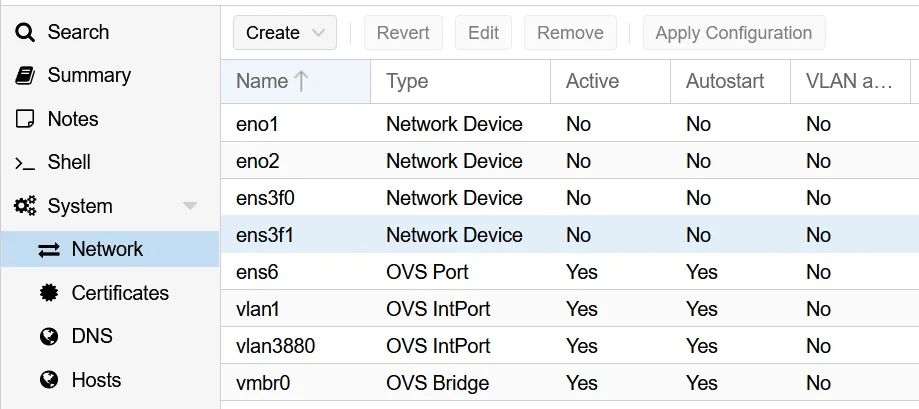
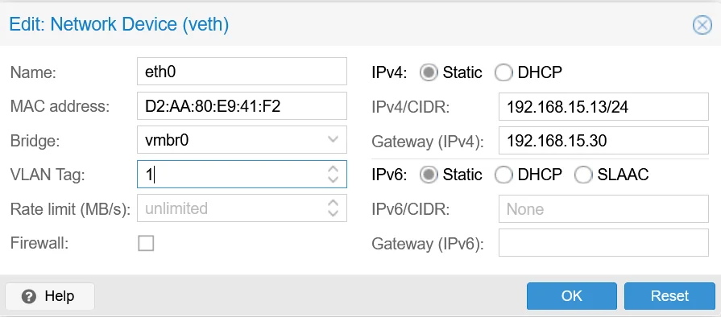

*如何通过升级到 OpenVSwitch 解决高带宽 VPS 服务器中的数据包丢失和延迟问题*

虚拟化是过去十年中托管世界中最普遍和最具变革性的技术之一。尽管如此，维持虚拟机的高效运行并不总是那么容易。在本文中，我们将探讨在客户运行的虚拟机上看到的性能问题的最常见原因之一，详细说明症状、故障排除过程以及一个非常有效的解决方案。

运行虚拟机主机节点的客户向我们提出的最具挑战性的问题之一是“为什么网络在这个新虚拟机上运行得很糟糕？” 通常，这会开始搜索所有网络基础设施，以确保网络各个方面的正常运行，从主机节点操作系统接口本身到处理流量的路由器。通常，这种详尽的搜索不会发现明显的问题。在所有点上都没有出现任何问题，所有链路都在全速运行。同时，虚拟机会出现高延迟、数据包丢失和吞吐量低于正常速度的情况，而这是不应该的。

此时，问题出在哪里呢？您可以继续在网络上搜寻幽灵，也可以花点时间考虑运行虚拟机管理程序的每个节点所涉及的一个常见组件：Linux 桥。

Linux 桥接器是一款简洁的软件，充当虚拟以太网交换机。这“桥接”了每个虚拟机的虚拟网络接口和物理网络接口卡。因此，它对来自虚拟机的所有流量进行管理，如果没有它，虚拟机将根本无法访问网络。值得庆幸的是，由于该软件是 Linux 内核的一部分，因此会自动安装。它的配置也很简单，一旦它被激活，您只需告诉您的虚拟机将其用作网络接口，工作就完成了。

然而，这种简单性也有一些缺点。最值得注意的是，作为该网络问题的较旧解决方案之一，它没有纳入当前已知的确保高性能软件桥接的最佳实践。 

在某些情况下，Linux 桥接口可能会变得不堪重负，这可能会导致我们之前提到的一些症状：

与大多数设置相比，您的设置是否需要 > 10gbps 的网络或拥有相对较多的虚拟机数量？如果您的节点是具有大量 MAC 或 IP 地址的单个超大型网络的一部分怎么样？这些类型的情况会产生高数据包计数、大量广播流量或更高的带宽要求，可能会导致网桥功能低于标准水平或直接崩溃。

那么有什么好的办法可以解决这个问题呢？ 

在这里，我们可以考虑使用第三方实用程序来提供性能更好的桥接平台，该平台不仅可以在更高的负载下表现更好，而且还可以为更复杂的网络提供额外的选项。最流行的高性能 Linux 桥接方案之一是 OpenVSwitch。

OpenVSwitch 提供了标准内置 Linux 桥的替代方案，可与许多不同的操作系统和虚拟化平台一起使用。根据我们使用 Proxmox 的经验，使用 OpenVswitch 代替 Linux 桥可以显着提高虚拟机的性能，同时还增强稳定性。

如果您想尝试一下，则需要安装并配置它。我们将讨论如何使用 Proxmox 安装 OpenVSwitch。

虽然 OpenVSwitch 比 Linux 桥接器更难设置，但实际上仍然相当简单。首先您需要做的就是通过命令行从默认的 Proxmox 存储库安装它。 

*'apt 安装 openvswitch-switch'*

它将安装所有必需的软件包，这就是安装。配置有点复杂。由于您无法同时运行 Linux 网桥和 OpenVSwitch 接口，因此切换到此配置将需要所有正在运行的虚拟机脱机。因此，在首次设置服务器时、在运行活动虚拟机之前设置 OpenVSwitch 会更方便。

使用 OpenVSwitch 的简单桥接设置涉及 3 个接口。物理接口配置、桥接接口和默认 vlan 接口。这是物理接口的简单配置

首先在“/etc/network/interfaces”处备份网络接口文件，或者用以下内容替换相应的物理接口以创建 OVSPort。我们将在下一节中创建桥“vmbr0”，但它也在此处定义。另请注意，有一个 VLAN 选项。此配置假设您有未标记的流量进入主机节点。由于 OpenVSwitch 需要 VLAN 感知流量，因此我们将所有流量重新定义为默认位于“vlan1”上。

*自动 ens6
允许 vmbr0 ens6
iface ens6 inet 手动
 ovs_bridge vmbr0
  ovs_type OVSPort
  ovs_options tag=1 vlan_mode=native-untagged*

接下来，您需要定义虚拟机使用的实际桥。这部分与 Linux 桥非常相似，但它使用 OpenVSwitch。我们只需设置可识别各种 OVS 端口的网桥。

*允许 ovs vmbr0
iface vmbr0 inet 手动
  ovs_type OVSBridge
  ovs_ports ens6 vlan1*

最后一个接口是vlan接口。如前所述，OpenVSwitch 希望使用 VLAN 感知布局。上述流量将被路由到 vlan1，我们在这里为网桥上的主机节点定义实际接口。 

*allow-vmbr0 vlan1
iface vlan1 inet static
  ovs_type OVSIntPort
  ovs_bridge vmbr0
  ovs_options tag=1
  地址 ###.###.###.###
  网络掩码 ###.###.###.###
  网关 # ##.####.###.###*

根据您的网络要求在网络接口文件中设置完此处的所有 3 个部分后，您只需重新启动服务器即可激活更改。 

现在我们有了新的 OpenVSwitch 桥设置，您应该能够在 Proxmox 控制面板中通过适当的 OpenVSwitch (OVS) 接口看到它：

创建虚拟机时，您现在需要记住一件更重要的事情。由于流量需要了解 VLAN 才能使新网桥正常工作，因此您需要在其高级配置中将每个虚拟机连接到该 VLAN。只需在创建时将标签编号 1 添加到每个标签即可。这里的所有都是它的。

这是 OpenVSwitch 的一个非常简单的配置和实现，它的功能当然不仅仅是一个桥接器。要查看更多可用选项，例如 Bonding 或 RSTP 选项，您可以参考此处的文档：

[Proxmox：打开 V](https://pve.proxmox.com/wiki/Open_vSwitch)[开关](https://pve.proxmox.com/wiki/Open_vSwitch)

对于有兴趣了解更多有关 openvswitch 与 Linux Bridge 的确切性能特征的人们，意大利博洛尼亚大学电气、电子和信息工程系的这份 PDF 报告提供了有关该主题的大量信息：

[云计算基础设施中网络虚拟化的性能：OpenStack 案例。](https://ioflood.com/s3-5-callegati-performance.pdf)

在这篇文章中我们讨论了虚拟机网络性能的一个常见问题。通常，这是默认“linux 桥”软件的性能问题，可以通过使用 OpenVSwitch 来克服。我们介绍了如何在 Proxmox 上安装和配置 OpenVSwitch。其他虚拟化平台的过程会有所不同，但可能非常相似。OpenVSwitch 的实现通常可以通过 Linux 桥解决这些性能问题。由于这是我们为相当多的客户所做的事情，我们希望与更广泛的社区分享这些信息。