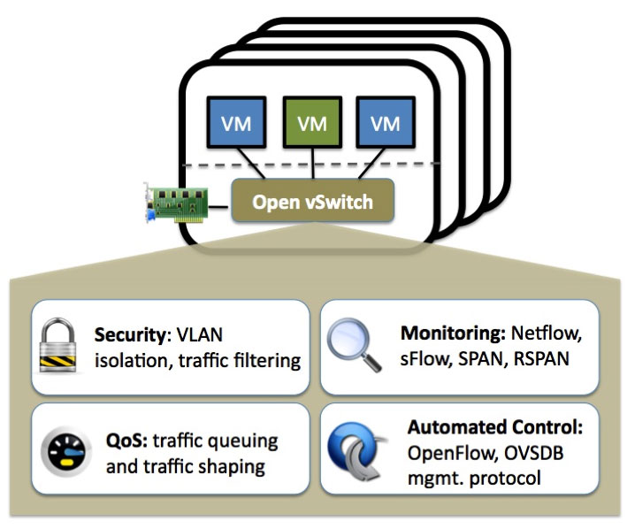

# OVS 与 Linux Bridge：谁是赢家？

发表于 [2019年1月31日](https://www.fiber-optic-transceiver-module.com/ovs-vs-linux-bridge-who-is-the-winner.html) 由 [管理员](https://www.fiber-optic-transceiver-module.com/author/admin)

在虚拟交换机技术领域，OVS（Open vSwitch）和Linux Bridge之间的争斗已经持续了一段时间。有人认为Open vSwitch功能更多、性能更好，在目前虚拟交换机中发挥着最重要的作用。而另一些人则认为Linux Bridge已经使用多年，比OVS成熟。那么 OVS 与 Linux Bridge：谁是赢家？

## OVS 与 Linux Bridge：它们是什么？

**OVS**

Open vSwitch (OVS) 是一种开源多层虚拟交换机。它通常作为基于软件的[网络交换机](https://www.fs.com/c/ethernet-switches-3079)或专用交换硬件的控制堆栈运行。OVS 旨在通过编程扩展实现有效的网络自动化，还支持标准管理接口和协议，包括 NetFlow、sFlow、CLI、IPFIX、RSPAN、LACP、802.1ag。此外，Open vSwitch可以支持跨多个物理服务器的透明分发。此功能类似于专有的虚拟交换机解决方案，例如VMware vSphere Distributed Switch (vDS)。简而言之，OVS 与虚拟机管理程序一起使用，以跨网络互连主机内的虚拟机以及不同主机之间的虚拟机。

图1：OVS

**Linux桥**

如上所述，Open vSwitch是一个多层虚拟交换机，可以作为二层或[三层交换机](https://www.fs.com/c/100g-switches-3258)工作。而 Linux 桥接器的行为仅类似于[第 2 层交换机](https://www.fs.com/c/10g-switches-3256)。通常，Linux 网桥放置在两个相互通信的独立计算机组之间，但它与其中一组计算机的通信要多得多。它由四个主要组件组成，包括一组网络端口、控制平面、转发平面和 MAS 学习数据库。借助这些组件，Linux 网桥可用于在路由器、网关或主机上的虚拟机和网络命名空间之间转发数据包。此外，它还支持STP、VLAN过滤和组播监听。

## OVS 与 Linux Bridge：OVS 的优点和缺点

与Linux Bridge相比，Open vSwitch有几个优点：

- 网络管理更轻松——通过Open vSwitch，管理员可以方便地管理和监控云环境中的网络状态和数据流。
- 支持更多隧道协议——OVS支持GRE、VXLAN、IPsec等。但是Linux Bridge仅支持GRE隧道。
- 纳入 SDN – Open vSwitch 纳入软件定义网络 (SDN)，可以使用 OpenStack 插件或直接从 SDN 控制器（例如 OpenDaylight）驱动。

尽管有这些优势，Open vSwitch 仍面临一些挑战：

- 缺乏稳定性——Open vSwitch 存在一些稳定性问题，例如 Kernetl 恐慌、ovs 切换的段错误和数据损坏。
- 复杂的操作——Open vSwitch本身就是一个复杂的解决方案，它拥有如此多的功能。学习、安装和操作都很困难。

## OVS 与 Linux Bridge：Linux Bridge 的优点和局限性

Linux Bridge 仍然流行主要有以下原因：

- 稳定可靠——Linux Bridge已经使用多年，稳定性和可靠性得到认可。
- 易于安装 – Linux Bridge 是标准 Linux 安装的一部分，无需安装或学习其他软件包。
- 方便故障排除——Linux Bridge本身就是一个简单的解决方案，其操作比Open vSwitch更简单。方便排除故障。

但是，也有一些限制：

- 功能较少 – Linux Bridge 不支持 Neutron DVR、更新且更具可扩展性的 VXLAN 模型以及其他一些功能。
- 支持者较少——许多企业希望确保有一个开放的模型将其服务集成到 OpenStack 中。但Linux Bridge无法保证需求，因此其用户数量比Open vSwitch要少。

## OVS 与 Linux Bridge：谁是赢家？

OVS vs Linux Bridge：谁是赢家？其实，这两种都是不错的网络解决方案，并且各有适合的使用场景。OVS具有更多的集中管理和控制功能。Linux Bridge具有良好的稳定性，适合大规模网络部署。总而言之，获胜者就是满足您需求的合适人选。