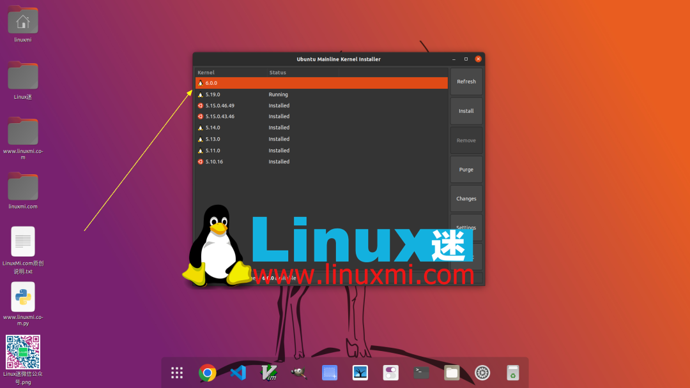
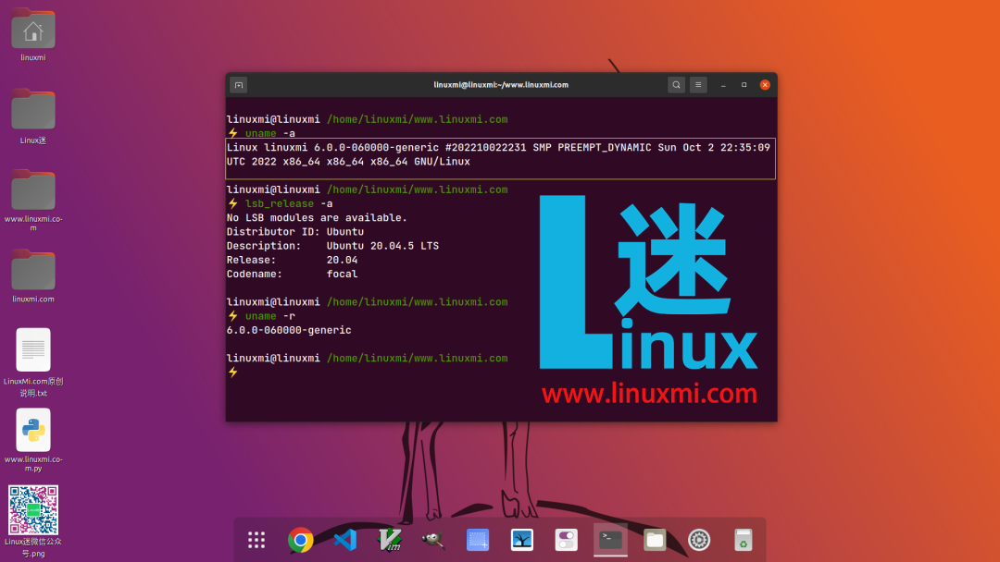

# Linus Torvalds 正式发布 Linux Kernel 6.0，性能大优化

作者：聆听世界的鱼2022-10-08 13:11:56

[系统](https://www.51cto.com/os)[Linux](https://www.51cto.com/linux)

Linux Kernel 6.0 终于发布了，它引入了对 AArch64 (ARM64) 硬件架构的支持，以交换透明的大页面而不拆分它们，支持NVMe带内认证，支持 OpenRISC 和 LoongArch 架构中的 PCI 总线，同时使用 XFS 和 io_uring 时的异步缓冲写入，以及零拷贝网络传输支持。

Linus Torvalds 近日宣布发布 Linux 6.0 作为一个主要的内核系列，它带来了新的特性，改进的硬件支持，以及 bug 和安全修复。

经过两个月的开发，Linux Kernel 6.0 终于发布了，它引入了对 AArch64 (ARM64) 硬件架构的支持，以交换透明的大页面而不拆分它们，支持NVMe带内认证，支持 OpenRISC 和 LoongArch 架构中的 PCI 总线，同时使用 XFS 和 io_uring 时的异步缓冲写入，以及零拷贝网络传输支持。

Linux Kernel 6.0 还为 RISC-V 硬件架构带来了对“Zicbom”扩展的支持，用于管理具有非缓存一致 DMA 的设备，一个新的运行时验证子系统，允许内核状态监视，支持生成新的 CXL 内存区域，支持在 OverlayFS 文件系统上正确实现 POSIX 访问控制列表，以及实现第二代Btrfs“发送”协议，该协议支持发送大数据和原始压缩区。

其他值得注意的更改包括: DAMON 机制中的新的用户空间内存管理特性，支持将 NFSv4 服务器限制为 1024 个活动客户机，支持 1GB RAM，支持 EXT4 文件系统获取和设置存储在文件系统超级块中的 uuid，支持 fsnotify 子系统以更好地控制被忽略的事件，支持附加到 uprobes 的可睡眠BPF程序，以及向 perf 工具报告锁争用跟踪点和用于内核内聚合的 BPF。

虚拟化方面也有好消息，因为 Linux Kernel 6.0 引入了一个新的伪设备，称为“guest vCPU失速检测器”，它可以充当看门狗，告诉主机虚拟机是否已经失速。在 Linux 6.0 中，还有一个新的 debugfs 接口、一个新的 BPF 迭代器、一组新的 BPF kfuncs、用于生成和检查 SYN cookie 的新的 BPF 助手，以及一个新的基于 io_uring 的用户空间块驱动程序。

*“大家都很清楚，主要的版本号变化更多的是让我耗尽手指和脚趾，而不是任何重大的基本变化。但是当然，在6.0中有很多不同的变化——我们总共有超过 15k 的非合并提交，毕竟，6.0 是一个更大的版本，至少在提交数量上是这样的，”Linus Torvalds说。*

当然，Linux 6.0 还包括许多更新和新的驱动程序，以提供更好的硬件支持。在此基础上，它添加了许多 bug 修复和调整，以提供比以前的内核更好的性能，最值得注意的是在大系统上的任务放置的调整，对内核内TLS实现的性能改进，以及一个新的 IORING_RECV_MULTISHOT 标志，以支持使用 recv() 调用的多镜头操作。

在安全方面，Linux Kernel 6.0 实现了从引导加载程序的设置数据到 x86 和 m68k 内核的随机数种子的获取，支持 SafeSetID 安全模块来控制 setgroups() 的更改，支持 ARIA 加密算法，以及支持绑定到控制组或 BPF 安全模块的单个目标进程的钩子。

Linux Kernel 6.0 可以从 Linus Torvald 的 git repo 中下载，供那些喜欢编译自己内核的人使用。对于其他人来说，你需要等到发行版的维护者将内核升级到 6.0 版本后才能尝试安装它。

责任编辑：庞桂玉来源： [Linux公社](https://mp.weixin.qq.com/s/vw2dyG-PW46zEm66czSNzw)

[Linux](https://so.51cto.com/?keywords=Linux)[Linux内核](https://so.51cto.com/?keywords=Linux内核)