# [LVM原理与实现](https://www.cnblogs.com/sddai/p/10615745.html)

#  

**一、什么是LVM**

> 不管是使用传统的MBR分区方式或者是GPT的分区方式，在最后数据量逐渐变大的过程中都会出现空间不足的情况，但是若是使用将此分区的数据全部迁移至一个更大空间的磁盘上的迁移时间也是不可想象的，为了解决这个问题，LVM就诞生了。
> LVM(Logical volume Manager)是逻辑卷管理的简称。
> LVM的工作原理其实很简单，它就是通过将底层的物理硬盘抽象的封装起来，然后以逻辑卷的方式呈现给上层应用。在传统的磁盘管理机制中，我们的上层应用是直接访问文件系统，从而对底层的物理硬盘进行读取，而在LVM中，其通过对底层的硬盘进行封装，当我们对底层的物理硬盘进行操作时，其不再是针对于分区进行操作，而是通过一个叫做逻辑卷的东西来对其进行底层的磁盘管理操作。比如说我增加一个物理硬盘，这个时候上层的服务是感觉不到的，因为呈现给上次服务的是以逻辑卷的方式。
> LVM最大的特点就是可以对磁盘进行动态管理。因为逻辑卷的大小是可以动态调整的。

------

**二、LVM原理**

> 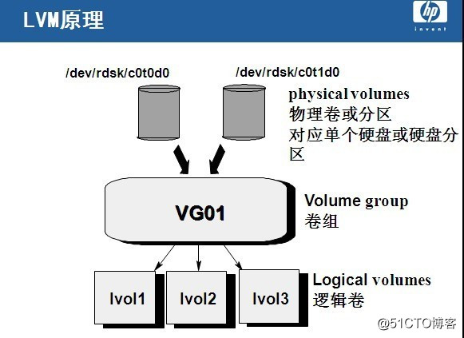
> PV（physical volume）：物理卷在逻辑卷管理系统最底层，可为整个物理硬盘或实际物理硬盘上的分区。
> VG（volume group）：卷组建立在物理卷上，一卷组中至少要包括一物理卷，卷组建立后可动态的添加卷到卷组中，一个逻辑卷管理系统工程中可有多个卷组。
> LV（logical volume）：逻辑卷建立在卷组基础上，卷组中未分配空间可用于建立新的逻辑卷，逻辑卷建立后可以动态扩展和缩小空间。
> PE（physical extent）：物理区域是物理卷中可用于分配的最小存储单元，物理区域大小在建立卷组时指定，一旦确定不能更改，同一卷组所有物理卷的物理区域大小需一致，新的pv加入到vg后，pe的大小自动更改为vg中定义的pe大小。
> LE（logical extent）：逻辑区域是逻辑卷中可用于分配的最小存储单元，逻辑区域的大小取决于逻辑卷所在卷组中的物理区域的大小。

------

**三、LVM实现过程**

> 1、创建PV（即从一块硬盘中创建分区，或者直接将此硬盘作为一个PV）
> **需要将此分区的标志该为lvm格式**
> 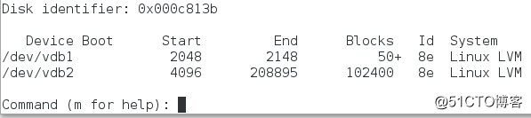
> pvcreate /dev/vdb1
> pvcreate /dev/vdb2
> 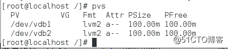
> 2、创建VG
> vgcreate vg0 /dev/vdb1 vg0任意，表示将/dev/vdb1加入到vg0这个物理卷组中
> 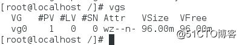
> 3、创建LV
> lvcreate -L 50M -n lv0 vg0
> -L 表示大小，该lv0的物理卷大小设置为50M 
> -n 表示逻辑卷的名字，可任意
> 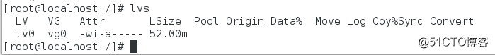
> 4、格式化此逻辑卷
> **若是xfs文件系统，仅可以进行拉申，不可以进行缩减
> 若是ext4文件系统，可以进行拉申，也可以进行缩减**
> 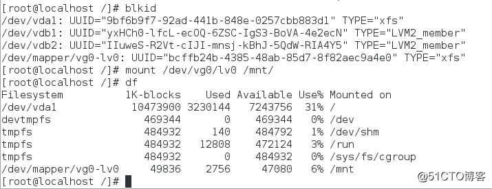
> 此时呈现给上层服务是逻辑卷的状态，但是上层服务是没有感知的，可以将逻辑卷与真实的硬盘分区一样的进行使用。

------

四、xfs文件系统

> 当物理卷组中的空间足够使用时，直接对逻辑卷进行拉申即可
> lvextend -L 500M /dev/vg0/lv0 对设备进行拉申
> xfs_growfs /dev/vg0/lv0 为热拉申，即在设备/dev/vg0/lv0正在使用的情况下进行拉申操作
> 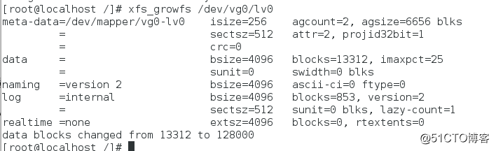
> 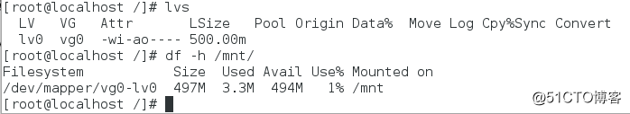
> **设备与文件系统均被扩展至500M**
> 当物理卷组中的空间不够使用时，若物理卷空间足够，之间将物理卷中没有加入物理圈足中的分区直接加入到物理圈足中，如果物理卷不够时，在硬盘中在进行分区，或者在加入新的硬盘。
> 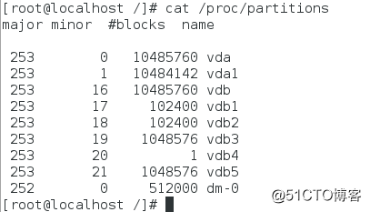
> /dev/vdb4是扩展分区
> pvcreate /dev/vdb5
> vgextend vg0 /dev/vdb5
> lvextend -L 1G /dev/vg0/lv0
> xfs_growfs /dev/vg0/lv0 
> 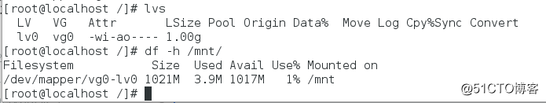

------

五、ext4文件系统

> （1）拉申操作
> lvextend -L 500M /dev/vg0/lv0 拉申设备
> resize2fs /dev/vg0/lv0 拉申文件系统
> 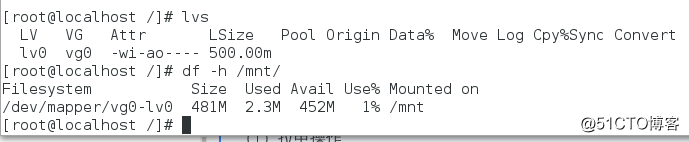
> （2）缩减操作
> umount /mnt/
> e2fsck -f /dev/vg0/lv0 对逻辑卷中的文件进行扫描，以确定需要缩减多少空间，以免出现丢失文件的情况
> resize2fs /dev/vg0/lv0 100M 缩减文件系统到100M
> 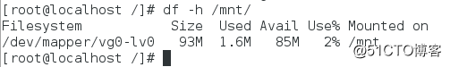
> lvreduce -L 100M /dev/vg0/lv0 缩减设备至100M
> （3）迁移操作
> 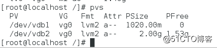
> 若需要将/dev/vdb1物理卷上的文件全部迁移至/dev/vdb2物理卷上，然后将/dev/vdb1从物理卷中取出
> pvmove /dev/vdb1 /dev/vdb2
> 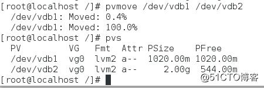
> 迁移成功
> vgreduce vg0 /dev/vdb1
> pvremove /dev/vdb1
> （4）快照
> 通过使用lvm的快照我们可以轻松的备份数据，由于snapshot和源lvm的关系，snapshot只能够临时使用，不能脱离源lvm而存在.
> snapshotCOW（COPY-ON-WRITE）简单原理：
> 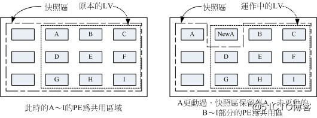
> 当一个snapshot创建的时候，仅拷贝原始卷里的数据，这部是物理上的数据拷贝，因此snapshot创建的特别块，当原始卷里的数据由写入时，备份卷开始记录原始卷哪些数据发生了变化，然后在原始卷新书局覆盖旧数据时，将旧数据拷贝到snapshot的预留空间中，起到备份数据的作用，就保证了所有数据和创建备份卷之前的数据一致性。
> snapshot的特点：
> 采用COW实现方式时，snapshot的大小并不需要和原始卷一样大
> 1、根据原始卷数据的改变大小范围来设置
> 2、根据原始卷数据的更新频率来定，一旦snapshot的空间记录满了原始卷块变换的信息，那么这个snapshot就不能使用了
> lvcreate -L 50M -n lv0backup -s /dev/vg0/lv0
> 创建一个50M 名字为lv0backup源设备为/dev/vg0/lv0的快照
> 此快照不需要格式化，直接进行挂载使用就行

 

[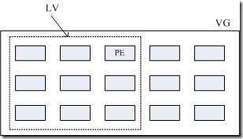](https://images0.cnblogs.com/blog/163646/201405/112242442766575.gif)

[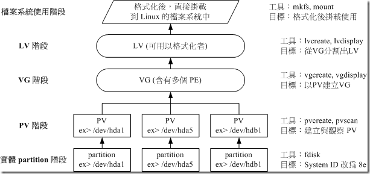](https://images0.cnblogs.com/blog/163646/201405/112242462602150.gif)

[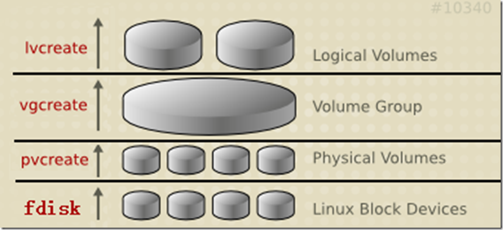](https://images0.cnblogs.com/blog/163646/201405/112243021679174.png)

[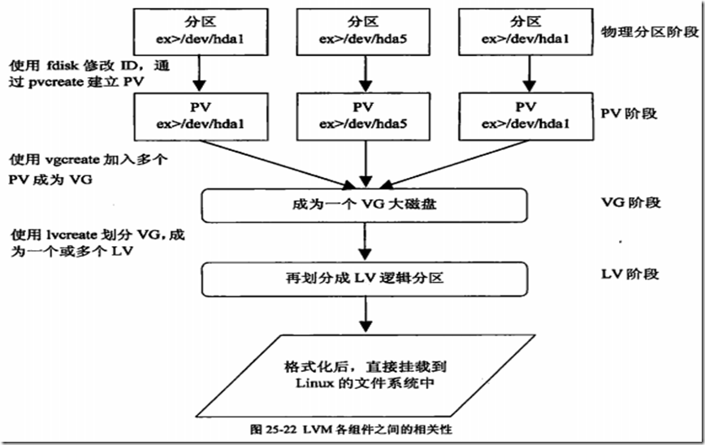](https://images0.cnblogs.com/blog/163646/201405/112243263384294.png)

分类: [操作系统](https://www.cnblogs.com/sddai/category/818173.html)