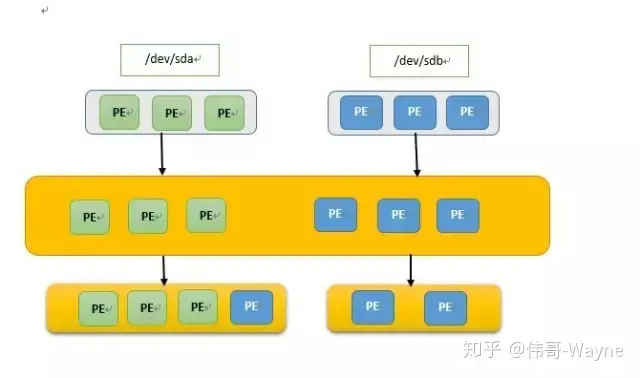

51 人赞同了该文章

**一、传统的磁盘管理**

其实在Linux操作系统中，磁盘管理机制和windows上的差不多，绝大多数都是使用MBR(Master Boot Recorder)都是通过先对一个硬盘进行分区，然后再将该分区进行文件系统的格式化，在Linux系统中如果要使用该分区就将其挂载上去即可，windows的话其实底层也就是自动将所有的分区挂载好，然后我们就可以对该分区进行使用了。

但是这种传统的磁盘管理经常会带来很多的问题，比如说当我们使用的一个分区，其空间大小已经不再够用了，这个时候我们没有办法通过拉伸分区来进行分区扩充，当然目前也有其他第三方的磁盘管理软件可以进行磁盘的分区空间划分，但是这样会给我们的文件系统造成很大的伤害，有时会导致文件系统崩溃等问题。

对于传统的磁盘管理如果说我们碰到当分区大小不足的时候，我们只能通过增加新的硬盘，然后在新的硬盘上创建分区，对分区进行格式化以后，然后将之前分区的所有东西都拷贝到新的分区里面才行。但是新增加的硬盘是作为独立的文件系统存在的，原有的文件系统并没有得到任何的扩充，上层应用只能访问到一个文件系统。这样的方式对个人的电脑来说可能还能接受，但是如果对于生产环境下的服务器来说，这是不可接受的。

因为如果要把一个分区的内容都拷贝到另一个分区上去，势必要首先卸载掉之前的那个分区，然后*对整个分区进行拷贝，如果服务器上运行着一个重要的服务，比如说WWW或者FTP，其要求是 7*24 小时运行正常的，那么卸载掉分区这是不可想象的，同时如果该分区保存的内容非常非常的多，那么在对分区进行转移时时间可能会耗费很久，所以，这个时候我们就会受到传统磁盘管理的限制，因为其不能够进行动态的磁盘管理。因此，为了解决这个问题，LVM技术就诞生了！！！

**二、LVM的磁盘管理**

正是因为传统的磁盘管理不能对我们的磁盘空间进行动态的管理，因此就诞生出了LVM这个技术，那么LVM到底是什么呢？它又是怎么对磁盘进行管理的呢？

LVM(Logical volume Manager)是逻辑卷管理的简称。它是Linux环境下对磁盘分区进行管理的一种机制。现在不仅仅是Linux系统上可以使用LVM这种磁盘管理机制，对于其它的类UNIX操作系统，以及windows操作系统都有类似与LVM这种磁盘管理软件。

LVM的工作原理其实很简单，它就是通过将底层的物理硬盘抽象的封装起来，然后以逻辑卷的方式呈现给上层应用。在传统的磁盘管理机制中，我们的上层应用是直接访问文件系统，从而对底层的物理硬盘进行读取，而在LVM中，其通过对底层的硬盘进行封装，当我们对底层的物理硬盘进行操作时，其不再是针对于分区进行操作，而是通过一个叫做逻辑卷的东西来对其进行底层的磁盘管理操作。比如说我增加一个物理硬盘，这个时候上层的服务是感觉不到的，因为呈现给上次服务的是以逻辑卷的方式。

LVM最大的特点就是可以对磁盘进行动态管理。因为逻辑卷的大小是可以动态调整的，而且不会丢失现有的数据。我们如果新增加了硬盘，其也不会改变现有上层的逻辑卷。作为一个动态磁盘管理机制，逻辑卷技术大大提高了磁盘管理的灵活性！！！

**三、LVM的原理**

要想理解好LVM的原理，我们必须首先要掌握4个基本的逻辑卷概念。

①PE　　(Physical Extend)　　物理拓展

②PV　　(Physical Volume)　　物理卷

③VG　　(Volume Group)　　卷组

④LV　　(Logical Volume)　　逻辑卷

我们知道在使用LVM对磁盘进行动态管理以后，我们是以逻辑卷的方式呈现给上层的服务的。所以我们所有的操作目的，其实就是去创建一个LV(Logical Volume),逻辑卷就是用来取代我们之前的分区，我们通过对逻辑卷进行格式化，然后进行挂载操作就可以使用了。那么LVM的工作原理是什么呢？所谓无图无真相，咱们下面通过图来对逻辑卷的原理进行解释！！

**1.将我们的物理硬盘格式化成PV(Physical Volume)**

我们看到，这里有两块硬盘，一块是sda，另一块是sdb，在LVM磁盘管理里，我首先要将这两块硬盘格式化为我们的PV(Physical Volume),也就是我们的物理卷，其实格式化物理卷的过程中LVM是将底层的硬盘划分为了一个一个的PE(Physical Extend),我们的LVM磁盘管理中PE的默认大小是4M大小，其实PE就是我们逻辑卷管理的最基本单位。比如说我有一个400M的硬盘，那么在将其格式化成PV的时候，其实际就是将这块物理硬盘划分成了100个的PE，因为PE默认的大小就是4M。这个就是我们的第一步操作。

**2.创建一个VG(Volume Group)**

在将硬盘格式化成PV以后，我们第二步操作就是创建一个卷组，也就是VG(Volume Group),卷组在这里我们可以将其抽象化成一个空间池，VG的作用就是用来装PE的，我们可以把一个或者多个PV加到VG当中，因为在第一步操作时就已经将该硬盘划分成了多个PE，所以将多个PV加到VG里面后，VG里面就存放了许许多多来自不同PV中的PE，我们通过上面的图片就可以看到，我们格式化了两块硬盘，每个硬盘分别格式化成了3个PE，然后将两块硬盘的PE都加到了我们的VG当中，那么我们的VG当中就包含了6个PE，这6个PE就是两个硬盘的PE之和。通常创建一个卷组的时候我们会为其取一个名字，也就是该VG的名字。

**3.基于VG创建我们最后要使用的LV(Logical Volume)**

【注意】PV以及VG创建好以后我们是不能够直接使用的，因为PV、VG是我们逻辑卷底层的东西，我们其实最后使用的是在VG基础上创建的LV(Logical Volume),所以第三步操作就是基于VG来创建我们最终要使用的LV。

当我们创建好我们的VG以后，这个时候我们创建LV其实就是从VG中拿出我们指定数量的PE，还是拿上图来说，我们看到我们此时的VG里面已经拥有了6个PE，这时候我们创建了我们的第一个逻辑卷，它的大小是4个PE的大小，也就是16M(因为一个PE的默认大小是4M)，而这4个PE有三个是来自于第一块硬盘，而另外一个PE则是来自第二块硬盘。当我们创建第二个逻辑卷时，它的大小就最多只有两个PE的大小了，因为其中的4个PE已经分配给了我们的第一个逻辑卷。

所以创建逻辑卷其实就是我们从VG中拿出我们指定数量的PE，VG中的PE可以来自不同的PV，我们可以创建的逻辑卷的大小取决于VG当中PE存在的数量，并且我们创建的逻辑卷其大小一定是PE的整数倍(即逻辑卷的大小一定要是4M的整数倍)。

**4.将我们创建好的LV进行文件系统的格式化，然后挂载使用**

在创建好LV以后，这个时候我们就能够对其进行文件系统的格式化了，我们最终使用的就是我们刚创建好的LV，其就相当于传统的文件管理的分区，我们首先要对其进行文件系统的格式化操作，然后通过mount命令对其进行挂载，这个时候我们就能够像使用平常的分区一样来使用我们的逻辑卷了。

我们在创建好LV以后，我们会在 /dev 目录下看到我们的LV信息，例如 /dev/vgname/lvname， 我们每创建一个VG，其会在/dev目录下创建一个以该VG名字命名的文件夹，在该VG的基础上创建好LV以后，我们会在这个VG目录下多出一个以LV名字命名的逻辑卷。

下面我们来对整个LVM的工作原理进行一个总结：

(1)物理磁盘被格式化为PV，空间被划分为一个个的PE

(2)不同的PV加入到同一个VG中，不同PV的PE全部进入到了VG的PE池内

(3)LV基于PE创建，大小为PE的整数倍，组成LV的PE可能来自不同的物理磁盘

(4)LV现在就直接可以格式化后挂载使用了

(5)LV的扩充缩减实际上就是增加或减少组成该LV的PE数量，其过程不会丢失原始数据

我们看到，我们这里如果要对LV进行扩充，直接加进来一块sdc硬盘，然后将其格式化成PE，然后将该PV加入到了VG当中，这个时候我们就可以通过增加LV中PE的数量来动态的对LV进行扩充了，只要我们的LV的大小不要超过我们VG空余空间的大小就行了！！

编辑于 2021-05-17 16:58

Linux 运维

LVM