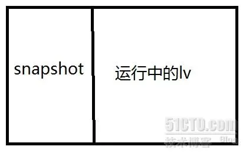
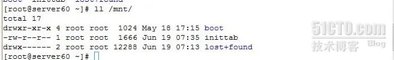
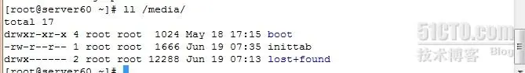

# lvm原理与使用

 原创

[deng304749970](https://blog.51cto.com/damondeng)2012-06-20 11:47:14博主文章分类：[linux base](https://blog.51cto.com/damondeng/category1)©著作权

***文章标签\*[lvm](https://blog.51cto.com/topic/lvm.html)*****文章分类\*[运维](https://blog.51cto.com/nav/ops)*****阅读数\**\*512\****

 lvm主要功能之一可以按需要调整文件系统的大小。 将多个分区组合成一个大的分区，可以在线调整它们的大小。如果要缩小的话就先卸载再缩小。

1，实现步骤：lvm（逻辑滚动条管理员)将几个实体的分区或磁盘通过软件组合成为一块看起来是一个独立的大磁盘（VG），再将这块大磁盘分割可以被使用的分区（LV），最终经过格式化与挂载才可以被使用。

physical volume (pv）--->vg(volume group)--->lv(logical volume)

(1)pv(物理卷):将物理的分区调整成lvm能识别的分区，也就是修改分区标识，修改成8e。然后经过pvcreate指令将分区转换成lvm最底成的物理卷，之后才能加以利用。

(2)vg(卷组）：由pv组合而成。可以在卷组上创建一个或多个LV（逻辑卷），LV由一个或多个物理卷组成。

(3)lv(逻辑卷):在vg上进行分区，类似于系统中普通分区，也需要在lv上建立文件系统。

(4)pe(physical extend):每一个物理卷被划分为称为pe(扩展卷)的基本单元，具有唯一编号的PE是可以被LVM寻址的最小单元。PE的大小是可配置的，默认为4MB。

(5)le(logical extend):逻辑卷也被划分为被称为le(扩展卷)的可被寻址的基本单位。在同一个卷组中，le的大小和pe是相同的，并且一一对应。、

2，实验流程：在主机上分出4个100M的分区，并将id改成8e。

(1)创建 pv：pvcreate(将物理分区建立成pv),pvscan(扫描当前系统上的pv磁盘）,pvdisplay（显示当前系统pv状态）,pvremove(将pv属性移除，让该分区不具有pv属性),pvmove(移动pe)

pvcreate /dev/sda5,pvcreate /dev/sda6（或者pvcreate /dev/sda{5,6}

(2)创建vg: vgcreate(建立vg），vgscan(扫描系统上面的vg),vgdisplay(显示当前系统上面的vg状态),vgextend(在vg内增加pv),vgreduce(在vg内移pv),vgchange(设定vg是否启动active),vgremove(删除vg)

vgcreate bingovg /dev/sda{5,6}（bingovg自己定义vg的名称，这里也可以指定pe的大小，加-s 后面跟大小，默认pe是4M)

(3)创建lv: lvcreate（建立lv)，lvscan(扫描系统上面的lv), lvdisplay(显示当前系统上的lv状态），lvextend(在lv内增加容量)，lvreduce(在lv内缩小容量)，lvremove(删除一个lv),lvresize（对lv大小进行调整）

lvcreate  -L 100M -n bingolv bingovg(-L指定容量，也可以换成-l指定pe的数量）

(4)格式化与挂载：

mke2fs -j /dev/bingovg/bingolv(注意/dev/bingovg/bingolv是/dev/mapper/bingovg-bingolv的软链接）

mount /dev/bingovg/bingolv  /mnt(到这里已经完成基本的lv建立）

(5)增加lv容量，如果vg还有剩余容量，则可以直接增加

 lvextend -L +100M /dev/bingovg/bingolv(或者lvresize -L +100M /dev/bingovg/bingolv两个命令效果一样，这一步是物理边界扩大）

resize2fs /dev/bingovg/bingolv(这一步调整文件系统的边界，经过这一步之后，被扩大的才会被文件系统所识别）

如果vg没有剩余的容量，则需要先扩大vg的容量才能扩大lv，如下

pvcreate /dev/sda{7,8}

vgextend bingovg /dev/sda{7,8}

lvextend -L +200M /dev/bingovg/bingolv

resize2fs /dev/bingovg/bingolv

(6)缩小lv容量，这需要卸载(把/dev/sda5拿掉）

umount /mnt

pvdisplay (查找/dev/sda5的pv大小）

e2fsck -f /dev/bingovg/bingolv 先执行这一步，强制检查。否则会导致数据丢失。

resize2fs /dev/bingovg/bingolv 100M 这是缩小文件系统的容量

lvreduce -L 100M /dev/bingovg/bingolv（这是缩小物理边界的容量，lvextend不支持缩小，缩减后物理边界为100M,如果使用-L -100M表示在原来基础上减去100M，文件系统的容量终于要小于等于物理边界的容量，当文件系统边界的容量比物理边界的容量还大时，数据肯定已经出现混乱或者丢失。)

pvdisplay（查看/dev/sda5的PE是否还在使用中）

如果/dev/sda5的free pe不是0,则需要执行下面的命令

pvmove /dev/sda5 /dev/sda8(只有sda8 的free pe能够容下sda5的pe)

pvmove bingovg /dev/sda5

这时/dev/sda5可以拿去用别的用途。

3，lvm还有一重要的功能是建立快照，快照的作用可以用来做备份之用。

如上图所示，当对lv建立一个快照区之后，从这建立快照的时间之后，通过快照访问里面的内容还是那个时刻之前的，在那个时刻之后所做的修改，并不影响快照中的内容。这样做用处是，当我们要备份lv中的数据时，只要备份快照中的数据就ok。

建立快照区需要在vg中有空余的容量，当然快照建立大小由自己需要决定。也就是说，在这备份这段时间内数据发生更改的频率太高，就建大一点。

建立快照之前先在往/dev/bingovg/bingolv里复制数据，在/mnt下有/boot 和inittab

lvcreate -L 100M -s -n  bingosnap  -p r /dev/bingovg/bingolv(—L指定大小 -s表示建立快照, -n表示快照名，-p表示这个快照只读r）

挂载快照  mount /dev/bingovg/bingosnap /media

快照中的内容跟原文件的内容一样，这时，可以对快照做备份

tar -jcf /backups/lv.tar.bz2 /media

在/dev/bingovg/bingolv增加内容与删除并不影响之前那一刻的数据，做完备份之后可以删除快照。

umount /media

lvremove  /dev/bingovg/bingosnap

快照到此的使命也完成