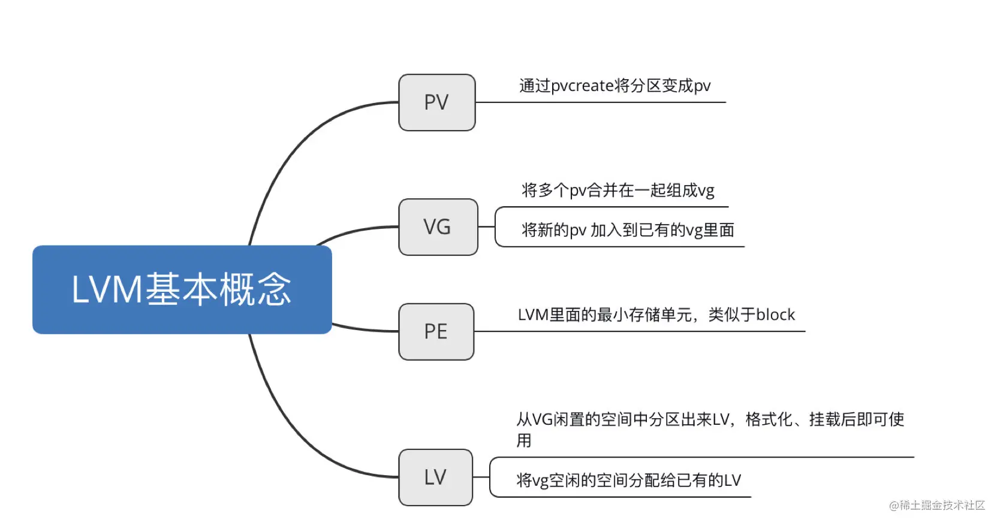

# 彻底击破lvm相关操作以及原理

[mrnx2004](https://juejin.cn/user/606586151895128/posts)

2020-02-06 12:213543

Logical Volume Manager简称LVM，LVM的重点是**弹性的调整file system的容量**，它可以整合多个**partition**在一起，让这些partition看起来就像是一个磁盘一样，而且后续需要新增或者移除其他partition到LVM管理的磁盘中。

## 什么是LVM

> LVM的全名是Logical Volume Manager，中文翻译为逻辑卷轴管理员，LVM的实现原理是将partition合并为VG，然后将VG拆分为LV，挂载LV后即可使用。

- PV(Phycical Volume)：实体卷轴

- VG(Volume Group)：卷轴群组

- PE(Physical Extent)：实体范围区块

- LV(Logical Volume)：逻辑卷轴

  

## LVM实作流程

1. Disk阶段：使用`lsblk`查看磁盘的具体使用情况，使用`fdisk`命令或者`gdisk`命令对磁盘进行分区，并且将分区的code设置为8e。

```arduino
arduino
复制代码fdisk /dev/sda           //进入该磁盘的操作界面，根据说明创建分区，修改code
```

1. PV阶段：使用`pvscan`查看当前存在的具有**pv属性的磁盘**，使用`pvcreate`将实体partition创建为pv，使用`pvremove`将pv属性移除，让该partition不具有pv属性。

```ruby
ruby复制代码pvscan                   //查看当前系统里面具有pv属性的磁盘
pvcreate /dev/sda1       //将分区partition设置为pv
pvdisplay /dev/sda1      //查看每个PV的个别信息
```

1. VG阶段：使用`vgcreate`命令创建vg，或者使用`vgextend vgname /dev/sda1`增加vg大小。

```bash
bash复制代码vgcreate -s 16M vgname /dev/sda1
vgcreate -s 16M vgname /dev/sda{1,2,3}     //创建vg，并且指定PE大小为16MB
vgextend vgname /dev/sda1                  //将空闲的pv空间添加到vgextend里面
```

1. LV阶段：使用`lvcreate`命令创建lv，也可以使用`lvextend`、`lvreduce`、`lvresize`对lv的容量进行调整。

```arduino
arduino复制代码lvcreate -L 2G -n lvname vgname         //从vg中拿一部分空间出来作为lv的空间
lvscan                                  //查看现存的lv
lvresize -L +500M /dev/vgname/lvname    //通过lvscan来查看lv的路径，使用lvresize添加空间
df -h             //此时查看目录大小，没有增大
xfs_growfs /home  //使用xfs_growfs刷新大小
//如果xfs_growfs命令不存在，可以使用如下命令
resize2fs /dev/vgname/lvname     //使用resize2fs刷新大小
```

## 使用LVM thin Volume让LVM动态自动调整磁盘使用率

> 什么是LVM thin Volume？创建一个可以实支实付、用多少才分配实际写入多少容量的**磁盘容量存储池(thin pool)**，再由thin pool去产生一个**指定固定容量大小的LV设备**，这个lv设备声称的容量可以大于thin pool的实际容量，也就是thin pool的实际容量只有1GB，但是可以分配给一个10GB的LV设备。

实际操作流程： 从VG空闲的空间中拿出一部分创建一个`thin pool LV`设备，然后由vpool产生一个大小为10GB的LV设备，将此设备格式化为xfs文件系统，挂载到/srv/thin目录内。

```bash
bash复制代码lvcreate -L 1G -T vgname/vpool
lvdisplay /dev/vgname/vpool      //查看可分配出去的容量，已分配的百分比
lvs vgname                       //更加清晰

//创建vthin1这个具有10GB的设备
lvcreate -V 10G -T vgname/vpool -n vthin1
lvs vgname         //查看vgname下面的lv设备

mkfs.xfs /dev/vgname/vthin1
mkdir /srv/thin
mount /dev/vgname/vthin1 /srv/thin
df -h /srv/thin     //确实有10个GB的空间
```

thin pool的基本用法如上所述，但是即使用户看到可用的空间很大，但是实际的可用空间还是由pool的空间来决定的，所以在使用的过程中要格外留意，如果突破pool的实际空间大小限制，可能**造成数据损毁**。

## LVM的LV磁盘快照

> 什么是磁盘快照？ LVM会预留一个区域作为数据存放处，此时快照区内没有任何数据，快照区与系统区共享所有的PE数据，系统运行一阵子后，假设A区域的数据变更，于是会将旧的A区域的内容移动到快照区。

### 快照区的创建与使用

快照区与原本的LV共享很多的PE区块，因此快照区与被快照的LV必须在同一个VG上。具体创建步骤如下：

```ruby
ruby复制代码vgdisplay vgname     //查看Total、Alloc、Free等属性
//-s参数表示创建快照区，-l参数表示使用多少个PE来作为快照区使用，-n 表示设备名称
lvcreate -s -l 26 -n vsnap1 /dev/vgname/lvname   
```

创建的快照区的内容和原LV的内容是一致的，如果想要验证可以使用如下步骤：

```bash
bash复制代码mkdir /srv/snapshot1
mount -o nouuid /dev/vgname/vsnap1 /srv/snapshot1
df -Th /srv/lvm /srv/snapshot1   //得到两者的内容完全一致
```

### 利用快照区复原系统

必须注意：**修复的数据量不能高于快照区所能负载的实际容量**。 由于原始数据会被搬移到快照区，如果你的快照区不够大，或者原始数据被变更的实际数据量比快照区大，那么快照区就无法容纳，，此时快照功能会失效。

恢复数据的步骤如下：

```bash
bash复制代码//之前已经将vsnap1挂载到/srv/snapshot1目录上
lvdisplay /dev/vgname/snap_lv_name    //查看snap_lv中的使用情况
//获得一个备份文件lvm.dump
xfsdump -l 0 -L lvm1 -M lvm1 -f /home/lvm.dump /srv/snapshot1

umount /srv/snapshot1
lvremove /dev/vgname/vsnap1    //卸载并且移除快照区

umount /srv/lvm
mkdf.xfs -f /dev/vgname/lvname
mount /dev/vgname/lvname /srv/lvm
xfsrestore -f /home/lvm.dump -L lvm1 /srv/lvm
```

标签：

[Linux](https://juejin.cn/tag/Linux)