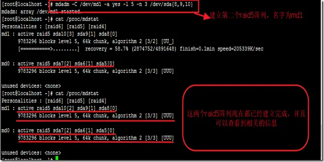
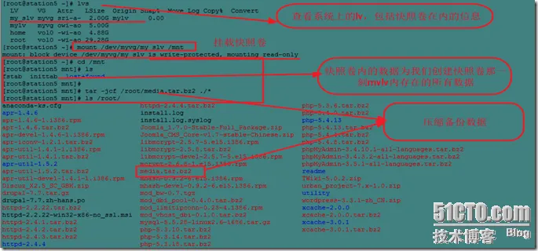

# 浅谈RAID和LVM

 原创

[chrinux](https://blog.51cto.com/chrinux)2013-04-25 20:39:32博主文章分类：[linux系统基础知识](https://blog.51cto.com/chrinux/category1)©著作权

***文章标签\*[RAID0 RAID 5 RAID01](https://blog.51cto.com/topic/raid0raid5raid01.html)*****文章分类\*[运维](https://blog.51cto.com/nav/ops)*****阅读数\**\*5790\****

一、关于RAID

​    冗余磁盘阵列RAID（Redundant Array of Independent Disks）技术是在1987年由加州大学伯克利分校提出的，最初的研究目的是为了组合小的廉价磁盘来代替大的昂贵的scsi磁盘，以降低大批数据存储的费用，但是RAID称为Redundant Array of Inexpensive Disks 廉价的磁盘阵列，后来希望采用冗余信息的方式，使磁盘失效时不会使数据的访问受损失，同时也为了保留专利，于是采用了后来的名字：Redundant Array of Independent Disks，至此大名鼎鼎的RAID就诞生了。

二、RAID的物理结构组成

  关于RAID呢，就像上面的说的一样，是将多个磁盘，通过某种技术和方式组合在一起，提高数据的读写性能及数据的安全、备份等等功能。然后这些多个磁盘组合在一起的阵列，通过RAID总线连接到主板上的一个RAID控制器，该控制器通过控制管理RAID设备中的数据读去与写入，这样降低了CPU处理数据的负载，从而提高了数据的读写性能。

  早期的RAID的实现方式与现状的方式并不一样，刚开始的时候只是通过在系统内利用软件的形式，把多个硬盘虚拟成一个大的存储设备。

  后来随着RAID技术的发展，就出现了软RAID和硬RAID。

软RAID：通过系统软件架设来完成RAID功能

硬RAID：通过硬件在物理上直接实现RAID的相关功能，比如现在利用比较广的RAID卡来实现的RAID架构。

三、RAID级别

  目前来说，RAID比较常见的几个级别有：RAID 0，RAID 1，RAID 2，RAID 3，RAID 4，RAID 5，RAID 10，RAID 01，RAID 50

1. RAID 0

   RAID 0

[](https://s4.51cto.com/attachment/201304/25/6466723_1366893394B1gU.png)


   从上图RAID 0的组成，我们可以看出RAID在数据的读入和写入时，都是把一个完整的数据划分为相等的片，分别存储在disk0~3上的。由于数据块在四个磁盘上分开存储，相对来说数据的读写都得到了很大的提升，但是这样一来，当其中的某一块磁盘坏掉，这个RAID上的数据将会坏掉。

RAID 0的特性

 优点：数据的读写性能提高

 缺点：不提供冗余功能，如果有一个磁盘损坏，则所有数据无法使用

 所需成员磁盘数：2个或更多，最低为2个

 适用领域：视频生成和编辑、图像编辑等其他需要大的传输带宽的操作

 磁盘利用率：100%

2、RAID 1

 RAID 1

[](https://s4.51cto.com/attachment/201304/25/6466723_1366893399EEq9.png)

由于RAID 0 无冗错功能，而RAID 1 就提出来提供容错的功能，数据在RAID阵列中存储的过程中，在物理磁盘0上存储的过程中，在物理磁盘1上也存储一份备份，所以RAID 1也叫镜像RAID磁盘，提供了容错功能，但是这样数据的写性能却降低了。

RAID 1的特性

 优点：具有100％数据冗余，提供最高的数据安全保障，理论上可以实现2倍的读取效率，设计和使用比较简单

 缺点：数据的写入能力差，空间利用率只有50％

 所需成员磁盘数：2个或更多，最低为2个

 适用领域：财务、金融等高可用、高安全的数据存储环境

 磁盘利用率：50%

3、RAID 3

RAID 3


[](https://s4.51cto.com/attachment/201304/204437139.png)


​    从上图的RAID 3中，磁盘阵列中数据的存储和读取过程中，加入了数据校验的性能，当一个数据写入RAID阵列时，会在disk0上写入数据的一部分，另外一部分会写入disk1，然后写到disk2上，同时数据在disk0和disk1、disk2上的校验码存放到disk3上，从数据的写入过程中看，RAID 3提供了高性能的写入，同时为数据的安全和完整性提供了一种保护的机制，提供冗错，

RAID 3的特性

优点：读写性能都比较好，当有磁盘损坏时，对整体吞吐量影响较小，减少了开销

缺点：控制器设计复杂，采用并行存取方式，主轴同步时吞吐量没有提高，校验磁盘的写性能有瓶颈

所需成员磁盘数：3个或更多，最低为3个

适用领域：视频生成和图像、视频编辑等，需要高吞吐量的应用环境

4、RAID 4

[](https://s4.51cto.com/attachment/201304/25/6466723_1366893412lbAI.png)

​     从上图的RAID 4中可以看出，在RAID4中，数据被分为更大的块并行传输到各个成员磁盘上，同时计算XOR校验数据存放到专用的校验磁盘上。RAID4采用独立存取方式，将条带由RAID3的小数据块改为更大的数据块，这是RAID4和RAID3最大的不同，RAID4的校验较为迅速，可以获得相对于RAID3更高的读取速度，但写入速度极差，控制器的设计更加复杂

优点:提供容错功能，读取速度提高。

缺点：写入速度极差

5、RAID 5

[](https://s4.51cto.com/attachment/201304/25/6466723_1366893416ewvQ.png)

​    从上图可以看出，RAID 5算是RAID 4的升级版，与RAID 4不同的是，数据的校验码均衡存放在阵列磁盘之间，解决了不同磁盘的负载均衡问题。

优点：提供容错功能，读性能比较高

缺点：中等的写性能，控制器设计复杂，磁盘重建的过程比较复杂

所需成员磁盘数：3个或更多，最低为3个

6、RAID 10

[](https://s4.51cto.com/attachment/201304/25/6466723_1366893425dQPf.png)

​    RAID10是结合RAID1和RAID0，先镜像，再条带化。综合RAID 1 和RAID 0 的特性，可以看出，RAID 10 获得了数据读写的高性能，及冗错功能，安全，备份功能，同时阵列的成本也增加了

优点：读性能很高，写性能比较好，数据安全性好，允许同时有N个磁盘失效

缺点：空间利用率只有50％，成本大

所需成员磁盘数：2N个，（N≥2），最低为4个

适用领域：多用于要求高可用性和高安全性的数据库应用

7、RAID 50

[](https://s4.51cto.com/attachment/201304/25/6466723_1366893429G1Wh.png)

​    从上图可以可以看出，RAID 50就是先把磁盘做成RAID5，然后再做成RAID0的方式来实现磁盘的组合使用，这样既提高了读写能力，也提供了数据冗余功能。

优点：比RAID5有更好的读性能，比相同容量的RAID5重建时间更短

缺点：同一个RAID5组内的两个磁盘失效会导致整个阵列的失效

所需成员磁盘数：6个或更多，最低为6个

适用领域：适用领域   大型数据库服务器、应用服务器、文件服务器等应用


总结：从以上各个RAID级别的介绍，综合看来RAID 0 比较适合那些单纯要求数据读写的高性能的需求，RAID 5合适企业考虑成本的压力，而采取的方案之一，RAID 10 和RIAD 50适合大型数据库的需要提供高性能的数据读写，及高冗错的功能。

========================================================================

下面我们在linux系统内怎么实现软RAID呢？？？

​    软件RAID：是通过内核识别每一个RAID磁盘设备，RAID直接连接到主板上，通过内核中的md(multiple devices)模块开实现RAID功能，而硬件RAID是通过主板驱动RAID适配器，RAID适配器再连接RAID设备实现的，内核不识别下层的RAID设备阵列，RAID的配置是在BIOS中进行。

​    在软RAID中由于RAID磁盘是通过内核中的md模块直接调用，用户层无法直接调用该模块，为此linux操作系统在用户层为我们提供了一个mdadm的工具来间接的调用md模块，配置RAID。


```
md将下层的RAID设备识别为不同的逻辑意义上的设备/dev/md0,/dev/md1.../dev/mdn等   mdadm工具的使用：   mdadm [mode] raiddevice [options] component-devices(要组合的设备名称)   mode选项说明：   -C：create 创建模式         子选项        -l：选择RAID级别        -n：硬盘设备个数        -a：自动为其创建设备文件，后跟yes、no        -c：指定chunk（数据库）大小，为2的整数次方默认为64K        -x：指定空闲盘个数--提供冗余，磁盘损坏后直接加载上去  -A：assemble 装配模式   -F: follow or monitor 监控RAID设备   -G:grow 增加RAID设备   -M：manage 管理RAID   -R:   1.2.3.4.5.6.7.8.9.10.11.12.13.14.15.16.17.18.19.20.21.22.23.24.25.26.27.28.29.30.31.
```

模拟创建RAID设备,我们就在此模拟新建一个比较复杂的RAID 50吧~

1.新建磁盘分区，并确定磁盘类型

fdisk  /dev/sda

新建6个分区，来模拟六块磁盘，格式修改为fd--Linux raid autodetect

[](https://s4.51cto.com/attachment/201304/25/6466723_1366893434X1im.png)


2、创建RAID设备

  首先创建RAID 5设备md0和md1

[](https://s4.51cto.com/attachment/201304/25/6466723_1366893441CZj3.png)


[](https://s4.51cto.com/attachment/201304/25/6466723_1366893455m77c.png)

格式化并指定文件系统格式

[](https://s4.51cto.com/attachment/201304/25/6466723_1366893464SB2N.png)

格式化、创建文件系统。

[](https://s4.51cto.com/attachment/201304/25/6466723_1366893469j5ch.png)


[](https://s4.51cto.com/attachment/201304/204946805.png)

​    上图可以看出我们的raid5（/dev/md0，/dev/md1)已经创建好，下面我们利用这连个raid创建radi0 吧

[](https://s4.51cto.com/attachment/201304/25/6466723_1366893484juwm.png)

创建文件系统、格式化，并把磁盘挂载到系统上

[](https://s4.51cto.com/attachment/201304/25/6466723_1366893492S1jL.png)

ok，至此这个RAID 50已经可以正常使用了

查看RAID设备的详细信息 mdadm -D  RAID-name

[](https://s4.51cto.com/attachment/201304/25/6466723_1366893500pNMq.png)

停止RAID设备的命令为mdadm -S RAID-name

[](https://s4.51cto.com/attachment/201304/25/6466723_1366893508egZz.png)

========================================================================

LVM：linux系统下的逻辑卷

​    上面我们介绍过RAID是通过linux内核的md模块在底层管理RAID设备，另外linux中海提供了一个dm的模块（device mapper）。

dm模块也能实现RAID的功能，dm模块在应用层为我们提供了一个应用程序的工具我们称为LVM（逻辑卷管理）

LVM在应用层管理的设备，我们不再称为RAID设备，而是称为逻辑卷

那么LVM在实际使用用的场景有哪些呢？
   首先最重要的就是让我们可以利用LVM提供的快照功能进行备份
   创建多个物理卷的单个逻辑卷或整个硬盘的单个逻辑卷，及再不影响原磁盘中的数据的情况下动态的扩展或者缩减单个逻辑卷的大小。
支持热插拔服务，在不中断服务的情况下管理磁盘比如增加磁盘，更换磁盘，在多个磁盘之间共享内容等等

关于快照的概念：在计算机系统中快照是系统在特定时间的一种状态
那么为什么要做快照呢？？
 下面我们不得不说说快照卷的作用
  1、快照的作用主要是能够进行在线数据备份与恢复。当存储设备发生应用故障或者文件  损坏时可以进行快速的数据恢复，将数据恢复某个可用的时间点的状态。
  2、快照的另一个作用是为存储用户提供了另外一个数据访问通道，当原数据进行在线应用处理时，用户可以访问快照数据
  3、快照的属性为只读

[](https://s4.51cto.com/attachment/201304/25/6466723_1366893513X9dL.png)


备注：当我们在逻辑卷上创建了快照后，某一时刻发生对数据的操作时，在对数据的操作之前必须先将该数据备份到快照卷中，然后再对该数据进行操作，当下一次对该同样的数据进行操作时，不再对该数据就行快照备份（这种机制我们成为写时复制）

基于写时复制，快照卷又为我们提供了一个访问过去某个时刻的数据。

但是在写时复制操作的过程中，有四次I/O的操作，数据的写入操作，复制源数据，读取快照，写入源数据，由此看来，快照卷增加了服务器的I/O操作。

关于LVM是分层次结构：
第一层：逻辑卷LV（Logical Volume），需要格式化挂载即可使用

第二层：卷组VG（Volume Group），只需把物理卷组成卷组

第三层：物理卷PV（Physiacl Volum），格式为8e

  结构如下图

[](https://s4.51cto.com/attachment/201304/25/6466723_1366893518cMFU.png)

从上图我们不难看出，在lv的创建过程中各个组成部分的大小为：LV≤VG=PV。并且我们在创建的过程的时候我们创建的顺序为：pv—>VG—>LV


```
逻辑卷的常用命令     PV相关命令：    pvcreate：创建PV    pvmore：挪动数据、    pvremove：擦除PV卷、    pvdisplay：显示物理卷的信息、    pvscan：扫描并显示系统上的pv卷、    pvs：查看pv信息      VG相关命令  vgcreate ：创建Vg   vgmore：移除  vgremove：删除vg  vgdisplay：显示vg的信息  vgs：查看vg信息        Vgcreate -s #：指定pe大小，默认为4Mb，默认单位为mb     LV的相关命令  lvcreate：创建逻辑卷  lvreduce：移除逻辑卷  lvremove：移除lv，后加路径  lvextend：扩展  lvdisplay：查看lv相关信息  lvs：查看lv信息     扩展逻辑卷  LVM的扩展：先扩展物理卷，再扩展逻辑卷  lvextend：扩展物理边界  Lvextend -L [+]# /PATH/TO/PV：+是至增加多大，不接+号时，则为扩展到多大  resize2fs：扩展逻辑边界  resize2fs /PATH/TO/LV 5G：扩展逻辑边界到5G  resize2fs -p /PATH/TO/LV ：有多大扩展到多大     缩减逻辑卷  LVM缩减：先缩减逻辑边界，再缩减物理卷边界  缩减的时候需要注意一下几点：  1、不能在线缩减，得先卸载  2、确保缩减后的空间大小能储存原来所有文件  3、在缩减之前应该强行检查文件，以确保文件系统处于一致性状态。  resize2fs /PATH/TO/LV 5G:缩减逻辑卷到5G  lvreduce -L [-]# /PATH/TO/PV: 缩减物理卷     快照卷创建的相关命令  通过上面的介绍，我们知道快照卷的生命周期为整个数据时长，在这段时长内，数据的增长量不能超出块照卷大小，快照卷应该是只读的，跟原卷在同一卷组内  lvcreate     -s ：指定类型为块照     -p r|w：表示指定权限  创建、还原过程        lvcreate -s -L # SLV_NAME -p -r /PATH/TO/LV        tar jcf /tmp/usrs.tar.bz2 块照挂载点内的内容        tar -xf /tmp/users.tar.bz2 解压缩   1.2.3.4.5.6.7.8.9.10.11.12.13.14.15.16.17.18.19.20.21.22.23.24.25.26.27.28.29.30.31.32.33.34.35.36.37.38.39.40.41.42.43.44.45.46.47.48.49.50.51.52.53.54.55.56.57.58.59.60.61.62.63.64.65.66.67.68.69.70.71.72.73.74.75.76.77.78.79.80.81.82.83.84.85.86.87.88.89.90.91.92.93.
```

下面我们通过一个实例来说明逻辑卷的创建

由于我这条件有限，就在虚拟机上的redhat enterprise 5.8系统上新建几个硬盘分区来建立我们的LVM。

1、新建三个新的磁盘分区，并修改格式为8e。

[](https://s4.51cto.com/attachment/201304/25/6466723_136689352569A9.png)


2、创建卷组并命名为myvg

[](https://s4.51cto.com/attachment/201304/25/6466723_13668935366MjE.png)

3、创建逻辑卷lv

[](https://s4.51cto.com/attachment/201304/25/6466723_1366893544WklL.png)


实例二、快照卷的创建

1、创建快照卷，创建之前我们需要查看下逻辑卷内的数据大小

[](https://s4.51cto.com/attachment/201304/25/6466723_1366893551XuSK.png)

创建：lvcreate -s -L 2G -n my_slv -p r /dev/myvg/mylv

​    -s 指定卷为快照卷、 –L 指定大小、 –n 指定名字、 –p 指定属性 r代表只读

然后把快照卷挂载到系统上，并对数据进行备份，备份完成以后此快照卷的生命周期就结束了，可以卸载、删除了

[](https://s4.51cto.com/attachment/201304/25/6466723_1366893560svrR.png)

[](https://s4.51cto.com/attachment/201304/25/6466723_13668935694Vv4.png)

本文总结：

通过以上的说明我们可以分别了解到RAID和LVM不同的应用场景以及创建使用的方法，其优点如下：

RAID 提供一定的冗错功能保证数据的安全性及高效的数据读写性能
LVM  可以实现在不改变源磁盘数据的情况下，动态的扩展或者缩减逻辑卷的大小管理磁盘中的数据，同时其提供的快照功能， 支持数据的在线备份，提高楼数据的安全性和完整性