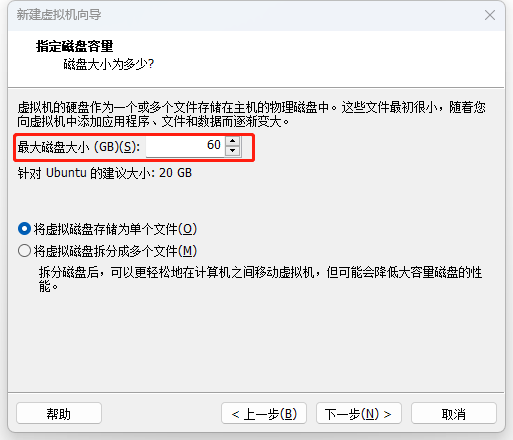
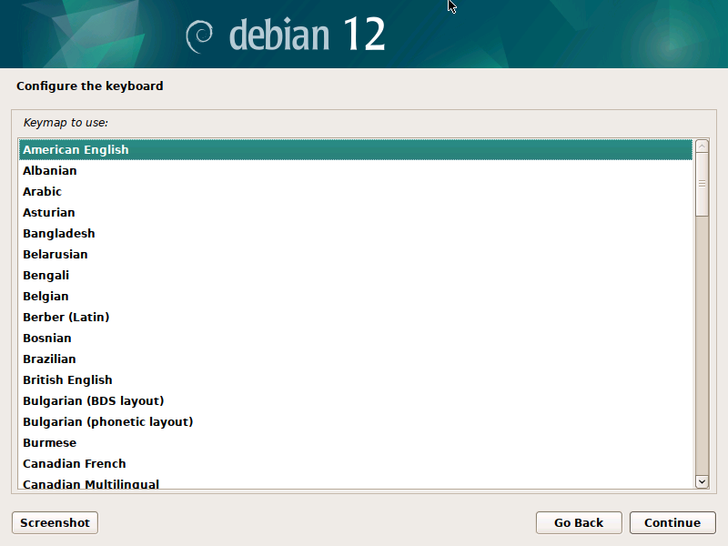
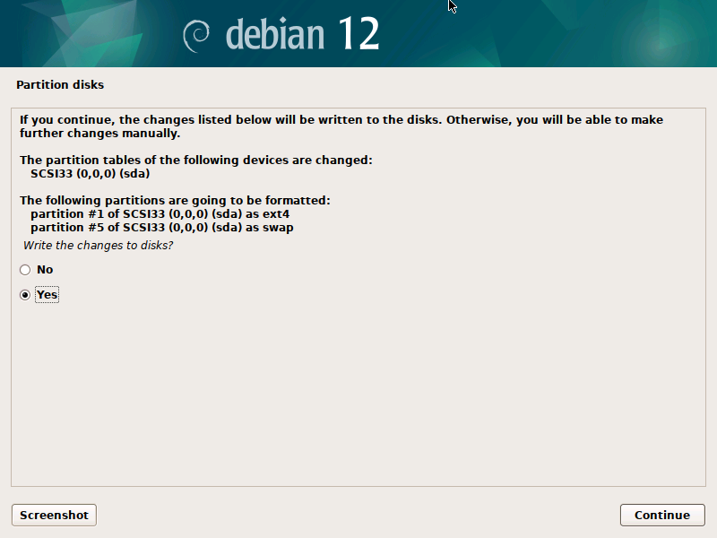
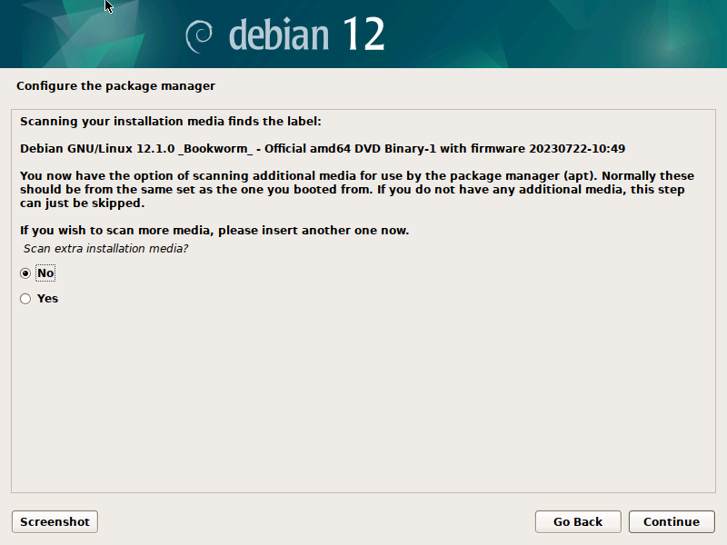
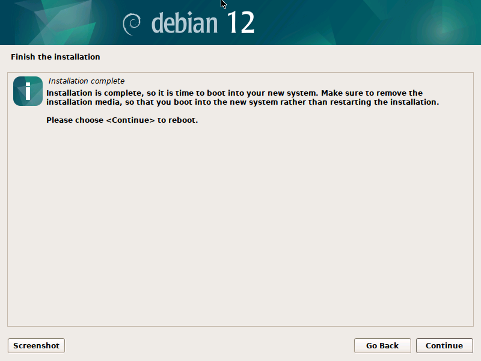

# 采购物理机

建议为1块ssd系统盘, 1块ssd数据盘, 1块hdd数据盘

## 塔式服务器

小型团队时选择

例如: https://item.m.jd.com/product/10068034355466.html?utm_user=plusmember&gx=RnAoG-fEvLx_EjSz49UzFw&gxd=RnAokm4IajzenspGrdZ3VFMbDwK4MN8&ad_od=share&utm_source=androidapp&utm_medium=appshare&utm_campaign=t_335139774&utm_term=CopyURL

联想的比较便宜, 但性能会稍微弱一点

采购一个大于8G的U盘作为linux系统启动盘


## 机架式服务器

中大型团队时选择

规格建议为64c256g


ups、交换机、路由器


# 网络环境

小型团队时没有交换机, 物理机需要通过网线连接路由器, 人员连接路由器上的wifi

物理机通过路由器连接到外网

物理机可以通过natapp被外网连接


# 安装操作系统

经典的选择centos7

新的稳定的选debian, 例如debian12

## 虚拟机模拟

`右键`> `新建虚拟机(N)`


根据实际情况修改本地文件位置


根据实际情况修改磁盘大小




为vmware的虚拟机提升性能: `编辑虚拟机设置` > `选项` > `高级` > `为启用了Hyper-V的主机禁用侧通道缓解(S)`

## 准备好系统

提前下载好 debian 12 dvd iso

​	https://cdimage.debian.org/debian-cd/current/amd64/iso-cd/

## 制作Linux u盘启动器

需要一个大于8G的U盘

使用软件`rufus`

## BIOS设置

开机自启

设置散热模式为性能模式

如果系统盘不是raid的话，设置系统盘类型为arch

系统盘尽可能使用raid1, 数据库裸磁盘即可

## 安装操作系统

### 安装debian12操作系统

其中的eufi选项选择yes


回车





修改root账号的密码


确认修改到磁盘






下面选择`Yes`


安装ssh 和 操作系统





## 配置系统

### SSH可登录

```
echo "PermitRootLogin yes" >> /etc/ssh/sshd_config


systemctl restart sshd
systemctl status  sshd

# 查看ip
hostname -I
```


### 固定IP

```
# 删除动态ip
sed -i '/BOOTPROTO="dhcp"/d'  /etc/sysconfig/network-scripts/ifcfg-enp47s0f1

# 添加静态配置
sed -i "s/dhcp/static/g" /etc/network/interfaces

cat >> /etc/network/interfaces <<EOF
address 192.168.2.34
netmask 255.255.255.0
gateway 192.168.2.1
EOF

cat /etc/network/interfaces

# 重启网络服务
systemctl restart networking
```


# 监控

## 硬盘

坏了会发出声音
